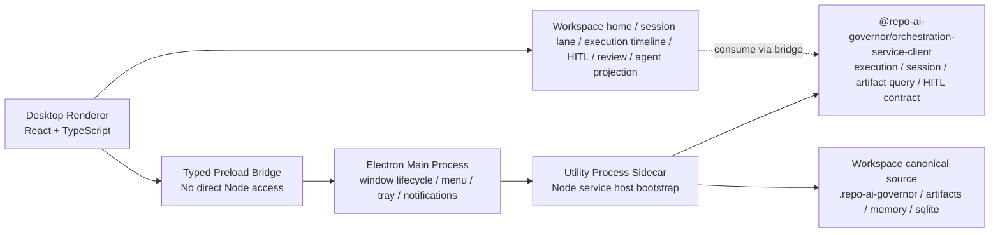

# Repo AI Governor 桌面端技术选型与分阶段设计

- Status: active
- Date: 2026-04-04
- Owner: AI-Agent
- Project: `project-041-desktop-surface-tech-selection-and-design`
- Sprint: `sprint-001-codex-reference-research-and-shell-selection`
- Scope: 当前文档只解决“桌面端应该先做成什么产品形态，以及当前最适合什么宿主框架”两个问题；不在本轮直接展开工程实现。

## 1. 结论先行

### 1.1 推荐结论

1. 产品形态先做成 `local orchestration service` 的桌面治理控制台（agent cockpit / governance console），而不是 VS Code-family 的 full IDE fork，也不是只保留聊天窗口。
2. MVP 宿主框架首选 `Electron + React + utility process sidecar`，继续复用当前仓库已经冻结的 `sidecar + ipc` 与 `@repo-ai-governor/orchestration-service-client` DTO/event contract；`AgentProjectionPanelViewModel` 只复用其共享语义，不允许直接依赖当前 `apps/cli` 内部实现。
3. `openai/codex` 的核心参考点是“shared harness / app server / thin client”的架构模式，而不是必须照搬其 native shell 或底层语言实现。
4. `Tauri` 不是被否定，而是被放到下一阶段：待 `service-host` 具备原生可执行打包能力，或者 installer 体积与系统权限收敛成为主矛盾后，再重新评估。

### 1.2 为什么是这个结论

1. 当前仓库的 desktop baseline 已经明确：桌面端只能消费 `orchestration-service-client` DTO/event contract，推荐 host/transport 固定为 `sidecar + ipc`，并且 runtime owner 在 service host，不在 UI 层。
2. 当前公开可发布的 host bootstrap 仍是 `@cjhdev/repo-ai-governor/service-host` 这一条 Node/JS surface；如果直接切到 `Tauri`，需要额外解决 Node runtime bundling 或 native sidecar 可执行化，工程变量会显著增加。
3. `Electron` 的 `main / renderer / preload / utility process` 结构，正好可以把现有 Node service host 收敛成“长期运行 child/utility process + typed IPC bridge”的形态，落地成本最低。
4. 产品目标仍是“目标仓库中的 AI 开发治理编排”，不是再做一个完整 IDE；因此不应该一上来就走 VS Code/Cursor/Windsurf 类 workbench 路线。

## 2. 仓库内已知硬约束

以下约束来自本仓库既有 PRD、desktop baseline 与已完成项目，不是本轮可以重新选择的内容：

1. PRD 已明确：CLI 与未来桌面端必须共用同一套 local orchestration service；桌面 UI 负责展示与人工决策交互，不直接拥有运行时主状态。
2. `integrations/desktop/README.md` 已冻结：
   - desktop surface 只能消费 `@repo-ai-governor/orchestration-service-client` 的 DTO / event contract
   - 当前唯一正式 baseline 是 `sidecar + ipc`
   - desktop 不得旁路 artifact / recovery / HITL contract
3. `project-014 / TK-144 + TK-154` 已经把 CLI / desktop 共用的 service owner、transport-neutral streaming、desktop-ready DTO hardening 做成正式 contract。
4. `project-015` 已把 memory provider shared loader / host surface 收敛到 CLI、desktop host 与 service-backed runtime 共用的同一条 seam。
5. `project-030 / TK-428` 已明确：未来 desktop 若展示 agent projection，必须复用 shared `AgentProjectionPanelViewModel` seam，而不是重新格式化 raw `agentView`。
6. 当前被文档化的 `AgentProjectionPanelViewModel` builder/type/reference consumer 仍位于 `apps/cli/src/**`。desktop phase 不允许直接依赖 `apps/cli`；在任何 desktop renderer 落地前，必须先把该 seam 提取到 `packages/reporting` 或等价的 shared presentation package。
7. 当前 desktop baseline 已经要求 future desktop 复用 service-backed session DTO / turn stream；因此 MVP 不能只做 run-centric panel，必须从一开始预留 `start / send / append / resume / list / subscribe session` 的桌面入口。
8. 当前 `orchestration-service-client` 与 preload bridge 还没有完整的 artifact/review query contract；只要该 contract 未补齐，desktop 就不能旁路 `.repo-ai-governor` 文件系统去做 Review / Artifact Pane。

换句话说，本轮真正要选的是：

1. 桌面端要做成什么产品形态。
2. 在不破坏以上 contract 的前提下，用什么壳最适合把它做出来。

## 3. 外部参考摘要

## 3.1 `openai/codex` 给我们的参考

1. `openai/codex` 官方 README 已经把 `CLI / IDE / desktop app / web` 作为同一产品族暴露出来，`codex app` 被明确列为 desktop app 体验入口。
2. OpenAI 在公开工程文章中明确说明：Codex 正在把不同 client surface 统一到 App Server 上；client 和 harness 通过 `JSON-RPC over stdio` 通信，桌面端与 IDE 通常拉起一个长期运行的本地 child process。
3. 文中还强调了两个关键点：
   - client 不是长期任务的 source of truth，状态和进度应该由 server/runtime 持有
   - 同一套 event stream、approval、thread/turn/session 语义应同时服务 desktop、IDE、web、TUI

对本项目的启发是：

1. 我们应该学习的是 `shared local orchestration service + thin clients` 的产品结构。
2. 我们不应该让 desktop renderer 直接掌握 runtime state，更不应该让 desktop 和 CLI 分别维护两套 agent loop。

## 3.2 VS Code-family 给我们的参考

1. VS Code 官方 wiki 明确把产品拆成 layered modular core，并把 extensions 放到独立的 `extension host` 进程。
2. 同一份 wiki 还清楚说明了 `electron-main`、`electron-utility`、`electron-browser` 等多环境分层。

对本项目的启发是：

1. 如果未来要做 full IDE workbench，Electron 的确是一条成熟路线。
2. 但这条路线意味着更重的环境分层、编辑器内核、扩展宿主与 workbench contribution 架构，不适合作为当前桌面端的第一阶段目标。

## 3.3 Electron 给我们的参考

1. Electron 官方 process model 说明了 `main process` 负责 app lifecycle 与 native capabilities，`renderer` 负责 web UI，`preload` 通过 `contextBridge` 暴露受控 API。
2. 官方 `utilityProcess` API 明确支持创建带 Node.js 的 child process，并通过 message ports 与主进程通信。
3. 官方 security tutorial 进一步要求：renderer 默认不应拿到 Node.js integration，应开启 `contextIsolation`、process sandboxing，并限制 IPC 与导航面。

对本项目的启发是：

1. Electron 非常适合把现有 Node service host 继续放在受控的 sidecar/utility process 中。
2. 只要严格遵守安全基线，renderer 可以保持“纯 web UI + typed bridge”，不破坏现有 runtime ownership。

## 3.4 Tauri 给我们的参考

1. Tauri 官方 process model 强调 multi-process、least privilege、core process 统一管理 IPC 与全局状态，而 WebView 负责前端渲染。
2. 官方 shell plugin 支持 child process / sidecar，并要求显式 permissions/capabilities。
3. 官方文档还强调，WebView 依赖操作系统提供的 runtime，因此最终包体通常更小。

对本项目的启发是：

1. 如果将来我们把 service host 原生化为可执行 sidecar，Tauri 会非常契合“轻壳 + 强 service owner”的方向。
2. 但在当前 `service-host` 仍是 Node/JS surface 的阶段，Tauri 需要先解决 Node runtime bundling 或可执行 sidecar 产物问题，这会把本轮的核心问题从“桌面端产品化”偏移成“宿主可执行化工程”。

## 4. 产品形态选择

### 4.1 备选形态

| 形态 | 描述 | 优点 | 风险 | 结论 |
|---|---|---|---|---|
| A. Full IDE workbench | 做成 VS Code/Cursor/Windsurf 类完整编辑器 | 长期扩展空间大，可承载编辑器/插件生态 | 当前明显超 scope，会把桌面端问题升级为“重新做一个 IDE” | 当前不选 |
| B. Agent cockpit / governance console | 以 run、review、HITL、artifact、timeline、session continuity 为核心的桌面控制台 | 最符合 PRD 与 current desktop baseline，能直接消费现有 service contract | 后续若需要深度编辑能力，要再补 editor surface | 当前推荐 |
| C. Pure chat desktop | 只做一个聊天壳 | 实现最快 | 无法承载 review、HITL、artifact、execution list、workspace continuity 等核心治理能力 | 当前不选 |

### 4.2 推荐产品形态

推荐选择 `B. Agent cockpit / governance console`。

原因：

1. PRD 已经把桌面端定位为 orchestration service 的 client surface，而不是新的 runtime owner。
2. 当前仓库已经有 execution list、subscribe、recovery、HITL、memory provider summary、agent projection seam 等 desktop-ready contract，说明桌面端第一阶段应优先消费这些能力。
3. 如果一开始就做 full IDE，会把现阶段桌面端的真正价值点稀释掉；如果只做聊天壳，又无法体现本产品的治理差异化。

## 5. 宿主框架选择

### 5.1 选择矩阵

| 方案 | 与当前 Node service-host 的贴合度 | 安全边界 | 跨平台打包复杂度 | 后续 editor 扩展空间 | 当前结论 |
|---|---|---|---|---|---|
| Electron control shell | 高 | 中到高，取决于 preload/IPC/sandbox 是否严格执行 | 中 | 高 | 推荐现在使用 |
| Tauri control shell | 低到中 | 高 | 中到高，当前会被 Node sidecar 可执行化问题拖慢 | 中 | 长期备选 |
| VS Code-family fork/workbench | 中 | 中 | 高 | 很高 | 当前拒绝 |
| Native Swift/Kotlin/WinUI 壳 | 低 | 高 | 很高 | 中 | 当前拒绝 |

### 5.2 推荐结论

推荐当前采用 `Electron`，但明确限定为“control shell”，不是“full IDE workbench”。

原因：

1. `Electron utilityProcess` 可以直接承接现有 Node service host，不需要立即把 `service-host` 改造成原生二进制。
2. renderer 可以保持 `React + TypeScript` 纯 UI，继续遵守 `orchestration-service-client` DTO/event seam，不碰 runtime internals。
3. 如果后续确实要加入 Monaco/diff/editor 或 richer extension-like capabilities，Electron 依然有可扩展空间。
4. 当前最需要收敛的是“桌面治理面”而不是“更小的壳”；在此阶段，工程可达性比 installer 体积更重要。

### 5.3 为什么不是现在就选 Tauri

不是因为 Tauri 不好，而是因为当前时点不对。

主要原因：

1. 本仓库当前公开、稳定、可复用的 host bootstrap 是 `@cjhdev/repo-ai-governor/service-host`，它本质上仍是 Node/JS surface。
2. Tauri 最舒服的路径是带一个原生 sidecar；如果现在切 Tauri，团队还需要同步解决：
   - Node runtime 一起打包还是外部依赖
   - JS service host 如何以 sidecar 方式稳定分发
   - codesign / notarize / updater 对 sidecar 的额外约束
3. 这些问题都重要，但它们属于“下一层 packaging/runtime productization”，不是“桌面端选型本身”的第一优先级。

因此，更合理的顺序是：

1. 先用 `Electron` 把桌面控制台产品面做出来，验证 run/review/HITL/artifact/workspace continuity 的桌面价值。
2. 再决定是否把 host surface 原生化，并顺势评估 Tauri。

## 6. 推荐架构

### 6.1 进程职责

1. `Renderer`
   - 只负责 UI：execution list、timeline、HITL decision panel、artifact/review pane、agent projection、workspace selector
   - 不直接访问 Node API，不直接读取 workspace 真值文件，不直接维护 runtime state
2. `Preload`
   - 只暴露受控 bridge：`getHealth`、`startExecution`、`subscribeExecution`、`listExecutions`
   - session continuity bridge 必须是 MVP 正式入口：`startSession`、`sendSessionTurn`、`appendSessionTurn`、`resumeSession`、`listSessions`、`subscribeSession`
   - Review / Artifact Pane 只能消费 service-owned read contract：`listArtifacts`、`getArtifactSummary`、`getArtifactContent`、`listReviewDocuments`、`getTranscriptBlocks`、`openArtifact`
   - 所有 bridge API 都是 typed contract，不暴露任意命令执行能力
3. `Main`
   - 负责 app lifecycle、窗口、菜单、tray、系统通知、深链、auto-relaunch
   - 管理 utility process 的启动、退出、异常重启与版本对齐
4. `Utility Process`
   - 启动现有 `service-host`
   - 维护 `sidecar + ipc` 生命周期、workspace routing、memory provider summary、event cursor/recovery
5. `Workspace canonical source`
   - 继续沿用 `.repo-ai-governor` 作为 artifact / ledger / state 的事实来源

### 6.2 MVP 前置 contract gate

以下三项不是“最好有”，而是 MVP 进入实现前必须先收口的前置条件：

1. `session bridge gate`
   - desktop 必须能通过 service-owned contract 完成 `start / send / append / resume / list / subscribe session`
   - 不允许把 session continuity 留到 Phase 2 以后再补，更不允许在 renderer 内维护 desktop-local session truth
2. `agent projection extraction gate`
   - 当前 `apps/cli/src/**` 中的 panel builder/type 只能视作 reference consumer
   - 实施前必须把 transport-neutral seam 提取到 `packages/reporting` 或等价 shared package，让 desktop 与 CLI 共同依赖包级 surface
3. `artifact query gate`
   - Review / Artifact Pane 进入 MVP 前，service owner 必须先补齐 artifact/review/transcript query DTO
   - 若该 gate 未完成，Phase 1 只能先交付 session / execution / HITL / agent projection，不能通过读取 `.repo-ai-governor` 文件来绕过

### 6.3 MVP UI 面

MVP 不做 full IDE，只做以下 6 个面：

1. `Workspace / Session Home`
   - 当前 workspace、当前 attach mode、adapter/provider readiness、最近 session 与最近 execution 列表
2. `Session Lane / Transcript`
   - 当前活跃 session、turn stream、resume affordance、session continuity state
3. `Execution Timeline`
   - started / delta / completed、artifact ready、warnings、errors、resume/recovery affordance
4. `HITL Decision Center`
   - approval request、risk summary、allow/deny/allow-with-rule
5. `Review & Artifact Pane`
   - 只在 `artifact query gate` 完成后进入 MVP
   - review markdown、artifact list、diff / transcript / result summary 都必须来自 service-owned read contract，而不是本地文件旁路
6. `Agent Projection Panel`
   - 复用 shared `AgentProjectionPanelViewModel` seam，而不是 renderer 自己重新拼 presenter 字符串

### 6.4 不在 MVP 的内容

1. 完整编辑器 workbench
2. 插件市场 / extension host
3. 自带 git client / merge tool
4. 独立于 CLI/runtime 的第二套 orchestration logic

## 7. 建议技术栈

### 7.1 Shell

1. `Electron`：当前稳定主线版本，实施启动时锁定当时 latest stable major
2. `BrowserWindow` renderer 默认不开 Node integration
3. `contextIsolation=true`
4. renderer 启用 sandbox
5. 所有 privileged API 仅经 preload 暴露

### 7.2 Frontend

1. `React 19 + TypeScript`
2. UI 数据模型优先直接消费当前 transport-neutral DTO / panel view-model
3. Phase 1 先不引入重型全局状态框架；优先用 `query + event stream store` 的轻量组合，避免在 renderer 新造第二份 runtime truth
4. i18n 延续仓库双语基线

### 7.3 Host Integration

1. 继续沿用 `@cjhdev/repo-ai-governor/service-host` 作为唯一公开 bootstrap
2. Electron `main` 负责 utility process lifecycle，不让 renderer 感知 host 实现细节
3. 若后续要换成原生 sidecar，可保持 renderer/preload contract 不变

## 8. 分阶段落地建议

### Phase 0: Shell 验证

1. 拉起 Electron shell
2. 补齐并验证 `execution + session` 双桥：`getHealth / listExecutions / subscribeExecution / listSessions / subscribeSession`
3. 抽离 `AgentProjectionPanelViewModel` seam 到 `packages/reporting` 或等价 shared package，消除 `desktop -> apps/cli` 依赖风险
4. 冻结 artifact/review/transcript query contract，确认 Review / Artifact Pane 不需要旁路 workspace 文件系统
5. 验证 utility process 重启与 workspace continuity

### Phase 1: Governance Console MVP

1. workspace/session home
2. session lane + transcript continuity
3. execution list + timeline
4. HITL approval center
5. agent projection panel（基于提取后的 shared package seam）
6. review/artifact pane（仅在 artifact query gate 已完成时进入）
7. 系统通知与窗口唤起

### Phase 2: Review / Diff / Recovery 强化

1. richer artifact preview
2. execution + session recovery / reconnect
3. multi-workspace switch
4. parallel execution lane overview

### Phase 3: Optional Editor Surface

1. 仅在确有价值时引入 Monaco 或只读 diff/editor
2. 仍不建议演进成 full IDE fork，除非产品战略变化

### Phase 4: Reevaluate Tauri

满足以下至少两个条件时再重新评估：

1. `service-host` 已具备原生可执行 sidecar 产物
2. installer / cold-start / system permissions 成为主矛盾
3. Electron shell 的安全审计或平台分发成本明显高于预期

## 9. 主要风险与缓解

| 风险 | 描述 | 缓解 |
|---|---|---|
| Electron 安全面扩大 | renderer 若错误暴露 Node/IPC，风险会放大 | 严格执行官方 security checklist：context isolation、sandbox、typed preload、限制 navigation/new windows、验证 IPC sender |
| Desktop scope 膨胀成 IDE | 一旦加入 editor/workbench，很容易偏离“治理控制台”定位 | 在 MVP 明确只做 run/review/HITL/artifact/agent projection 五个面 |
| Node sidecar 生命周期复杂 | host 崩溃、升级、跨平台打包可能引入稳定性问题 | 将 utility process lifecycle 做成 main-process 的正式 owner，并优先复用现有 release/smoke gate |
| 未来切 Tauri 代价 | 当前若壳层写死 Electron 特性，后续迁移成本会上升 | renderer/preload 只依赖 typed contract，不直接依赖 Electron-specific runtime internals |

## 10. 推荐后续动作

1. 先激活 `TK-517`，把当前结论转成实现型 sprint 的 task package。
2. 第一条实现型 sprint 只做 `Phase 0 + Phase 1`，不要把 editor/workbench 一并打包进来。
3. 在实现前补一条 desktop release baseline：installer/signing/notification/utility-process restart smoke。

## 11. Sources

以下外部资料已于 `2026-04-04` 检索：

1. OpenAI Codex GitHub README: <https://github.com/openai/codex>
2. OpenAI Codex CLI README raw: <https://raw.githubusercontent.com/openai/codex/main/README.md>
3. OpenAI engineering article, “Unlocking the Codex harness: how we built the App Server”: <https://openai.com/index/unlocking-the-codex-harness/>
4. VS Code source code organization wiki: <https://github.com/microsoft/vscode/wiki/source-code-organization>
5. Electron process model: <https://www.electronjs.org/docs/latest/tutorial/process-model>
6. Electron security checklist: <https://www.electronjs.org/docs/latest/tutorial/security>
7. Electron `utilityProcess` API: <https://www.electronjs.org/docs/latest/api/utility-process>
8. Tauri process model: <https://v2.tauri.app/concept/process-model/>
9. Tauri shell plugin: <https://v2.tauri.app/plugin/shell/>

## 12. 说明

1. 本文结论显著依赖外部资料，但所有外部参考都只用于帮助“选择与设计”，不覆盖仓库内已经冻结的 desktop/runtime contract 真值。
2. 当前文档不是 formal technical solution；若用户认可，可在后续窗口继续提升为正式方案或直接拆解实现型 stream。
