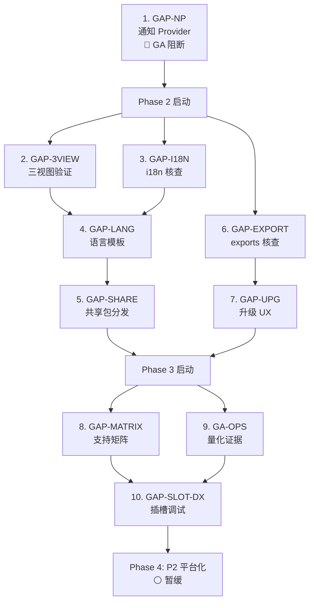

# Repo AI Governor 差距修复推荐执行顺序

- Status: draft
- Date: 2026-03-27
- Upstream: `.repo-ai-governor/draft/comprehensive-requirements-gap-analysis.md`

---

## 速查表

| 顺序 | Gap ID | 描述 | 工作量 | GA 影响 |
|---|---|---|---|---|
| 1 | GAP-NP | 通知渠道 Provider 实装 | 中 | **硬阻断** |
| 2 | GAP-3VIEW | Standards Pack 三视图端到端验证 | 小 | P1 |
| 3 | GAP-I18N | i18n 键集覆盖度核查 | 小-中 | P1 |
| 4 | GAP-LANG | 多编程语言治理模板 | 中 | P1 |
| 5 | GAP-SHARE | 团队共享规范包分发路径 | 小 | P1 |
| 6 | GAP-EXPORT | package.json exports 核查 | 小 | P1 |
| 7 | GAP-UPG | upgrade/workspace UX 打磨 | 中 | P1 |
| 8 | GAP-MATRIX | 正式支持矩阵文档 | 小 | GA 证据 |
| 9 | GA-OPS | GA Readiness 量化证据沉淀 | 中 | GA 证据 |
| 10 | GAP-SLOT-DX | 插槽调试 DX 增强 | 小 | 可推迟 |
| 11-15 | P2 | Desktop/可视化/云端/市场/组织审计 | 大 | P2 暂缓 |

---

## Phase 1：关闭 GA 硬阻断（最高优先级）

### 1. GAP-NP：实装通知渠道 Provider

- PRD 依据：§8.6 #5, §10.2 #8
- 目标：
  1. 新增 `packages/notification-providers/webhook/` 作为主渠道
  2. 新增 `packages/notification-providers/email/`（或等效）作为备渠道
  3. 接入 `notification-dispatcher` 的 provider 契约
  4. 完成 1 主 1 备 HITL rehearsal 验证
- 排序理由：PRD §10.2 #8 要求"至少 1 主 1 备 HITL 通知渠道 rehearsal 通过"，当前 `notification-providers/` 目录不存在，是唯一的 GA 硬阻断项。不关闭它，所有 HITL 生产场景都停留在"协议演示"层。
- Exit Criteria：
  1. webhook provider 可实际接收 HITL 通知并返回回执
  2. email（或等效备选）provider 在主渠道失败时可降级接管
  3. rehearsal 记录写入审计事件

---

## Phase 2：P1 产品化缺口收口

### 2. GAP-3VIEW：Standards Pack 三视图端到端验证

- PRD 依据：§8.3 #7-8
- 目标：
  1. 补写 E2E 测试覆盖 pack → rule-renderer → agents-projector → AGENTS.md 投影链路
  2. 确认当前 `AGENTS.md` 是由 projector 自动渲染还是手工维护
- 排序理由：验证成本低，但不验证就无法确认"单一事实源→三视图"核心承诺是否落实。应在深化其他功能前先确认基础链路闭环。
- Exit Criteria：E2E 测试通过，AGENTS.md 渲染来源明确

### 3. GAP-I18N：i18n 键集覆盖度核查

- PRD 依据：§8.8 #3, §8.9.1 #6
- 目标：
  1. 核查 `zh-CN/en` 两套资源的语义键完整性
  2. 补缺失翻译键，确保 CLI 文案已完全 i18n 化
  3. 确认 key parity gate 可正确阻断缺失键
- 排序理由：不影响架构，影响非中文用户的实际使用体验；key parity gate 已存在，补齐成本可控。
- Exit Criteria：parity gate 通过，CLI 所有用户可见文案均由 i18n 键驱动

### 4. GAP-LANG：多编程语言治理模板

- PRD 依据：§8.8 #1
- 目标：
  1. 至少补齐 Python 和 Go 的最小治理模板示例
  2. 包含语言特定的代码规范、测试策略、lint 工具链
  3. 放在 `examples/` 或 `packages/standards` 中作为语言模板扩展
- 排序理由：PRD 明确列出 TypeScript/Python/Go/Java/Rust 支持需求，当前仅 TypeScript 成熟。Python 和 Go 是最常见的第二/第三语言，优先覆盖 ROI 最高。
- Exit Criteria：至少 2 种非 TypeScript 语言有可用的最小治理模板

### 5. GAP-SHARE：团队共享规范包分发路径

- PRD 依据：§8.3 #9
- 目标：
  1. 明确官方/团队/仓库三层来源的外部消费路径
  2. 补充文档说明团队如何发布和使用共享 pack
  3. 提供最小示例
- 排序理由：架构已支持 `merge_precedence`，但外部团队如何实际消费仍缺产品化路径。主要是文档和示例工作，成本低。
- Exit Criteria：有清晰的团队共享 pack 发布/消费流程文档和示例

### 6. GAP-EXPORT：package.json exports 系统性核查

- PRD 依据：架构 §6.2
- 目标：
  1. 逐包核查 6 个 public 包的 `exports` 字段
  2. 确保覆盖全部公开 API 入口，阻止深层路径隐式导出
- 排序理由：防止外部消费方通过深层路径 import，包重构后静默破坏。一次性工作量小，防御价值高。
- Exit Criteria：6 个 public 包均有完整 exports 声明

### 7. GAP-UPG：upgrade/workspace lifecycle UX 打磨

- PRD 依据：§8.10.1
- 目标：
  1. 优化 `upgrade` 命令的 schema diff → 冲突分级 → 确认 → 回滚 体验
  2. 优化 workspace migration 的 dry-run → execute → rollback 体验
  3. 补充 adopter 级操作文档和 troubleshooting
- 排序理由：服务层能力（`UpgradeSchemaDiffService`、`WorkspaceMigrationService`）已有，缺的是"adopter 能不能照着操作"的最后一步。放在 Phase 2 后段，因为前面几项成本更低、收益更确定。
- Exit Criteria：adopter 能清晰知道"升级会改什么、为什么阻断、怎么回滚"

---

## Phase 3：GA 运营证据沉淀

### 8. GAP-MATRIX：正式支持矩阵文档

- PRD 依据：§10.2 #10
- 目标：
  1. 声明正式支持的安装模式（path/link/tgz/dist）
  2. 声明正式支持的适配器（Codex/Copilot/Claude Code/local-model）
  3. 声明正式支持的 IDE surface
  4. 附 clean-room smoke 记录
- Exit Criteria：正式支持矩阵文档发布 + 矩阵内 smoke 通过

### 9. GA-OPS：GA Readiness §10.2 量化证据

- PRD 依据：§10.2 全文
- 目标：
  1. clean-room 两种安装模式各连续 3 次通过
  2. 黑盒路径矩阵 100% 通过
  3. 至少 1 条无人值守链路连续 3 次 rehearsal 通过
  4. 运营指标快照（接入耗时/违规率/成功率/回滚率/介入率）
  5. 受控 delivery rehearsal 通过并显式记录自动推送/发 PR 边界
- Exit Criteria：§10.2 所有条目有正式证据记录

### 10. GAP-SLOT-DX：插槽调试 DX 增强

- PRD 依据：§8.4 #5
- 目标：面向开发者的插槽调试与测试工具链
- 排序理由：可推迟到下轮迭代，当前插槽 v1 功能已完整
- Exit Criteria：开发者可通过 CLI 或工具链调试和验证自定义插槽

---

## Phase 4：P2 平台化（暂缓）

以下任务在 Phase 1-3 全部完成前**不建议启动**：

| 顺序 | Gap ID | 描述 | 前置条件 |
|---|---|---|---|
| 11 | GAP-DESKTOP | Desktop Client 实装 | sidecar + IPC 已完备，可作为 P2 首个切入点 |
| 12 | GAP-VISUAL | 可视化配置与执行面板 | 需求设计未展开 |
| 13 | GAP-CLOUD | 云端同步与策略分发 | 需组织级架构设计 |
| 14 | GAP-MARKET | 插槽市场/共享机制 | 需插槽生态形成后再建设 |
| 15 | GAP-ORG | 组织级审计与指标看板 | 需试点仓库运营数据积累 |

> [!IMPORTANT]
> **核心原则**：P0/P1 外部产品化缺口关闭前，P2 和内部治理深化均暂缓。当前最大风险不是能力不足，而是继续在内部治理上投入导致"内部很强、外部难用"的偏差进一步扩大。

---

## 依赖关系图

