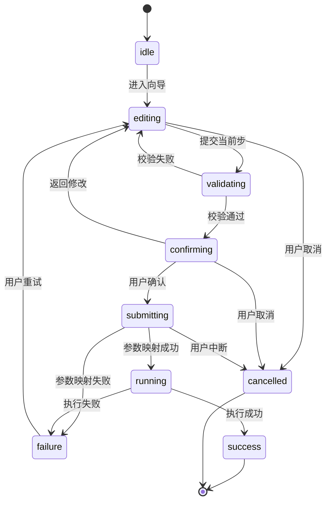

# Repo AI Governor React 风格交互式 CLI 技术实施方案（Draft）

- Status: draft
- Date: 2026-03-28
- Scope: CLI UX / guided configuration / React-style interactive shell
- Related:
  - `.repo-ai-governor/draft/interactive-cli-point-and-type-solution-survey.md`
  - `.repo-ai-governor/draft/interactive-cli-l3-deep-mouse-tui-technical-solution.md`
  - `apps/cli/src/main.ts`
  - `apps/cli/src/cli-governance-runtime.ts`
  - `apps/cli/src/commands/init-command.ts`
  - `apps/cli/src/commands/connect-command.ts`
  - `apps/cli/src/commands/workspace-command.ts`
  - `apps/cli/src/commands/upgrade-command.ts`

## 1. 目标

在保留现有 CLI 自动化契约（`pretty/plain/json`、`--no-interactive`）和现有命令语义的前提下，为配置类命令提供一层 React 风格的交互式壳层。

预期目标：

1. 让 `init/connect/workspace/upgrade` 的首次配置与日常调整更易理解、更低心智负担。
2. 将现有“prompt 零散分布在命令内部”的实现收敛为统一的交互会话层。
3. 保持现有 `CliGovernanceRuntime`、输出 presenter、命令参数契约可复用，不重写领域逻辑。
4. 以渐进方式演进默认交互入口，先实验、后局部默认、再决定是否扩大覆盖面。

## 2. 非目标

1. 不在首阶段引入深度鼠标事件、滚轮拖拽、alternate screen 全屏应用式 TUI。
2. 不改变现有命令语义、退出码和 `json/plain` 输出 schema。
3. 不把治理 runtime、参数解析和副作用执行逻辑迁入 React 组件。
4. 不在首阶段引入跨语言 UI 子系统。

## 3. 为什么选这条路线

相较于直接进入 L3 深度 TUI，React 风格 CLI 更适合本仓库当前阶段。

1. 当前最紧迫的问题是“让配置更人性化”，而不是立刻构建一个全屏终端应用。
2. 本仓库已经是 Node.js + TypeScript CLI，`Ink + @inkjs/ui` 与现有命令入口和 runtime 的桥接成本最低。
3. 与深度 TUI 相比，React 风格 CLI 对终端协议、鼠标兼容、raw mode 清理和跨平台差异的风险更低。
4. 组件化视图、状态管理和测试模型更适合把交互层逐步规范化，而不是继续让问答逻辑散落在多个命令里。

## 3.1 当前是否支持流程定制

结论是：底层支持已经存在，但用户侧还没有“足够好用”的定制入口。

1. `packages/core-process` 已经提供 `ProcessDslDefinition`、`ProcessNodeType`、`ProcessCompiler` 和 `compiled-ir` 落盘能力。
2. 现有编排内核已经支持 `Sequential / Parallel / Loop / Condition` 这类节点模型，且 Loop 限制也已在 DSL 层表达。
3. CLI 侧的现状更像“内置固定流程 + 程序化 assembly”，而不是“面向用户的流程编辑器”。
4. 所以更准确地说，当前工具具备流程定制的技术基础，但还不算支持了成熟的、交互友好的流程定制产品能力。

这也是为什么 React 风格 CLI 方案要把“流程定制”作为独立能力，而不是继续塞进零散问答。

## 4. 总体架构

采用“命令入口 + React 交互壳层 + 命令桥接 + 现有 runtime”分层。

1. `CLI Command Entry`
   - 仍由 Commander 命令入口负责解析参数、TTY 条件和输出模式。
2. `ReactCliShell`
   - 负责渲染向导布局、表单控件、步骤导航、帮助提示和运行状态。
3. `ReactCliSessionController`
   - 负责会话状态机、表单校验、步骤推进、取消/返回、提交与重试。
4. `ReactCliCommandBridge`
   - 负责将表单值映射为现有命令参数，并调用 `CliGovernanceRuntime` 或既有命令执行路径。
5. `CliGovernanceRuntime / existing presenters`
   - 继续负责业务执行、检查结果、治理规则和最终输出塑形。

关键原则：

1. React 层只拥有交互状态，不拥有业务真相。
2. 命令逻辑继续以现有 runtime 和 command service 为准。
3. 交互壳层失败时，必须可自动回退到当前 classic prompt CLI。

## 5. 交互模式决策与启用规则

建议引入统一的 UI 模式判定，而不是让每个命令自行决定。

建议的模式集合：

1. `none`
2. `classic`
3. `react`
4. `tui`

建议的优先级：

1. `--no-interactive` 时，强制解析为 `none`。
2. 非 TTY 或 `--output json/plain` 时，强制解析为 `none`。
3. `--ui react` 时，显式启用 React 风格 CLI。
4. `--ui tui` 时，仅在后续 L3 能力存在时启用；否则报出可诊断错误并回退。
5. 未显式指定时，先保持 `classic` 作为默认；待 `init` 路径稳定后，再将 `init` 的默认交互升级为 `react`。

这意味着首阶段不是“一上来把所有交互都切 React”，而是：

1. 先以 `--ui react` 做实验入口。
2. `init` 稳定后切为 TTY + pretty 下默认。
3. 再视效果扩展到 `connect/workspace/upgrade`。

## 5.1 现成枚举与常量复用

不要在新方案里再造一套平行常量。

1. 命令名建议直接复用 `apps/cli/src/constants/cli-command.constant.ts` 里的 `CliCommandName`。
2. 工作区模式建议继续复用 `packages/shared/src/constants/workspace-mode.constant.ts` 里的 `WorkspaceMode`。
3. 语言与本地化相关值继续复用 `packages/shared/src/constants/i18n.constant.ts` 里的 `Locale`、`DEFAULT_I18N_LOCALE` 和 `DEFAULT_I18N_FALLBACK_LOCALE`。
4. React CLI 自己新增的闭合集，也应采用 enum/constant 集中管理，而不是在多个组件里散落字符串字面量。
5. `workflow` 如果进入正式落地，必须先扩展 `CliCommandName.WORKFLOW`，同步更新 `CLI_COMMAND_DEFINITIONS`，并在 Commander 命令树里注册对应子命令；不要把它做成隐藏字符串分支。

## 6. 输出与流控制契约

这是实现中最关键的边界之一。

1. React 交互壳层渲染到 `stderr`。
2. 现有命令最终结果继续走既有 presenter 路径，避免破坏脚本消费预期。
3. 若某条命令在交互完成后仍需输出最终 summary，应先 teardown React shell，再交给现有 presenter 输出。
4. `json/plain` 模式下不允许 React shell 抢占终端，避免破坏机器可读输出。

这样做的原因是：即使未来某些本地集成或包装脚本在 TTY 中调用 CLI，也不会因为 UI 渲染污染既有结果通道。

## 6.1 界面美观与人性化原则

React 风格 CLI 的目标不是“把信息堆在屏幕上”，而是让用户一眼知道下一步该做什么。

建议的视觉原则：

1. 重要操作只保留一个主按钮，减少分心。
2. 标题、步骤、当前状态、错误提示要层次分明。
3. 说明文案优先短句，尽量让每一屏只表达一个决策点。
4. 成功、警告、错误信息要有稳定的颜色语义和位置语义。
5. 默认布局留白要够，避免把终端做成“密集表格噪音”。

建议的人性化原则：

1. 每一步都给出“为什么要做这一步”。
2. 允许随时返回、跳过或取消，而不是强制用户一次性做完。
3. 对常见项提供默认值，对高风险项提供确认层。
4. 对输入错误提供局部修正，不要一次失败后整段重填。
5. 对新用户优先展示简单模式，对高级用户再开放更多细节。

## 6.2 从相似工具借鉴的实现细节

结合官方资料对标，React 风格 CLI 这条路线是成立的，但要把几件事先固化：

1. `Ink` 官方 README 明确支持 `useInput`、`useFocus`、`useFocusManager`、`useStdin`、`useStdout`、`useStderr`，并提供 `ink-testing-library` 作为主要测试入口。
2. `Ink` 还支持 React Devtools 和 `isScreenReaderEnabled`，说明可测试性、可观测性和可访问性都应该是方案的一部分，而不是后补项。
3. `@inkjs/ui` 已经覆盖 `TextInput`、`PasswordInput`、`ConfirmInput`、`Select`、`MultiSelect` 等大多数配置向导控件，因此 M1/M2 不应自己重造一套控件系统。
4. `Inquirer` 和 `huh` 这类成熟 prompt/form 工具的共同点，是每一步都尽量短、明确、可回退，并支持主题化或可访问性降级，这一点应直接映射到 React CLI 的文案与布局原则。
5. `Textual` 的 command palette、ListView、widgets 和 mouse docs 说明：一旦进入“图形化流程编辑”阶段，交互复杂度会迅速提升，因此 `workflow` 在当前阶段应保持“向导 + 预览 + 轻编辑”，不要直接做拖拽式图编辑器。
6. `Bubble Tea` / `Huh` 的 form 生态说明，表单化流程很适合做动态依赖字段，但也应该优先用模板和动态字段控制复杂度，而不是一上来把所有节点都暴露成自由编辑图。

换句话说，这个方案正确的方向不是“做一个很大很炫的 CLI”，而是“做一个稳定、可测、可访问、可渐进扩展的向导式交互层”。

## 6.3 工程落地约束

这些约束不是实现细节，而是首轮落地必须写进方案的边界。

1. `apps/cli` 继续保持当前 ESM 组织方式，React CLI 相关文件也沿用同一套 `.js` 导入约定；如果选用的 `Ink` 版本有 ESM-only 要求，应在方案阶段明确锁定。
2. `react-cli-runner.ts` 负责完整生命周期管理：`render()`、`unmount()`、`waitUntilExit()`、`SIGINT` 清理和 classic fallback 切换，避免 raw mode 残留。
3. React UI 渲染必须定向到 `stderr`，不要污染 `stdout` 上的 machine output；实现上应在 runner 中显式指定渲染流。
4. React CLI 的标题、步骤、错误、按钮文案应通过现有 i18n runtime 或等价 adapter 注入，默认复用 `Locale` / `DEFAULT_I18N_LOCALE` / `DEFAULT_I18N_FALLBACK_LOCALE`，不要在组件里硬编码多语言文案。
5. 首阶段只支持同步校验；若某字段需要远程检查或耗时探测，先作为 M2 增强项，并在 UX 上明确显示校验中状态与失败回退。
6. React shell 的默认主题和可访问性支持应从第一天开始考虑，至少保证颜色语义、焦点语义和 screen reader 兼容性都在方案里有位置。

## 7. 技术选型

## 7.1 主实现

1. `Ink`
2. `@inkjs/ui`

选择理由：

1. `Ink` 提供 React 组件化 CLI 渲染模型、Flexbox/Yoga 布局、输入 hooks 和 testing 友好的心智。
2. `@inkjs/ui` 已经提供 `TextInput`、`PasswordInput`、`Select`、`MultiSelect` 等足够支撑配置向导的组件。
3. 两者都与当前 Node/TS 仓库形态天然兼容，不需要引入跨语言进程桥接。

## 7.2 不在首阶段引入的能力

1. 深度鼠标事件模型
2. alternate screen 全屏应用
3. 复杂 panel drag/resize
4. 跨语言 UI 进程

## 8. 模块与目录设计（建议）

```text
apps/cli/src/react-cli/
  app/
    react-cli-app.tsx
    react-cli-runner.ts
  session/
    react-cli-session-controller.ts
    react-cli-form-schema-registry.ts
  bridge/
    react-cli-command-bridge.ts
    react-cli-command-form-mapper.ts
    react-cli-command-descriptor-registry.ts
  views/
    layout-shell.tsx
    stepper-panel.tsx
    form-panel.tsx
    help-panel.tsx
    result-panel.tsx
    footer-shortcuts.tsx
  i18n/
    react-cli-i18n-adapter.ts
  hooks/
    use-cli-shortcuts.ts
    use-command-runner.ts
  state/
    react-cli-view-model.interface.ts
    react-cli-state-reducer.ts
    react-cli-state-store.ts
  constants/
    cli-ui-mode.constant.ts
    react-cli-step.constant.ts
  types/
    interfaces/*.interface.ts
    aliases/*.type.ts
```

约束：

1. `bridge/session/state` 保持非组件化、可单测。
2. `views/**` 只负责渲染和输入事件转发。
3. 有副作用的流程控制不直接写进组件。

## 9. 核心运行模型

React 风格 CLI 不等于“把命令封成几个组件”，而是要显式定义会话状态机。

建议状态：

1. `idle`
2. `editing`
3. `validating`
4. `confirming`
5. `submitting`
6. `running`
7. `success`
8. `failure`
9. `cancelled`

建议每个命令都通过统一 descriptor 声明：

1. 命令标题与帮助文案
2. 交互步骤
3. 表单字段与验证规则
4. 提交前确认策略
5. 表单值到 CLI 参数的映射规则
6. 成功/失败结果的展示方式

建议用 enum 集中管理所有闭合集，避免在 descriptor 和 view model 中直接散落字符串字面量：

1. `ReactCliUiMode`
2. `ReactCliCommandStepId`
3. `ReactCliFieldKind`
4. `ReactCliRunState`
5. `ReactCliValidationSeverity`
6. `ReactCliResultKind`
7. `ReactCliFieldDependencyMode`

状态流转建议：



## 10. 关键接口草图（Draft）

```ts
export enum ReactCliUiMode {
  NONE = 'none',
  CLASSIC = 'classic',
  REACT = 'react',
  TUI = 'tui',
}

export enum ReactCliFieldKind {
  TEXT = 'text',
  PASSWORD = 'password',
  SELECT = 'select',
  MULTI_SELECT = 'multi_select',
  CONFIRM = 'confirm',
}

export enum ReactCliRunState {
  IDLE = 'idle',
  EDITING = 'editing',
  VALIDATING = 'validating',
  CONFIRMING = 'confirming',
  SUBMITTING = 'submitting',
  RUNNING = 'running',
  SUCCESS = 'success',
  FAILURE = 'failure',
  CANCELLED = 'cancelled',
}

export enum ReactCliValidationSeverity {
  ERROR = 'error',
  WARNING = 'warning',
}

export enum ReactCliFieldDependencyMode {
  ALL = 'all',
  ANY = 'any',
}

export interface ReactCliFieldOption {
  label: string;
  value: string;
  description?: string;
  disabled?: boolean;
}

export interface ReactCliValidationContext {
  values: Record<string, string | boolean | string[]>;
  locale: Locale;
}

export interface ReactCliValidationRule {
  id: string;
  severity: ReactCliValidationSeverity;
  message: string;
  validate: (
    value: string | boolean | string[] | undefined,
    context: ReactCliValidationContext,
  ) => boolean | Promise<boolean>;
}

export interface ReactCliCommandDescriptor {
  commandName: CliCommandName;
  title: string;
  summary: string;
  steps: ReactCliStepDescriptor[];
  confirmBeforeSubmit: boolean;
}

export interface ReactCliStepDescriptor {
  id: string;
  title: string;
  fields: ReactCliFormField[];
}

export interface ReactCliFormField {
  id: string;
  kind: ReactCliFieldKind;
  label: string;
  required: boolean;
  defaultValue?: string | boolean | string[];
  placeholder?: string;
  helpText?: string;
  options?: ReactCliFieldOption[];
  validationRules?: ReactCliValidationRule[];
  dependsOn?: string[];
  visibleWhen?: {
    mode: ReactCliFieldDependencyMode;
    fieldIds: string[];
    value?: string | boolean | string[];
  };
}
```

```ts
export interface ReactCliViewModel {
  commandName: CliCommandName;
  stepIndex: number;
  totalSteps: number;
  currentStepTitle: string;
  runState: ReactCliRunState;
  formValues: Record<string, string | boolean | string[]>;
  validationErrors: Record<string, string>;
  logs: string[];
}
```

## 11. 命令覆盖优先级

建议按“对新用户价值最高、风险最低”的顺序推进。

1. `init`
2. `connect`
3. `workspace`
4. `upgrade`
5. `verify` / `doctor`（如后续需要更强的检查可视化）

原因：

1. `init` 最符合向导式交互。
2. `connect/workspace` 表单化收益高，且更接近“配置体验”主问题。
3. `upgrade` 有更高风险，需要确认层和回滚提示更成熟后再切默认。

## 11.1 流程定制入口

如果把“流程定制”也纳入 React CLI，建议它不是一个附属开关，而是单独入口。

建议增加一个独立命令族，且在命令级别完成显式注册：

1. `workflow`：面向用户配置流程骨架、角色、节点顺序和条件路由。
2. `workflow init`：创建默认模板。
3. `workflow edit`：编辑已有流程。
4. `workflow preview`：预览执行图和节点摘要。
5. 如果 `workflow` 成为正式命令 surface，必须扩展 `CliCommandName.WORKFLOW`、同步更新 `CLI_COMMAND_DEFINITIONS`，并按 Commander 的子命令树注册 `workflow init/edit/preview`。

这样做比把流程编辑塞进 `init` 更合理，因为：

1. 初始化配置和流程定制是两类不同决策。
2. 初始化更关注 workspace、locale、adapter、默认开关。
3. 流程定制更关注编排图、角色、节点类型、条件分支和风险确认。

## 11.2 `workflow` 命令的交互草图

`workflow` 更像一个“流程设计向导”，而不是普通配置页。

建议的首屏：

```text
┌─────────────────────────────────────────────────────────────────────┐
│ Workflow Designer                                                   │
│ Create, preview, or edit a process definition for this workspace    │
├───────────────────────────────┬─────────────────────────────────────┤
│ 1. Template                   │ Workflow summary                    │
│ 2. Roles                      │ • Process ID: repo-guided-flow      │
│ 3. Nodes                      │ • Nodes: Sequential → Parallel →    │
│ 4. Conditions                 │   Loop → Condition                  │
│ 5. Review & Save              │ • Guardrails: Loop maxCycles /      │
│                               │   maxWallTimeSeconds                │
│                               │                                     │
│ [Create] [Preview] [Cancel]   │ Status: editable                    │
└───────────────────────────────┴─────────────────────────────────────┘
```

建议交互流程：

1. 进入 `workflow` 后，先选择动作。
   - `create`
   - `edit`
   - `preview`
2. 如果是 `create`，先选模板。
   - `sequential-baseline`
   - `parallel-review`
   - `loop-guarded`
   - `condition-route`
3. 再进入节点编辑。
   - 为每个节点选择 `ProcessNodeType`
   - 填写 `stageId` / `routeKey` / `roleProfileId`
   - Loop 节点强制补 `maxCycles` 和 `maxWallTimeSeconds`
4. 再进入条件与连线编辑。
   - 从节点列表中选 `fromNodeId`
   - 再选 `toNodeId`
   - 若是 `CONDITION`，选择 `conditionKey`
5. 最后预览 compiled IR 概要，再保存到 workspace 配置文件。

建议的预览方式：

```text
Template: loop-guarded
Process ID: repo-guided-flow
Entry node: node-planner

node-planner [SEQUENTIAL] ---> node-execute [PARALLEL] ---> node-review [LOOP]
                                                        ↘ condition: retry

Loop limits:
  maxCycles = 3
  maxWallTimeSeconds = 900
```

这类草图的目标是让用户先看到“流程长什么样”，再谈“要不要改”，避免一上来就是密密麻麻的 JSON/YAML 表单。

## 11.3 方案审视结论

对比官方资料后，这份方案有三点可以保留：

1. `Ink + @inkjs/ui` 作为 React 风格 CLI 底座是正确的，和官方推荐的组件化、可测试、可访问心智一致。
2. 把 `init/connect/workspace/upgrade` 收敛到统一 session/bridge 层是合理的，能避免 prompt 逻辑继续碎片化。
3. `workflow` 先做模板、预览、轻编辑，再扩展到完整编辑器，是更符合成熟 prompt/form 工具演进规律的。

但也有三点要收紧：

1. 不要把 `workflow` 过早做成“全功能图编辑器”，那会滑向另一个 L3 TUI 项目。
2. 不要低估可测试性和可访问性，应该把 `ink-testing-library`、screen reader support 和主题化当成首批需求。
3. 不要把默认体验做得太重，简单配置应该优先短路径完成，复杂配置再进入 `workflow`。

## 12. 界面模型（建议）

首阶段不追求全屏应用感，优先做“稳定、清晰、低风险”的向导式布局。

建议布局：

1. 顶部：命令标题与当前步骤
2. 中区左侧：步骤导航或概要列表
3. 中区右侧：表单与说明文案
4. 底部：快捷键提示、状态提示、错误摘要

建议的视觉风格：

1. 用简洁的卡片式区块，而不是把内容铺满整个终端。
2. 当前步骤高亮，其他步骤淡化。
3. 表单字段按“最常改的在前，最危险的在后”排序。
4. 错误提示贴近字段，避免只在底部抛一条泛化错误。
5. 对流程定制类页面，尽量增加图形化摘要，例如节点链、分段标签、条件分支提示。

建议键盘交互：

1. `Tab` / `Shift+Tab` 切换焦点
2. `Up/Down` 切换列表项
3. `Enter` 提交或进入下一步
4. `Esc` 返回上一步或打开取消确认
5. `Ctrl+C` 统一走可恢复中断路径

## 13. 默认切换策略

建议采用三段式切换，而不是一次性替换现有交互。

## M1（实验能力，最小可用）

目标：先把 React CLI 变成“可用的配置向导”，只验证路径，不追求面面俱到。

交付清单：

1. 新增 `--ui react`。
2. 建立 `react-cli` 目录骨架与会话状态机。
3. 仅接入 `init`，并保留 classic fallback。
4. 统一 `TTY + pretty + interactive` 启动条件。
5. 统一 `stderr` 渲染与最终 presenter 输出边界。
6. 复用 `CliCommandName`、`WorkspaceMode`、`Locale` 等既有枚举。
7. 让 `init` 支持最小向导：
   - workspace mode
   - default locale
   - fallback locale
   - interactive on/off

验收：

1. `init --ui react` 能在 TTY 中完成配置。
2. 非 TTY 和 `--no-interactive` 自动回退。
3. `pretty/plain/json` 输出契约无回归。
4. 现有 `init` classic 路径仍可用。

## M2（共享框架与只读预览）

目标：把配置向导从单点扩成可复用框架，并先让更多配置命令共享同一套交互壳层，同时把 `workflow` 先做成只读预览。

交付清单：

1. 抽出共享的 `CommandDescriptor` 注册表。
2. 抽出统一字段渲染器：
   - text
   - password
   - select
   - multi-select
   - confirm
3. 接入 `connect` 和 `workspace`。
4. 抽出统一帮助区、错误摘要、footer shortcuts。
5. 抽出统一的校验与步骤推进逻辑。
6. `init` 在 `TTY + pretty + interactive` 下默认走 `react`。
7. 新增 `workflow` 只读预览模式：
   - 模板选择
   - 流程摘要
   - compiled IR 预览

验收：

1. `init/connect/workspace` 共享同一壳层框架。
2. 交互步骤由 descriptor 驱动，不再散落在命令里。
3. `workflow preview` 能展示流程摘要，但还不改写流程文件。
4. 组件和状态机测试覆盖主路径。

## M3（流程定制编辑落地）

目标：把流程定制从“预览”推进到“可编辑、可保存、可验证”。

交付清单：

1. `workflow create` / `workflow edit` / `workflow preview` 三态完善。
2. 支持流程图节点编辑：
   - `Sequential`
   - `Parallel`
   - `Loop`
   - `Condition`
3. Loop 节点编辑时强制显示 `maxCycles` 与 `maxWallTimeSeconds`。
4. 支持连线与条件分支编辑。
5. 保存为 workspace 内可持久化的流程配置文件。
6. 引入流程图预览摘要，尽量减少直接读 JSON 的负担。
7. `connect/workspace` 默认切到 `react`，`upgrade` 保持显式启用。

验收：

1. `workflow edit` 可编辑并保存一份流程定义。
2. 保存后的流程能被编译器接受，并产出可预览的 compiled IR。
3. 新用户配置感知是“向导式的”，不是“被 JSON 吓到”。
4. 视觉布局、错误提示、回退路径都已成熟。

## 14. 测试策略

## 14.1 单元测试

1. descriptor 与 form mapper
2. session controller 状态流转
3. reducer 与校验逻辑
4. UI mode 解析优先级
5. enum/constant 复用检查
6. workflow template 和节点映射规则
7. 纯函数校验规则与异步校验分支
8. locale 文案解析与 i18n adapter

## 14.2 组件测试

1. 焦点切换
2. 表单提交
3. 错误提示与确认层显示
4. workflow 预览摘要渲染
5. `ink-testing-library` 的 `render()` / `lastFrame()` 断言
6. 受控输入在 `stderr` 上的渲染结果

## 14.3 集成测试

1. `TTY + pretty` 下 `--ui react` 正常启动
2. 非 TTY 自动回退
3. `--no-interactive` 优先级高于 `--ui react`
4. `--output json/plain` 下禁止进入 React CLI
5. `stderr` UI 渲染不破坏最终输出契约
6. `workflow preview` 不修改流程文件
7. `workflow edit` 保存后可被编译器接受
8. 通过子进程 `spawn` 捕获 stdout/stderr，验证 shell 不污染 machine output
9. `SIGINT` 和 `Ctrl+C` 后终端能恢复正常模式

## 14.4 黑盒回归

1. `init` 完整向导流
2. `connect` 表单流
3. 失败、取消、重试路径
4. `workflow create/edit/preview` 三态流

## 15. 风险与回退策略

主要风险：

1. React 组件层与命令桥接层边界模糊，导致业务逻辑回流到组件树。
2. UI 渲染与现有输出 presenter 冲突，造成流污染。
3. 会话状态机设计不当，导致 back/cancel/retry 行为复杂化。
4. 交互壳层覆盖过快，导致高风险命令的默认体验不稳定。
5. 流程定制入口过早暴露高级图编辑能力，导致初学者迷路。

回退策略：

1. 保留 `classic` 交互路径作为稳定后备。
2. 全局保留 `--no-interactive` 与 `json/plain` 机器路径。
3. React shell 启动失败时自动回退 classic prompt，并输出可诊断错误。
4. 默认切换只先发生在 `init`，不同时覆盖所有配置命令。
5. 流程定制先以模板向导模式落地，再逐步开放高级编辑。

## 16. 里程碑与验收

## 16.1 M1（4-6 天）

1. 完成 `--ui react`
2. 完成 `init` React shell
3. 跑通基本状态机、校验与提交

验收：

1. `init --ui react` 可在 TTY 中完成完整配置
2. 非 TTY 与 `--no-interactive` 路径无回归
3. 现有输出契约测试保持通过

## 16.2 M2（5-7 天）

1. 接入 `connect/workspace`
2. 补齐帮助区、错误摘要、统一 footer shortcuts
3. 补强测试基线
4. `workflow preview` 只读预览落地

验收：

1. 三个命令共享统一交互壳层
2. 表单字段和校验由 descriptor 驱动，不再散落在命令内部
3. `workflow preview` 能展示流程摘要但不写文件
4. `pnpm run check` 全绿

## 16.3 M3（5-7 天）

1. `workflow create/edit` 完整落地
2. 完善取消/返回/重试语义
3. 给 `upgrade` 做显式启用版 PoC
4. `connect/workspace` 默认切到 React

验收：

1. 新用户默认配置体验稳定
2. 现有自动化场景零回归
3. 是否进入深度 TUI 路线有明确验证结论
4. `workflow edit` 可被编译器接受并保存

## 17. 任务拆解建议（可映射 TK）

| TK | Phase | 交付目标 | 核心产出 | 验收点 |
|---|---|---|---|---|
| TK-RC-001 | M1 | UI mode 解析与 `--ui react` 实验入口 | `cli-ui-mode` 解析器、`react` 启动分支、classic fallback | `init --ui react` 能进 React shell；`--no-interactive` / 非 TTY 自动回退 |
| TK-RC-002 | M1 | React CLI shell 与 session controller 基线 | `react-cli` 目录骨架、状态机、基础布局、footer shortcuts | 能完成一个最小向导闭环，且不污染现有输出 |
| TK-RC-003 | M1 | `init` descriptor / form mapper / bridge 接入 | `init` 的 descriptor、字段校验、值映射、桥接层 | 可完成 workspace / locale / interactive 的最小配置写回 |
| TK-RC-004 | M2 | `connect/workspace` descriptor 化改造 | 共享 descriptor registry、字段渲染器、步骤推进器 | `connect`、`workspace` 共享同一套壳层和校验逻辑 |
| TK-RC-005 | M2 | 输出流与 presenter 契约回归测试 | `stderr` 渲染边界测试、`pretty/plain/json` 回归 | 新 UI 不影响 machine output；现有 contract tests 继续绿 |
| TK-RC-006 | M2 | `init` 默认切换与 classic fallback 策略 | 默认路由判定、fallback 机制、错误提示文案 | TTY + pretty + interactive 下 `init` 默认走 React；失败自动回 classic |
| TK-RC-007 | M3 | `workflow` 注册与流程定制 PoC | `CliCommandName.WORKFLOW`、Commander 子命令树、`upgrade` 显式 React shell、`workflow preview/edit` PoC | `workflow preview` 可看见流程结构；`upgrade` 仍保持显式开启 |

## 17.1 子任务清单

### TK-RC-001

1. 增加 `--ui` 参数解析与枚举常量。
2. 新增 UI 模式判定函数，统一处理 `none/classic/react/tui` 优先级。
3. 接入 `TTY + pretty + interactive` gating。
4. 给 `init` 增加 React 启动分支与 classic fallback。
5. 补集成测试，覆盖 `--no-interactive` 与非 TTY 回退。

### TK-RC-002

1. 创建 `apps/cli/src/react-cli/` 目录骨架。
2. 搭建 React shell 的最小布局和 footer shortcuts。
3. 实现会话状态机骨架和 reducer。
4. 把命令描述注册表接入 shell。
5. 补一条最小向导闭环的组件测试和状态测试。

### TK-RC-003

1. 设计 `init` descriptor，声明 workspace / locale / interactive 字段。
2. 实现字段到 CLI 参数的映射器。
3. 复用现有 `WorkspaceMode` 与 `Locale` 常量。
4. 将 `init` 写回逻辑接到现有 config 生成路径。
5. 补 `init` 向导的回归测试，确认生成配置可被后续命令消费。

### TK-RC-004

1. 抽象共享 `CommandDescriptor` 注册机制。
2. 统一实现 text/password/select/multi-select/confirm 渲染器。
3. 接入 `connect` 与 `workspace` 的命令描述。
4. 抽出统一的步骤推进与返回逻辑。
5. 补 `connect/workspace` 共享壳层的组件测试与集成测试。

### TK-RC-005

1. 确定 React shell 只渲染到 `stderr`。
2. 固化 `pretty/plain/json` 的输出边界测试。
3. 补 `stderr` 不污染 stdout 的契约测试。
4. 加入 React shell 失败回退的错误路径测试。
5. 验证现有 `init/connect/workspace` 的 classic 路径仍全绿。

### TK-RC-006

1. 定义 `init` 的默认切换条件。
2. 确认 `TTY + pretty + interactive` 的默认路由。
3. 补 fallback 提示文案与退出策略。
4. 把 `init` 的 React 路径设为默认后，做一次现有 prompt 路径保底测试。
5. 补一轮用户可见性验证，确认默认切换不会破坏新手理解。

### TK-RC-007

1. 设计 `workflow` 命令基础入口和动作选择页。
2. 在 `CliCommandName` 中新增 `WORKFLOW`，并把 Commander 子命令树注册为 `workflow init/edit/preview`。
3. 实现 `workflow preview` 只读草图，展示模板、节点和 Loop 约束。
4. 实现 `workflow edit` 的最小节点编辑闭环。
5. 把 `Sequential / Parallel / Loop / Condition` 节点映射到现有 DSL。
6. 给 `upgrade` 做显式 React shell PoC，验证高风险动作的确认层。
7. 补流程预览和保存后的编译器接受性测试。

## 17.2 M1 / M2 / M3 执行顺序表

| 顺序 | 里程碑 | 先做什么 | 后做什么 | 依赖关系 | 目的 |
|---|---|---|---|---|---|
| 1 | M1 | `--ui react` 解析 + UI mode gating | React shell 骨架 + classic fallback | 依赖现有 `main.ts` 输出模式与 `init` 命令入口 | 先跑通实验入口，不碰其他命令 |
| 2 | M1 | `init` descriptor 与字段映射 | `init` 写回配置与回归测试 | 依赖 `WorkspaceMode` / `Locale` 常量与现有 config 生成路径 | 把最常用配置场景做成最小闭环 |
| 3 | M1 | shell 状态机与 stderr 边界 | 组件测试与输出契约测试 | 依赖 `ReactCliSessionController` 与 presenter 分层 | 确保界面和机器输出不互相污染 |
| 4 | M2 | 共享 descriptor registry | `connect/workspace` 接入 | 依赖 M1 的 shell、mapper、fallback 模式 | 让更多配置命令复用同一套壳层 |
| 5 | M2 | 统一 help / error / footer 体验 | `init` 默认切换策略 | 依赖 `connect/workspace` 共享框架已稳定 | 让默认体验更人性化，但仍可回退 |
| 6 | M2 | `workflow preview` 只读草图 | 流程摘要和 compiled IR 预览 | 依赖 `ProcessDslDefinition` / `ProcessCompiler` / 现有 DSL 内核 | 先让用户“看懂流程”，再考虑编辑 |
| 7 | M3 | `workflow create/edit` | 节点、连线、条件分支编辑 | 依赖 `workflow preview` 和流程模板机制 | 将流程定制从预览推进到可编辑 |
| 8 | M3 | Loop guardrail 编辑 | 保存与编译器接受性测试 | 依赖 `ProcessNodeType` 和 Loop 规则 | 把风险最高的流程能力先守住 |
| 9 | M3 | `upgrade` 显式 React PoC | 默认扩面评估 | 依赖前面所有交互稳定性结果 | 只在验证成熟后再考虑更高风险命令 |

## 17.3 Checklist 风格落地清单

- [ ] M1-1：实现 `--ui react` 和 UI mode gating
- [ ] M1-2：搭建 React shell 骨架与 session controller
- [ ] M1-3：接入 `init` 的 descriptor、字段映射与回写
- [ ] M1-4：补齐 `init` 的 classic fallback 和输出契约测试
- [ ] M2-1：抽出共享 descriptor registry 和字段渲染器
- [ ] M2-2：接入 `connect/workspace` 并统一帮助区、错误区、footer
- [ ] M2-3：让 `init` 在 TTY + pretty + interactive 下默认走 React
- [ ] M2-4：实现 `workflow preview` 只读流程摘要
- [ ] M3-1：实现 `workflow create/edit` 节点编辑闭环
- [ ] M3-2：支持 `Sequential / Parallel / Loop / Condition` 映射
- [ ] M3-3：Loop 节点强制校验 `maxCycles` 与 `maxWallTimeSeconds`
- [ ] M3-4：实现 `upgrade` 显式 React shell PoC
- [ ] M3-5：补齐流程保存、编译和接受性测试

## 18. 结论

React 风格 CLI 是本仓库当前阶段最稳妥、最符合目标的问题解法。

它不是深度 TUI 的替代品，而是更适合当前产品阶段的第一跳：

1. 先用 React 风格 CLI 解决“配置难上手”的现实问题。
2. 把交互逻辑收敛为统一会话层和桥接层。
3. 在这条基线上，再决定是否需要进入更昂贵的 L3 深度 TUI。

## 19. 参考资料（外部审视）

1. Ink README  
   https://github.com/vadimdemedes/ink
2. Ink UI README  
   https://github.com/vadimdemedes/ink-ui
3. Ink testing library  
   https://github.com/vadimdemedes/ink-testing-library
4. Inquirer.js README  
   https://github.com/SBoudrias/Inquirer.js
5. Clack prompts  
   https://github.com/bombshell-dev/clack
6. Textual docs and widgets  
   https://textual.textualize.io/guide/input/  
   https://textual.textualize.io/widgets/
7. Bubble Tea README  
   https://github.com/charmbracelet/bubbletea
8. Bubbles README  
   https://github.com/charmbracelet/bubbles
9. Huh README  
   https://github.com/charmbracelet/huh
