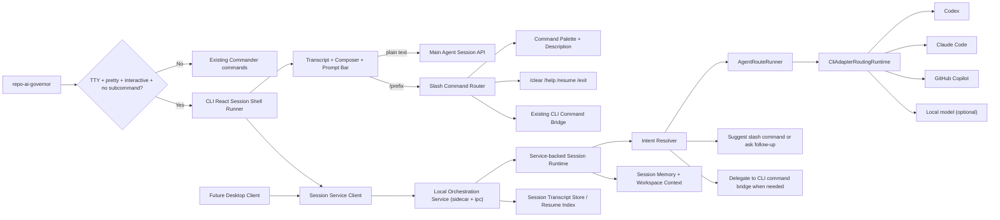

# Repo AI Governor Session-First 主 Agent 终端壳层技术方案（Draft）

- Status: draft
- Date: 2026-03-29
- Scope: CLI entry UX / session-first terminal shell / main-agent conversation / slash command palette
- Target Modules:
  - `runtime.cli-interactive-shell`
  - `runtime.adapter-routing`
  - `runtime.agent-session`
  - `entry.cli`
- Related:
  - `.repo-ai-governor/draft/interactive-cli-react-style-technical-solution.md`
  - `.repo-ai-governor/draft/runtime-cli-run-live-react-session-shell-technical-solution.md`
  - `apps/cli/src/main.ts`
  - `apps/cli/src/cli-governance-runtime.ts`
  - `apps/cli/src/react-cli/**`
  - `apps/cli/src/runtime/interactive-shell/**`
  - `apps/cli/src/runtime/adapter-routing-runtime.ts`
  - `packages/adapter-sdk/src/agent-route-runner.ts`

## 1. 背景与问题

当前 `repo-ai-governor` 的入口仍然是经典 Commander 风格：

1. 用户执行 `repo-ai-governor` 且不带子命令时，当前行为是直接输出 help。
2. React 风格交互壳层目前仍然是“命令内交互”，不是“会话优先入口”。
3. 用户如果只是想“先和主 agent 说一句，再由系统帮我决定下一步”，目前没有统一入口。
4. 用户输入 `/x` 时，也不存在像 Claude Code / Codex / aider 那样的命令推荐、过滤和说明。

因此，当前 CLI 已经具备 React shell 基线，但还没有具备“session-first terminal product”的首屏体验。

用户期望的目标更接近：

1. 直接执行 `repo-ai-governor` 就进入一个常驻终端会话。
2. 用户输入自然语言，直接和一个主 agent 对话。
3. 用户输入 `/` 或 `/x` 时，出现命令推荐列表和简明说明。
4. 用户在对话和命令之间无缝切换，而不是反复退出回到 shell 再敲子命令。

## 2. 外部参考结论

基于联网检索，几个高相关产品呈现出一致模式。

### 2.1 Codex

OpenAI 的 Codex CLI 官方 README 明确把 `codex` 本身作为默认启动入口，而不是要求用户先记住子命令树。

参考：

1. [OpenAI Codex README](https://github.com/openai/codex/blob/main/README.md)
   - “Then simply run `codex` to get started.”

这说明“无子命令直接进入交互入口”是终端型 AI coding agent 的合理默认。

### 2.2 Claude Code

Claude Code 官方 CLI reference 明确区分了：

1. `claude`
   - 直接开始 interactive session。
2. `claude "query"`
   - 以初始 prompt 启动 interactive session。
3. `claude -p "query"`
   - 非交互 print mode。
4. `claude -c` / `claude -r`
   - 继续最近会话 / 恢复指定会话。

参考：

1. [Claude Code CLI reference](https://code.claude.com/docs/en/cli-reference)

Claude Code 官方 built-in commands 文档还明确说明：

1. 输入 `/` 会展示全部可用命令。
2. 输入 `/` 后继续输入字母，会过滤命令列表。

参考：

1. [Claude Code built-in commands](https://code.claude.com/docs/en/commands)

### 2.3 aider

aider 的 in-chat commands 文档提供了更完整的“会话内命令面板”范式：

1. 所有命令统一使用 `/` 前缀。
2. 命令覆盖工作流、模型切换、上下文管理、shell 命令、会话控制。
3. `/run` 支持执行 shell command，别名就是 `!`。
4. `/clear`、`/model`、`/ls`、`/map`、`/add`、`/drop`、`/exit` 等都在会话里完成。
5. 多行输入、历史回溯、快捷键也被视为会话产品的一部分，而不是 CLI 外壳的附属品。

参考：

1. [aider in-chat commands](https://aider.chat/docs/usage/commands.html)

### 2.4 可借鉴的共性

这些产品共同说明了四件事：

1. 默认启动入口应该是“进入会话”，而不是“打印帮助”。
2. slash command 应该是会话内控制面，不应散落在外层 CLI 子命令之外。
3. 普通文本与命令文本必须有明确语法分流。
4. 交互模式与脚本模式必须严格分离，避免污染机器可读输出。

## 3. 当前仓库的现成接缝

这个需求不是从零开始，仓库已经具备可复用的四类接缝。

### 3.1 入口层

`apps/cli/src/main.ts` 当前在 `rawArgs.length === 0` 时直接 `program.outputHelp()` 并返回 `0`。

这意味着无子命令入口改造只需要替换一个分流点，不需要整体推翻 Commander 命令树。

### 3.2 React shell 层

当前已经存在：

1. `apps/cli/src/react-cli/app/react-cli-runner.ts`
2. `apps/cli/src/react-cli/session/react-cli-session-controller.ts`
3. `apps/cli/src/runtime/interactive-shell/init-react-shell-ink-prompt-adapter.tsx`
4. `apps/cli/src/runtime/interactive-shell/init-react-shell-live-prompt.tsx`

这套基线已经验证了：

1. `Ink + @inkjs/ui` 可用。
2. `stderr-only` live shell 可用。
3. 单实例 `rerender()` 可用。
4. React CLI 主题和 shared shell layout 已经成型。

### 3.3 命令元数据层

当前已经存在：

1. `CliCommandName`
2. `CLI_COMMAND_DEFINITIONS`
3. `ReactCliCommandDescriptorCatalog`

这意味着 slash command 推荐列表不需要从头硬编码，可以站在已有 command metadata 上做统一注册表。

### 3.4 agent dispatch 层

当前已经存在：

1. `CliAdapterRoutingRuntime`
2. `AgentRouteRunner`
3. adapter `invokeStage()` / `streamEvents()` seam

这意味着“主 agent 会话”可以复用当前 adapters/routing 能力，而不是另造一套聊天后端。

### 3.5 desktop convergence 基线

仓库已经明确冻结了 desktop 侧的若干硬约束：

1. `integrations/desktop/README.md` 明确 desktop client 只能消费 `@repo-ai-governor/orchestration-service-client`。
2. 当前唯一推荐 host / transport 组合是 `sidecar + ipc`。
3. desktop client 不允许直接持有 runtime internals，也不允许旁路 HITL / recovery / artifact contract。
4. `product-requirements-brief.md` 也已经明确：CLI 与未来桌面端应共用同一套 local orchestration service。

这意味着本方案如果只做成“CLI 私有会话壳层”，后面一定会返工。

更直白地说：

1. 如果 session 只保存在 CLI 进程里，那么 CLI 一退出，会话状态就丢了。
2. 后续 desktop 就接不住“刚才在 CLI 里开的那个 session”。
3. 用户也无法做到“先在 CLI 里开聊，稍后在 desktop 里继续”。
4. 所以从一开始就应该把 session 真相放到 local orchestration service，而不是某个前端进程内存里。

## 4. 目标

本方案的目标是：

1. 让 `repo-ai-governor` 在本地人类交互场景下默认进入一个 session-first 的 terminal shell。
2. 让用户输入普通文本时，直接和一个主 agent 对话。
3. 让用户输入 `/` 或 `/x` 时，看到带说明的命令推荐列表。
4. 保持现有 `init/connect/doctor/check/run/review/verify/plan/upgrade/workspace/workflow` 子命令可直接调用，不破坏既有自动化和 CI 契约。
5. 复用现有 React CLI、adapter routing、memory、i18n、workspace runtime，而不是重写领域逻辑。
6. 从第一天开始保证这套 session 能力后续可以无缝接到 desktop 界面，而不是变成一套只能给 CLI 用的分叉实现。

## 5. 非目标

1. 本方案首阶段不做 alternate screen 全屏应用。
2. 不在首阶段实现鼠标拖拽式 workflow editor。
3. 不把所有 slash command 都做成真正的图形表单。
4. 不改变现有 `json/plain` 输出 schema。
5. 不把“主 agent 对话”直接等同于“完整 task-driven run”；两者需要分层。

## 6. 推荐产品行为

### 6.1 默认启动行为

推荐将 `repo-ai-governor` 的无子命令行为改为：

1. `TTY + pretty + interactive + rawArgs.length === 0`
   - 默认进入 `session-shell`。
2. `--help`
   - 仍然输出 Commander help。
3. `json/plain`、非 TTY、`--no-interactive`
   - 不进入 session shell，继续保持现有行为。
4. 显式子命令
   - 继续走现有命令树。

### 6.2 输入语法

推荐采用三类输入语法：

1. 普通文本
   - 发送给主 agent，作为自然语言对话 turn。
2. `/command ...`
   - 解释为 slash command。
3. `!command ...`
   - 作为后续增强项；首阶段可不做，或仅保留占位语义。

### 6.3 slash 推荐行为

当用户输入 `/` 时：

1. 展示所有可用 slash command。
2. 每个命令都显示一行简短说明。
3. 继续输入字母时做前缀过滤。
4. 回车执行当前高亮命令。
5. 右侧或下方显示参数 hint。

例如：

```text
/init        初始化当前仓库或工作区
/connect     生成或更新多工具接入基线
/doctor      探测本地工具和环境健康状态
/workspace   执行迁移、回滚或清理配置
/workflow    创建、编辑或预览流程定义
/run         启动任务驱动编排执行
/plan        生成或更新任务计划
/review      发起或查看代码评审
/clear       清空当前会话消息
/resume      恢复最近一次会话
/help        查看会话帮助
/exit        退出会话
```

首阶段建议这里优先只展示 MVP 已承诺的命令，避免把尚未实现的二阶段命令提前暴露给用户。

### 6.4 会话控制命令

这里需要把“会话内命令”和“会话外命令”分开讲清楚。

会话内必须支持：

1. `/exit`
   - 退出当前会话界面。
   - 不删除已保存的 session transcript。
2. `/resume [session-id]`
   - 在当前界面中恢复最近一次或指定 session。
3. `Ctrl+C`
   - 作为快速退出当前前台会话的快捷键。
4. `Ctrl+D`
   - 作为等价的 EOF 退出路径。

会话外建议新增：

1. `repo-ai-governor resume`
   - 直接恢复最近一次 session。
2. `repo-ai-governor resume <session-id>`
   - 直接恢复指定 session。

这里不建议单独增加顶层 `repo-ai-governor exit` 子命令。

原因很简单：

1. `exit` 只对“当前已经附着的前台会话”有意义。
2. 单独启动一个新进程再执行 `exit`，并没有明确的目标会话可以退出。
3. 因此退出能力应该作为会话内 built-in command，而恢复能力才适合作为会话外入口命令。

## 7. “主 agent” 的推荐定义

这里不建议直接把现有 `planner` 或 `coder` 角色硬当成前台主 agent。

更合理的做法是引入一个新的会话层概念：

1. `session.main`
   - 面向用户的会话前台 agent。
2. 它的职责是：
   - 理解用户意图。
   - 决定这是纯问答、命令建议、命令执行前引导，还是需要转交给更重的 `run/workflow/review` 链路。
   - 将用户输入映射到现有命令或 route runner。
3. 它不直接替代 `planner/coder/reviewer/verifier`。
4. 它更像一个 “front-door governor agent” 或 “session concierge agent”。

推荐理由：

1. 这样不会污染已有 role semantics。
2. 这样能把“聊天入口”与“编排角色”解耦。
3. 这样更容易在后续给主 agent 配置独立 prompt、memory policy、tool policy。

## 8. 总体架构



## 9. 核心分层

### 9.1 Entry 层

在 `apps/cli/src/main.ts` 新增一条分流：

1. 如果满足 session-first 条件，则不再输出 help。
2. 直接进入 `CliSessionShellRunner`。
3. 其它场景保持现有 Commander 行为。

### 9.2 Session Shell 层

新增一个真正的常驻会话壳层，而不是一次性表单：

1. `header bar`
   - workspace / profile / adapter / theme / mode
2. `transcript area`
   - 用户消息、agent 回复、系统通知、命令执行摘要
3. `command palette overlay`
   - 当输入以 `/` 开头时显示
4. `composer`
   - 单行输入默认
   - 支持多行模式切换

### 9.3 Slash Router 层

新增统一注册表：

1. `SessionSlashCommandRegistry`
2. 每条 slash command 声明：
   - `command`
   - `summary`
   - `argsHint`
   - `kind`
     - `shell_action`
     - `cli_handoff`
     - `agent_setting`
   - `availabilityPredicate`

### 9.4 Main Agent Conversation Runtime

新增一层专门处理自然语言消息。

但这里有一个关键约束：

1. CLI 不应该成为会话状态 owner。
2. CLI 只应该是 session client + presenter。
3. 真正的 session runtime、resume index、event stream cursor 和 transcript canonical store，后续应收敛到 local orchestration service。

如果这句话不够直观，可以直接理解成：

1. 用户先在 CLI 里发起一个 session。
2. 关闭 CLI 以后，这个 session 仍然应该存在。
3. 稍后用户打开 desktop，应该还能继续刚才那条 session。

要满足这三点，会话状态就不能只保存在 CLI 自己内存里，而必须保存在共享的 local orchestration service 里。

因此更准确的落点是：

1. CLI 侧先实现 `session shell runner + session client`。
2. runtime 侧新增“由本地 orchestration service 托管的 session runtime”。
3. 自然语言消息通过 service contract 发送给 `session.main`。

建议的 service contract 最少覆盖：

1. `startSession`
2. `sendSessionTurn`
3. `subscribeSession`
4. `getSession`
5. `listSessions`
6. `resumeSession`

对 CLI 来说，主流程仍然是：

1. 收到普通文本后，形成 conversation turn。
2. 组装最小上下文：
   - 当前 cwd
   - workspace state
   - current-context 路径摘要
   - 当前配置的 adapters/routing
   - 最近几条会话历史
3. 通过 `AgentRouteRunner` 将请求发给 `session.main` route。
4. 返回结构化结果：
   - `assistantMessage`
   - `suggestedSlashCommand?`
   - `executionIntent?`
   - `followUpQuestion?`

### 9.5 与桌面端结合的设计原则

这部分必须提前写进方案，否则后续 desktop 会出现双实现。

#### 原则 1：session state 必须 service-owned

1. session id
2. transcript
3. resume pointer
4. command handoff result summary
5. pending confirmation state

以上都不应只存在于 CLI 进程内存中。

#### 原则 2：CLI 与 desktop 共享同一套 session DTO

建议扩展 `@repo-ai-governor/orchestration-service-client`，而不是在 `apps/cli` 私有定义 session protocol。

原因：

1. desktop baseline 已经要求 transport-neutral DTO。
2. sidecar + ipc 已是正式基线。
3. 这样后面 desktop 只需要换一层界面渲染，不需要重做后端协议。

这里的“只换一层界面渲染”，意思是：

1. CLI 用 Ink 把同一份 session state 渲染成终端界面。
2. desktop 用桌面 UI 把同一份 session state 渲染成窗口界面。
3. 但两边看的都是同一条 session、同一份 transcript、同一套 handoff 结果。

#### 原则 3：CLI 专属只保留在 presenter 层

CLI 专属：

1. Ink renderer
2. terminal shortcuts
3. slash palette 浮层
4. stderr/stdout boundary

desktop 专属：

1. window layout
2. richer history sidebar
3. native notifications
4. multi-pane shell UX

共享层：

1. session contract
2. session runtime
3. command registry metadata
4. message semantics
5. handoff result semantics

#### 原则 4：slash command registry 也应可共享

建议把 slash command metadata 从 CLI 进程抽成 headless registry：

1. `command`
2. `summary`
3. `argsHint`
4. `kind`
5. `requiresConfirmation`
6. `desktopVisibility`
7. `cliVisibility`

这样未来 desktop command palette 可以直接复用同一份 metadata。

## 10. 推荐的 slash command 集合

### 10.1 MVP 必备

1. `/help`
2. `/clear`
3. `/resume`
4. `/exit`
5. `/init`
6. `/connect`
7. `/doctor`
8. `/verify`
9. `/workspace`
10. `/workflow`
11. `/run`
12. `/plan`
13. `/review`

### 10.2 第二阶段推荐

1. `/theme`
2. `/memory`
3. `/status`
4. `/config`
5. `/agents`
6. `/history`
7. session routing setting command（暂名 `/model`）

这里需要额外说明一下：

1. `/model` 不是当前仓库里已经存在的 CLI 命令。
2. 如果后续保留这个命名，它的作用也不是“切换底层 LLM 参数”，而是切换当前 `session.main` 的路由偏好或 adapter preset。
3. 更贴近本仓库语义的理解是：
   - 查看当前 session 更偏向走哪条 adapter / route
   - 临时切到 `auto`、`codex`、`claude`、`copilot` 这类 session 级偏好
4. 举例来说，后续如果实现，它更像：
   - `/model`
   - `/model auto`
   - `/model codex`
5. 由于当前仓库现有抽象更偏“agent / adapter / routing”而不是“model”，后续真正落地时也可以把它改名为 `/agent` 或 `/routing`。
6. 因此 MVP 不需要实现它，首版 command palette 也不应默认展示它。

### 10.3 第三阶段增强

1. `/run-shell`
2. `!`
3. `/attach`
4. `/context`
5. `/files`
6. `/git`

## 11. slash command 的执行模型

### 11.1 `shell_action`

不调用外层 CLI 子命令，只影响当前 session：

1. `/help`
2. `/clear`
3. `/resume`
4. `/exit`
5. `/theme`

如果第二阶段补充 session settings commands，那么预留的 session routing setting command（暂名 `/model`，也可能改名为 `/agent` 或 `/routing`）也应归到这一类。

### 11.2 `cli_handoff`

复用现有命令运行时：

1. `/init`
2. `/connect`
3. `/doctor`
4. `/verify`
5. `/workspace`
6. `/workflow`
7. `/run`
8. `/plan`
9. `/review`

执行方式建议：

1. shell 内先展示“即将执行的规范化命令”。
2. 允许用户确认。
3. 执行期间复用现有 React shell / live shell。
4. 命令结束后把结果摘要写回 transcript。

这意味着 slash command 不是一个旁路系统，而是 `CLI Command Entry` 的前置控制面。

## 12. 会话 UI 设计

### 12.1 视觉形态

不建议继续沿用当前“一张 bordered summary 卡片就是整个界面”的模型。

建议演进为三段式：

1. 顶部 status bar
2. 中间 transcript window
3. 底部 composer + command palette

原因：

1. bordered summary card 适合单步向导。
2. transcript session 需要滚动历史和持续输入。
3. slash suggestions 需要浮层或下拉式可见区域。

### 12.2 文本分区

建议 transcript 消息类型最少区分：

1. `user`
2. `assistant`
3. `system`
4. `command_preview`
5. `command_result`
6. `error`

### 12.3 输入与快捷键

MVP 建议支持：

1. `Enter`
   - 发送
2. `Up/Down`
   - 在 slash suggestions 中移动
3. `Tab`
   - 补全 slash command
4. `Esc`
   - 关闭 command palette
5. `Ctrl+C`
   - 退出或中断当前前台动作
6. `Ctrl+L`
   - 清屏但不清会话

多行输入建议作为 M2：

1. `/multiline`
2. 或 `Ctrl+J` 插入换行

## 13. 输出与兼容性约束

### 13.1 `stderr` 与 `stdout`

必须继续遵守：

1. live session UI 只渲染到 `stderr`
2. `stdout` 只保留给命令结果或机器输出
3. session shell 本身不允许污染 `json/plain`

### 13.2 非交互场景

以下场景必须不进入 session shell：

1. `--output json`
2. `--output plain`
3. `--no-interactive`
4. 非 TTY
5. agent 风格包装调用

### 13.3 子命令兼容

这些路径必须继续有效：

1. `repo-ai-governor init`
2. `repo-ai-governor connect`
3. `repo-ai-governor workflow edit`
4. `repo-ai-governor run`

Session-first 只是新增默认入口，不是替换现有子命令 contract。

## 14. 技术落点建议

```text
apps/cli/src/runtime/session-shell/
  cli-session-shell-runner.ts
  cli-session-controller.ts
  cli-session-slash-command-registry.ts
  cli-session-command-router.ts
  cli-session-service-client.ts

apps/cli/src/commands/
  resume-command.ts

apps/cli/src/react-cli/session-shell/
  session-shell-app.tsx
  session-shell-layout.tsx
  transcript-pane.tsx
  composer-input.tsx
  slash-command-palette.tsx
  prompt-bar.tsx

apps/cli/src/types/interfaces/
  cli-session-message.interface.ts
  cli-session-state.interface.ts
  cli-session-command.interface.ts

packages/orchestration-service-client/src/
  ...existing dto/client...
  session-session.contract.ts
  session-message.contract.ts
  session-command.contract.ts

packages/core-orchestration-service/src/
  local-orchestration-service-session-runtime.ts
  local-orchestration-service-session-shell.ts

integrations/desktop/
  ...future desktop presenter consumes service-backed session DTO...
```

## 15. `project / sprint / task` 拆解建议

### 15.1 Project 建议

建议新开：

1. `project-029-cli-session-first-agent-shell`

原因：

1. 它已经超出了 `project-027` 的单命令 React shell 范畴。
2. 它新增的是“入口产品形态”，而不只是某个命令的交互优化。

### 15.2 Sprint 拆解

为避免与当前已存在的 `TK-xxx` 编号冲突，下面建议直接为 `project-029` 预留一段新的号段：

1. `TK-401` ~ `TK-416`

#### sprint-001-entrypoint-session-shell-foundation

目标：

1. 默认入口分流。
2. transcript shell 骨架。
3. slash command palette skeleton。
4. `/exit` 与快捷退出语义明确。

建议任务：

1. `TK-401` 无子命令入口分流与 session-shell runner 基线
2. `TK-402` transcript/composer/prompt-bar React 组件
3. `TK-403` slash command registry 与推荐过滤器
4. `TK-404` `stderr-only` / fallback / non-interactive contract 回归，并固定 `/exit`、`Ctrl+C`、`Ctrl+D` 的退出语义

#### sprint-002-main-agent-conversation-runtime

目标：

1. 普通文本可发给主 agent。
2. transcript 可落盘和恢复。
3. session.main route contract 成型。
4. session contract 从一开始就是 desktop-ready。
5. `resume` 同时具备会话内与会话外恢复入口。

建议任务：

1. `TK-405` `orchestration-service-client` session DTO 与 service-owned contract 基线
2. `TK-406` sidecar host session runtime 与 `session.main` route dispatch
3. `TK-407` CLI session client、transcript store、`/resume` 与顶层 `resume` 命令
4. `TK-408` 多轮对话、错误恢复、cancellation 与 desktop-ready streaming parity

#### sprint-003-command-handoff-and-hybrid-workflow

目标：

1. slash command 真正接到现有 CLI command runtime。
2. 命令结果可回灌 transcript。
3. 主 agent 可建议 slash command 并触发 handoff。

建议任务：

1. `TK-409` `/init/connect/doctor/workspace/workflow` handoff
2. `TK-410` `/run/plan/review` handoff 与 live-result bridge
3. `TK-411` command preview / confirm / execute UX
4. `TK-412` transcript 内 command result summary / artifact backlink

#### sprint-004-polish-and-session-productization

目标：

1. `/theme`、`/clear`、`/help`、session settings commands 与 deferred command naming 收口
2. 多行输入、历史、搜索、`!` shell passthrough 与 `repo-ai-governor "query"` 初始 prompt 启动入口全部收口。
3. 文案、帮助面、docs 与 adoption playbook 收口。
4. 后续接 desktop 界面时，不会被当前 CLI 实现卡死。

建议任务：

1. `TK-413` session settings commands 与 deferred command naming 收口
2. `TK-414` multiline/history/search UX 与 `!` passthrough / `"query"` 启动入口
3. `TK-415` i18n / help / docs / adoption playbook 与全能力可发现性收口
4. `TK-416` desktop sidecar smoke baseline 与 session DTO packaged-surface 校验

## 16. MVP 推荐边界

我更推荐以下 MVP，而不是一步做到“像 Claude Code 一样完整”。

### 16.1 必做

1. `repo-ai-governor` 默认进入 session shell
2. 普通文本发给主 agent
3. `/` 命令推荐与过滤
4. `/help` `/clear` `/exit` `/resume`
5. `/init` `/connect` `/doctor` `/workspace` `/workflow`
6. `repo-ai-governor resume [session-id]`

### 16.2 收口口径（更新）

在当前已接受并进入 `project-029` follow-up 的执行口径下，上述原本列为“可后置”的非-desktop CLI 能力，不再继续后置。

改为：

1. 到 `sprint-004` 结束时，除 desktop presenter / 窗口层本体外，其余非-desktop 功能全部收口。
2. 这明确包括：
   - `!` shell passthrough
   - session routing setting command（命名在 `/model`、`/agent`、`/routing` 中最终收口为一种）
   - `/theme`
   - 多行编辑器
   - `repo-ai-governor "query"` 直接带初始 prompt 启动

## 17. 主要风险

### 17.1 产品语义风险

如果直接把当前 `planner/coder` 其中之一当作主 agent，会把“会话引导”和“编排角色”混在一起。

建议：

1. 新增 `session.main` 语义层。
2. 与现有 role registry 分离建模。

### 17.2 UI 形态风险

如果沿用当前“一屏一张卡”的 React shell 形态，会很快撞上 transcript 场景的上限。

建议：

1. 为 session shell 单独建 layout，而不是强行复用 form-card layout。

### 17.3 兼容性风险

如果默认入口切换过快，可能误伤脚本或 IDE wrapper。

建议：

1. 默认启用只限 `TTY + pretty + interactive + no subcommand`。
2. 其它路径一律保持老行为。

### 17.4 能力边界风险

如果主 agent 一开始就承担“任意指令都自动执行”，会直接把产品拉进高风险执行域。

建议：

1. MVP 先做到“对话 + 建议 + 命令 handoff”。
2. 真正执行高副作用命令前仍要走明确确认。

### 17.5 CLI / desktop 双轨实现风险

如果先把 session runtime 写死在 CLI 里，再考虑桌面端，后续几乎一定会出现：

1. CLI 一套 session state
2. desktop 一套 session state
3. 两套 resume / history / command registry

建议：

1. 从 Phase 1 开始就把 canonical state 收敛到 local orchestration service。
2. CLI 只做第一个 presenter。

## 18. 方案结论

这项需求是值得做的，而且它不是对当前 React shell 的推翻，而是自然的下一步。

更优雅且风险可控的路径不是：

1. 继续堆更多一次性表单命令页。

而是：

1. 把 `repo-ai-governor` 的本地人类入口升级为 session-first shell。
2. 把自然语言输入和 slash command 收敛到统一会话面。
3. 把现有命令树变成“可直接调用，也可由 session shell 代理调用”的双入口结构。
4. 把 session runtime 放到 service 侧，确保后续 desktop 只是换一个界面层，而不是重做后端。

一句话总结：

1. 当前仓库已经有“命令内 React shell”的底座。
2. 下一阶段应该演进到“产品级 session shell”。
3. 默认入口、主 agent、`resume`、slash command palette 和 desktop convergence，应该一起设计，而不是分散补丁式接入。

## 19. 外部参考链接

1. [OpenAI Codex README](https://github.com/openai/codex/blob/main/README.md)
2. [Claude Code CLI reference](https://code.claude.com/docs/en/cli-reference)
3. [Claude Code built-in commands](https://code.claude.com/docs/en/commands)
4. [aider in-chat commands](https://aider.chat/docs/usage/commands.html)
5. [Desktop execution surface baseline](https://github.com/JimmyDaddy/repo-ai-governor/blob/main/integrations/desktop/README.md)
6. [Orchestration service client README](https://github.com/JimmyDaddy/repo-ai-governor/blob/main/packages/orchestration-service-client/README.md)
