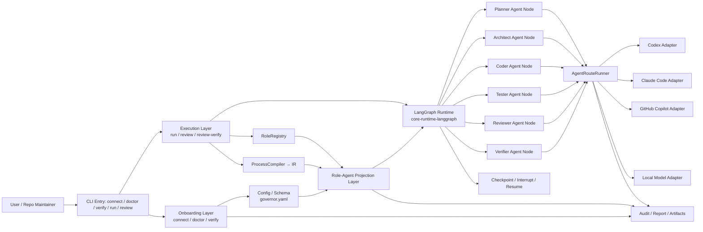
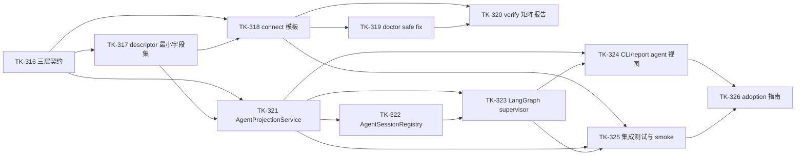

# Repo AI Governor 多 AI 工具快速接入与 Role-Agent 投影统一方案（Draft）

- Status: draft
- Date: 2026-03-28
- Scope: local adoption / orchestration projection / multi-tool collaboration
- Related:
  - `.repo-ai-governor/draft/multi-ai-tools-fast-onboarding-technical-solution.md`
  - `.repo-ai-governor/draft/role-to-agent-projection-technical-solution.md`
  - `apps/cli/src/main.ts`
  - `apps/cli/src/cli-governance-runtime.ts`
  - `apps/cli/src/runtime/task-driven-run-runtime.ts`
  - `apps/cli/src/runtime/adapter-routing-runtime.ts`
  - `apps/cli/src/runtime/adapter-verification-runtime.ts`
  - `packages/core-role-registry/src/role-registry.ts`
  - `packages/adapter-sdk/src/agent-route-runner.ts`
  - `packages/core-runtime-langgraph/src/compiled-ir-graph-adapter.ts`
  - `.repo-ai-governor/normative_knowledge_sources/product-requirements-brief.md`
  - `.repo-ai-governor/normative_knowledge_sources/technical-solutions/runtime-orchestration/module-overview.md`

## 1. 方案定位

这不是两个方案并列，而是一个方案的两层结构：

1. **外层是快速接入**，解决“怎么把多个 AI 工具尽快接进来并验证可用”。
2. **内层是 role-agent 投影**，解决“为什么当前 role 已经能调度执行，但还没有清晰的 agent 视图”。

这两个层次放在一起，才能同时满足产品落地和架构优雅：

1. 用户先能顺利接入、探测、修复、验证。
2. 系统再把 role 统一投影成 agent 实体，便于 UI、report、diagnostics 和审计理解。

## 2. 核心结论

当前仓库已经具备多工具适配、多角色治理、多阶段编排和审计回放能力，但还缺一个统一的“产品化接入面”和一个显式的“agent 投影层”。

因此，最佳路径不是：

1. 只做接入向导，继续让角色和 agent 的语义断开。

也不是：

1. 直接把 role 改造成长期 agent 实体，重写执行路径。

而是：

1. 先用 `connect / doctor / verify` 把外部接入收口。
2. 再用 `AgentProjectionService` 把 `roleProfileId -> agent descriptor` 显式化。
3. 最后把这两层合并成统一的 CLI / report / UI 视图。

## 3. 当前状态判断

### 3.1 已经具备的能力

1. 多工具适配已存在，Codex / Claude Code / GitHub Copilot / Local Model 都可进入统一 adapter 路由。
2. 默认角色集已存在，`planner / architect / coder / tester / reviewer / verifier` 已经在 CLI 侧落地。
3. 执行运行时已存在，`connect / doctor / verify / run / review / review-verify / HITL` 都不是空壳。
4. 编排执行已存在，`Sequential / Parallel / Loop / Condition` 能按 graph-first runtime 运行。
5. 审计、report、artifact、policy gate、risk evaluator 这些护栏已经实装。

### 3.2 还缺的能力

1. 缺少一个统一的多工具接入向导，把配置、探测、修复、验证连成一条顺滑路径。
2. 缺少一个显式的 agent 投影层，避免“role 配置”被误解成“已生成 agent”。
3. 缺少 agent 级视图，UI 和 report 主要还是按 role、stage、surface 看结果。
4. 缺少更清晰的外部 adopter 说明，让用户快速理解“谁负责什么、谁调用什么工具、谁在降级回退”。

## 4. 统一架构

推荐采用“接入层 + 投影层 + 执行层”的三层结构。

1. **接入层**
   - `connect`
   - `doctor --adapters`
   - `verify --adapters`
   - 作用：把工具、角色、路由、最小支持矩阵一次性整理好。
2. **投影层**
   - `AgentProjectionService`
   - `AgentSessionRegistry`
   - 作用：把 `roleProfileId`、`routeKey`、`surface`、`capability` 投影成 agent descriptor。
3. **执行层**
   - `RoleRegistry`
   - `ProcessCompiler`
   - `AgentRouteRunner`
   - `CliOrchestrationServiceRuntime`
   - 作用：继续负责真实执行、回退、审计和结果回写。

### 4.1 为什么这样最优雅

1. 接入层解决“能不能用”。
2. 投影层解决“看起来和理解上像多 agent 协同”。
3. 执行层继续保留现有成熟的治理语义，不重写 runtime。

这能避免两种常见问题：

1. 只有底层，没有产品入口，用户接不住。
2. 只有 UI，没有运行时语义， agent 只是表面幻觉。

### 4.2 LangGraph 在这套结构里的位置

LangGraph 适合作为执行层里的 graph-first orchestration 内核，而不是替代上层的 role、agent 投影和 adapter 协议。

推荐用法是：

1. `role -> agent projection` 先把治理语义整理成 agent descriptor。
2. `LangGraph supervisor` 负责协调多个 agent 节点的顺序、并行、循环、条件分支和中断恢复。
3. 每个 agent 节点内部仍然调用现有 `AgentRouteRunner` 和 `AgentProtocolContract` 去选 surface、probe、invoke stage。
4. checkpoint / interrupt / resume 只负责执行态恢复，不升格为 canonical source。

这样，LangGraph 变成“图怎么跑”的内核，而不是“谁来做、用哪个工具做”的语义来源。

## 5. 快速接入链路

建议把多工具接入整理成三段式。

### 5.0 与现有 runtime 的复用方式

这套方案不是替换现有 runtime，而是复用并收敛它们的职责边界。

1. `adapter-routing-runtime` 继续负责 surface 构造、能力探测、fallback wiring，`connect` 只是在其之上做模板化配置生成。
2. `adapter-verification-runtime` 继续负责工具可用性、能力矩阵和 nextAction 归一化，`doctor / verify` 复用它的探测语义。
3. `ProcessCompiler` 和 `CompiledIrGraphAdapter` 继续负责流程编译与 IR 到 graph 的转换，不因为 agent projection 而改写。
4. `AgentProjectionService` 只做 role / route / surface 的投影，不替代 adapter routing，也不直接执行 stage。

### 5.1 `connect`

目标：一次性生成或更新角色、工具和路由基线。

职责：

1. 生成 `roles[]`。
2. 生成 `adapters.tools`。
3. 生成 `routing.roleBindings`。
4. 输出模板化方案，支持单工具多角色和多工具分角色。
5. 支持显式参数覆盖，参数列表如下：
   - `--tools <csv>`：`codex|claude-code|github-copilot|ollama`
   - `--preset <id>`：默认 `multi-tool-default`
   - `--dry-run`：仅预览，不落盘
   - `--overwrite`：允许覆盖冲突片段
   - `--single-tool-all-roles <tool>`：快捷将全部启用角色绑定到同一工具
   - `--role-binding <roleProfileId=tool[,fallbackTool...]>`：可重复传入，覆盖模板绑定

### 5.2 `doctor --adapters`

目标：把环境探测和常见修复结构化。

职责：

1. 探测命令可执行性。
2. 探测登录态和认证状态。
3. 探测能力矩阵和 restricted network 降级可能性。
4. 仅执行 `safe_local` 级修复，例如补目录、修本地可写权限、补模板配置。
5. 对认证、网络代理、权限上限、发布相关动作只输出 `nextAction`，不自动执行。
6. 所有可修复项和不可自动修复项都要写入诊断结果。

### 5.3 `verify --adapters`

目标：给出最小联调的最终结论。

职责：

1. 基于当前角色/路由配置做 probe + dry-run。
2. 输出统一矩阵：tool / surface / roleProfileId / availability / capabilitySupport / routeCoverage / nextAction。
3. 产出可回链到 execution_id 的标准化报告。
4. 判定阈值固定为三档：
   - `pass`：所有必需角色绑定都存在可用 primary，且无必需能力缺口
   - `warn`：primary 不可用但存在可用 fallback，或能力处于 degraded 但不阻断闭环
   - `fail`：任一必需角色无可用工具，或必需能力缺口导致流程不可闭环

### 5.4 预置模板

首批模板建议保留并显式呈现：

1. `single-tool-minimal`
2. `multi-tool-default`
3. `single-tool-all-roles`
4. `restricted-network-safe`

模板作用：

1. 生成推荐角色集，优先覆盖 Planner/Coder/Reviewer 最小闭环。
2. 生成推荐路由策略，允许 1 个工具绑定多个角色。
3. 输出风险提示，例如某工具仅建议用于低风险 route。

### 5.5 `governor.yaml` 配置示例

```yaml
schemaVersion: "1.2"
adapters:
  tools:
    codex:
      enabled: true
    claude-code:
      enabled: true
routing:
  roleBindings:
    planner-default:
      primary: codex
      fallbacks: [claude-code]
    coder-default:
      primary: codex
      fallbacks: [claude-code]
    reviewer-default:
      primary: claude-code
      fallbacks: [codex]
```

### 5.6 输出契约与降级策略

`verify --adapters --output json` 的最小字段建议固定为：

1. `schema_version`
2. `execution_id`
3. `summary`：`passed/failed/warn`
4. `tool_matrix[]`
   - `tool`
   - `surface`
   - `role_profile_id`
   - `availability_status`
   - `capability_gap[]`
   - `route_coverage[]`
   - `next_action`
5. `role_binding_matrix[]`
   - `role_profile_id`
   - `primary_tool`
   - `fallback_tools[]`
   - `binding_status`
6. `artifacts[]`
   - `diagnostics_trace`
   - `doctor_report`
   - `verify_report`

降级策略：

1. 单工具不可用不应直接阻断整体接入，只要仍存在可用主链路。
2. 若全部工具不可用，必须返回阻断并给出按优先级排序的修复步骤。
3. 受限网络下优先走本地 fallback 路径，并显式标注 `degraded`。

## 6. Role-Agent 投影层

这是整套方案的语义补强点。

### 6.1 问题定义

当前 `role` 主要用于：

1. 决定 stage 用哪个角色语义。
2. 决定 routeKey 该去哪个 surface。
3. 决定 fallback 和 capability 选择。

但它没有变成一个清晰的 `agent` 视图，因此用户会看到“配置了 role”，却不容易直观看到“这个 role 在系统里对应哪个 agent、用什么工具、当前状态如何”。

### 6.2 设计目标

1. 不改变 `role -> route -> adapter` 主链路。
2. 增加一层显式的 `agent projection`。
3. 让 UI、审计、report 和 diagnostics 共用同一份 agent descriptor。
4. 不把投影层做成第二套 runtime。
5. 与 overall-technical-solution §6.2 的 `Agent 契约` 对齐，`AgentDescriptor` 作为投影友好子集，不另造平行业务实体。

### 6.3 推荐接口

`AgentProjectionService` 的输入：

1. `roleProfileId`
2. `routeKey`
3. `stageId`
4. `adaptersConfig`
5. `runtimeDebugOptions`
6. `executionContext`

输出：

1. `agentId`
2. `agentRole`
3. `roleProfileId`
4. `primarySurface`
5. `fallbackSurfaces`
6. `capabilities`
7. `status`
8. `selectedBy`
9. `executionId`
10. `sessionId`
11. `budget` / `timeout` / `constraint` 摘要

### 6.4 投影原则

1. Agent 是投影出来的，不是执行层临时拼接出来的。
2. role 仍然是治理主语，agent 是可视化和回放语义。
3. route 仍然决定真实调用 surface，agent 只负责让这条决策对人可理解。

### 6.5 TypeScript 契约草案

```ts
export interface AgentDescriptor {
  agentId: string;
  agentRole: string;
  roleProfileId: string;
  roleSource: 'default' | 'custom';
  primarySurface: string;
  fallbackSurfaces: string[];
  capabilities: string[];
  permissionLevel: 'read' | 'edit' | 'test' | 'commit' | 'pr';
  inputSchemaRef: string | null;
  outputSchemaRef: string | null;
  errorContractRef: string | null;
  maxExecutionTimeSeconds: number;
  stageTimeoutSeconds: number;
  tokenBudget: number | null;
  costBudget: number | null;
  timeBudgetSeconds: number | null;
  retryPolicyRef: string | null;
  timeoutPolicyRef: string | null;
  budgetPolicyRef: string | null;
  workspaceId: string;
  workspaceMode: 'tool_managed' | 'repo_local';
  executionId: string | null;
  sessionId: string | null;
}
```

`AgentProjectionService` 的输出建议是 `AgentDescriptor` 的 JSON 可序列化投影，必要时再叠加 CLI / report 专属 presenter 字段。

`AgentSessionRegistry` 应当只把 `execution_session` 做成 agent 视角投影，而不是引入新的会话事实源；它的读取端建议直接对接现有 `Shared Session Manager`、审计记录和 execution metadata。

## 7. 推荐工作流

把两层方案串起来时，推荐的执行顺序是：

1. 用户执行 `connect`，生成角色与路由初始配置。
2. 用户执行 `doctor --adapters`，修复本机工具可用性。
3. 用户执行 `verify --adapters`，确认多工具矩阵可用。
4. 编排进入 `run / review / review-verify`。
5. 每个 stage 在执行前生成 agent descriptor。
6. `AgentRouteRunner` 继续执行真实 surface 调度。
7. 结果回写到 `agent_session`、审计和 report。

这样一来：

1. 外部用户看见的是接入流程。
2. 内部系统保留的是严格的 role 和 route 治理。
3. 上层展示的是 agent 视图，不会和底层语义混淆。

### 7.1 外部 adopter 最小路径

外部 adopter 的 Hello World 路径建议明确为：

1. `npm install` 或 `pnpm dlx` 安装 CLI
2. `repo-ai-governor init`
3. `repo-ai-governor connect --preset multi-tool-default`
4. `repo-ai-governor doctor --adapters`
5. `repo-ai-governor verify --adapters`
6. `repo-ai-governor run`

最小前置依赖：

1. Node.js 满足仓库支持版本
2. 至少 1 个 AI 工具已安装并可探测
3. 目标仓库能写入 `.repo-ai-governor` 工作区

## 8. 对照表

| 维度 | 当前已支持 | 还缺什么 |
|---|---|---|
| 技术底座 | 多工具 adapter、role registry、graph-first runtime、policy gate、audit/report 都已实装。 | 缺一个统一的 agent 投影层，把 role 显式映射成 agent descriptor。 |
| 工作流 | `connect -> doctor -> verify -> run -> review -> review-verify` 已能承载治理闭环。 | 缺少更强的模板化接入链路和 agent 会话级回放。 |
| UI 入口 | CLI 已有结构化输出和部分交互式 bootstrap。 | 缺少统一的 agent 级视图和更顺手的接入体验壳层。 |
| 外部可用性 | 内部治理闭环已经成熟，能支撑多工具协作。 | 缺少外部 adopter 视角的“拿来就能用”说明和稳定体验矩阵。 |

## 9. 模块建议

```text
packages/core-agent-projection/
  src/
    agent-projection.service.ts
    agent-session-registry.ts
    agent-descriptor-registry.ts
    agent-projection.types.ts
    agent-projection.mapper.ts

apps/cli/src/
  onboarding/
    onboarding-command.ts
    onboarding-template-registry.ts
  agent-projection/
    agent-projection.presenter.ts
```

### 9.1 `onboarding`

负责 `connect / doctor / verify` 的接入体验收口。

### 9.2 `agent-projection`

负责把 role 和 route 投影为 agent 视图，并回写给 report/UI。

### 9.3 `langgraph-supervisor`

负责把 agent descriptor 编排成可执行图；这里是 `core-runtime-langgraph` 的 multi-agent 用法扩展，不是新的编排范式：

1. 调度多个 agent 节点。
2. 承接 `Sequential / Parallel / Loop / Condition`。
3. 在 HITL 节点触发人工确认或升级。
4. 维护 checkpoint / resume / recovery 语义。

### 9.4 与现有 runtime 的关系

1. `connect` 复用 `adapter-routing-runtime` 的能力矩阵和路由构造语义。
2. `doctor / verify` 复用 `adapter-verification-runtime` 的探测与阈值归一化语义。
3. `AgentProjectionService` 从 `RoleRegistry`、`ProcessCompiler` 和 `CompiledIrGraphAdapter` 读取投影输入。
4. `LangGraph supervisor` 只承接图编排，不替代 `AgentRouteRunner` 与 `AgentProtocolContract`。

## 10. 实施顺序

1. 先把 `connect / doctor / verify` 收成一个稳定 onboarding 命令组。
2. 再做 `AgentProjectionService`，只输出 descriptor，不改执行逻辑。
3. 再做 `AgentSessionRegistry`，绑定 execution 和 agent 视图。
4. 最后把 agent 视图接到 CLI 输出、report 和未来 React 风格壳层。

## 11. 风险与边界

1. 不能把 agent projection 误做成第二套 runtime。
2. 不能让 UI 持有 canonical truth，agent descriptor 只是投影。
3. 不能让 role、agent、surface 三套概念互相覆盖，必须职责分明。
4. 不能为了更好看而牺牲 `pretty/plain/json` 和 `--no-interactive` 的既有契约。

## 12. 落地架构图



## 13. 结论

这套合并方案的优雅之处在于：

1. 它保留了现有成熟的治理执行内核。
2. 它补上了多工具接入的产品入口。
3. 它用显式的 role-agent 投影层消除语义断层。

最终可以把整体逻辑概括成一句话：

1. `connect / doctor / verify` 负责让多工具“接得上”。
2. `role -> agent projection` 负责让多工具“看得懂”。
3. `route -> adapter -> runtime` 负责让多工具“真执行”。

## 14. Project / Sprint / Task 拆解

建议将本方案正式承接为一个独立 follow-up project，而不是继续挂靠在现有 gap remediation 里做局部补丁。

### 14.1 Project 定义

| 项目 | 建议值 |
|---|---|
| Project ID | `project-027-multi-ai-onboarding-projection` |
| Project 名称 | 多 AI 工具快速接入与 Role-Agent 投影统一化 |
| 目标 | 把多工具接入、角色投影、LangGraph 编排和 agent 视图统一成可执行产品面 |
| 主产物 | onboarding 命令、agent projection service、LangGraph supervisor 接线、统一 report/UI 视图 |
| 依赖 | 现有 CLI、adapter SDK、role registry、core-runtime-langgraph、reporting |
| 建议落盘路径 | `.repo-ai-governor/context/dev/project-027-multi-ai-onboarding-projection/` |
| 建议计划文件 | `.repo-ai-governor/context/dev/project-027-multi-ai-onboarding-projection/plan.md` |
| 建议任务目录 | `.repo-ai-governor/context/dev/project-027-multi-ai-onboarding-projection/sprint-*/tasks/` |
| 启动方式 | 作为 `current-context.md` 的 follow-up stream 登记后再进入 active 主线 |

### 14.2 Sprint 切分

| Sprint | 主题 | 目标 |
|---|---|---|
| `sprint-001-contract-baseline-and-boundary-lock` | 基线与契约 | 统一接入层、投影层、执行层的边界，冻结命名与输出契约 |
| `sprint-002-onboarding-and-adapter-matrix` | 快速接入 | 落实 `connect / doctor / verify` 三段式链路和最小支持矩阵 |
| `sprint-003-role-agent-projection-and-langgraph-supervisor` | 语义与编排 | 落实 `role -> agent projection` 和 LangGraph supervisor 编排 |
| `sprint-004-ui-report-rollout-and-hardening` | 视图与收口 | 把 agent 视图接到 CLI / report / diagnostics，并完成稳定性加固 |

### 14.3 任务拆解

| Task ID | 所属 Sprint | 依赖 | 任务标题 | 结果定义 |
|---|---|---|---|---|
| `TK-316` | `sprint-001-contract-baseline-and-boundary-lock` | n/a | 定义 onboarding / projection / runtime 三层契约并冻结 `governor.yaml` schema v2 | 明确 CLI、投影层、执行层的输入输出与边界，锁定 `adapters / routing` 配置结构 |
| `TK-317` | `sprint-001-contract-baseline-and-boundary-lock` | `TK-316` | 冻结 agent descriptor 最小字段集 | 输出 `agentId / agentRole / roleProfileId / surface / status` 等核心字段 |
| `TK-318` | `sprint-002-onboarding-and-adapter-matrix` | `TK-316`, `TK-317` | 实现 `connect` 模板与路由基线生成 | 能生成 `roles[] / adapters.tools / routing.roleBindings` |
| `TK-319` | `sprint-002-onboarding-and-adapter-matrix` | `TK-318` | 实现 `doctor --adapters` 探测与 safe fix | 能输出工具可用性、登录态、降级建议与安全修复 |
| `TK-320` | `sprint-002-onboarding-and-adapter-matrix` | `TK-318`, `TK-319` | 实现 `verify --adapters` 矩阵报告 | 能产出可回链 execution_id 的统一验证报告 |
| `TK-321` | `sprint-003-role-agent-projection-and-langgraph-supervisor` | `TK-316`, `TK-317` | 实现 `AgentProjectionService` | 将 role/route/surface 投影成 agent descriptor |
| `TK-322` | `sprint-003-role-agent-projection-and-langgraph-supervisor` | `TK-321` | 实现 `AgentSessionRegistry` | 将 agent descriptor 与 execution/session 绑定 |
| `TK-323` | `sprint-003-role-agent-projection-and-langgraph-supervisor` | `TK-321`, `TK-322` | 接入 LangGraph supervisor | 用 graph-first runtime 协调多个 agent 节点 |
| `TK-324` | `sprint-004-ui-report-rollout-and-hardening` | `TK-321`, `TK-323` | 让 CLI/report 输出 agent 视图 | 在 `run / review / verify` 输出 agent 级状态与回放信息 |
| `TK-325` | `sprint-004-ui-report-rollout-and-hardening` | `TK-318`, `TK-321`, `TK-323` | 增加集成测试与 smoke 门禁 | 覆盖 onboarding、projection、LangGraph 编排和回退路径 |
| `TK-326` | `sprint-004-ui-report-rollout-and-hardening` | `TK-324`, `TK-325` | 输出使用文档与 adoption 指南 | 给外部 adopter 一套可直接执行的接入说明 |

### 14.4 执行建议

1. 先落 `sprint-001`，把边界和字段统一，否则后续实现会反复返工。
2. 再落 `sprint-002`，优先把接入链路做成可用闭环。
3. 然后落 `sprint-003`，把 role-agent 语义和 LangGraph supervisor 接起来。
4. 最后落 `sprint-004`，把 agent 视图和验证体系补齐，完成对外可用形态。

### 14.5 项目级验收口径

1. `connect` 至少覆盖 `single-tool-all-roles` 与 `multi-tool-default` 两类 preset，且生成配置可通过 schema 校验。
2. `doctor --adapters` 至少覆盖 1 条可自动修复路径和 1 条只输出 `nextAction` 的不可自动修复路径。
3. `verify --adapters` 必须产出 `pass / warn / fail` 三档判定，并可回链 `execution_id`。
4. `AgentProjectionService` 对同一组输入必须幂等，且结果可序列化为 JSON 并回放。
5. LangGraph supervisor 的 `run` 主链路需要与当前非-supervisor 路径保持 audit 语义一致。
6. 若该 project 后续正式启动，应补充 completion audit summary，并在 `plan.md` 记录里程碑回链。

### 14.6 任务依赖图


