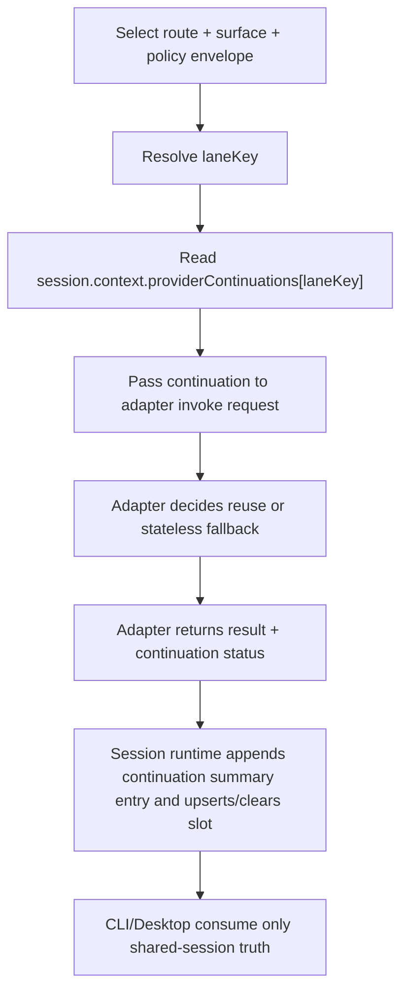

# Repo AI Governor provider 会话复用与后端连续对话技术方案（Draft）

- Status: draft
- Date: 2026-04-04
- Scope: provider-native conversation continuation / backend session reuse / shared-session persistence / adapter contract extension / phased provider rollout
- Target Module IDs:
  - `runtime.orchestration`
  - `runtime.cli-interactive-shell`
  - `runtime.agent-projection`
- Implementation Surfaces:
  - `apps/cli`
  - `packages/adapter-sdk`
  - `packages/core-session`
  - `packages/core-orchestration-service`
  - `packages/adapters/codex`
  - `packages/adapters/claude-code`
  - `packages/adapters/github-copilot`
- Related:
  - `.repo-ai-governor/draft/api-key-remote-adapter-invocation-technical-solution.md`
  - `.repo-ai-governor/draft/session-main-conversational-chat-and-skill-intent-handoff-technical-solution.md`
  - `.repo-ai-governor/normative_knowledge_sources/repo-ai-governor-overall-technical-solution.md`
  - `.repo-ai-governor/normative_knowledge_sources/technical-solutions/runtime-orchestration/adrs/session-main-supervisor-and-role-subagent-collaboration.md`
  - `.repo-ai-governor/normative_knowledge_sources/technical-solutions/runtime-cli-interactive-shell/contracts/cli-session-shell-contract.md`
  - `packages/adapter-sdk/src/types/interfaces/agent-protocol.interface.ts`
  - `packages/core-session/src/shared-session-manager.ts`
  - `packages/core-orchestration-service/src/local-orchestration-service-session-runtime.ts`
  - `apps/cli/src/runtime/session-main-supervisor-runtime.ts`
  - `packages/adapters/codex/src/codex-agent-adapter.ts`
  - `packages/adapters/claude-code/src/claude-code-agent-adapter.ts`
  - `packages/adapters/github-copilot/src/github-copilot-agent-adapter.ts`

## 1. 背景与问题

当前产品已经有两层 continuity，但只完成了其中一层：

1. 本地 canonical session continuity 已存在。
   - `LocalOrchestrationServiceSessionRuntime` 已把 `sessionId / turnId / turnIndex` 作为 shared session truth 管理，并支持 `resume`、transcript、context patch。
   - `SharedSessionManager` 已支持 append-only event log 和 `updateContext()`。
2. provider-native conversation continuity 还没有正式落地。
   - `session-main-supervisor-runtime` 会把 `sessionId / turnId / turnIndex` 放进 stage input，但这只是本地 runtime metadata。
   - 多数 adapter 仍把每一轮 provider 调用当作新的后端对话，而不是复用 provider 自身的 thread / response / conversation handle。

这带来 4 个直接问题：

1. 主 agent 的 follow-up continuity 主要依赖本地 transcript 和 prompt 拼装，无法真正复用 provider 原生会话上下文。
2. 某些 provider 已经返回了 thread/message id，但当前 runtime 没有正式 contract 去保存、选择和回用这些 id。
3. 同一 shared session 在用户视角是连续的，在 provider 视角却常常是“每轮新开一段对话”，会抬高 token、延迟和回答漂移风险。
4. 当前 CLI shell 的 `resume`、`history`、`turn metadata` 已经 productized，但 backend provider continuity 仍停留在“结果偶尔带 id、但系统不真正消费”的半成品状态。

用一句话概括当前现状：

`前台 session continuity 已完成，本地 orchestration continuity 已完成，但 provider-level conversation continuity 还没有成为正式 runtime contract。`

## 2. 当前实现判断

### 2.1 已有能力

当前仓库已经具备实现 provider 会话复用的 3 个前提条件：

1. canonical session owner 已经明确。
   - `packages/core-orchestration-service/src/local-orchestration-service-session-runtime.ts`
   - session summary、event log、resume cursor 已经由本地 orchestration service 托管。
2. session context 已经支持持久化 patch。
   - `packages/core-session/src/shared-session-manager.ts`
   - 这意味着 provider continuation handle 可以进入 shared session context，而不需要新建第二套 durable store。
3. supervisor 已经把 turn identity 传到 adapter input。
   - `apps/cli/src/runtime/session-main-supervisor-runtime.ts`
   - 这意味着 runtime 已具备“把 continuation slot 和 turn lane 绑定”的最小上下文。

### 2.2 未完成能力

当前 provider 侧连续对话仍主要缺在 adapter seam，而不是缺在 shared session seam。

#### 2.2.1 Codex

1. CLI 路径当前每轮都是 fresh `spawn(...)`。
2. `codex exec --json` 的解析里已经能拿到 `thread.started -> thread_id`。
3. `invokeStage()` 也会把 `threadId` 放回 output。
4. 但下一轮调用并没有把这个 `threadId` 再传回 provider。
5. remote API 路径目前请求体仍只有 `{ model, input }`，没有 continuation 字段。

结论：

`Codex 当前已经有“拿到 handle”的半条链，但还没有“回用 handle”的后半条链。`

#### 2.2.2 Claude Code

1. remote API 路径当前会返回 `remoteMessageId`。
2. 但下一轮请求仍是 fresh `messages: [{ role: 'user', content: prompt }]`。
3. CLI 路径当前显式带 `--no-session-persistence`。

结论：

`Claude 当前代码明确偏向 stateless turn execution，不适合作为第一批 CLI 复用目标。`

#### 2.2.3 GitHub Copilot

1. 当前 CLI 路径同样是 fresh `spawn(...)`。
2. 现有 adapter output 没有一条正式的 provider continuation token contract。
3. 因此 runtime 没有稳定依据判断“下一轮该复用什么”。

结论：

`GitHub Copilot 目前更适合放到后续 phase，而不是第一阶段主线。`

## 3. 目标

本方案的目标是把“后端 provider 会话复用”正式化为受治理、可失效、可恢复、可降级的 runtime contract。

具体目标如下：

1. 当 provider 原生支持连续会话时，复用同一 backend conversation，而不是每轮都新开。
2. continuation handle 必须由 adapter 以 opaque token 形式拥有和解释，runtime 不理解 provider 私有语义。
3. continuation handle 必须持久化到 shared session context，而不是只存在某一轮的临时 output。
4. 复用范围必须被严格限定在同一 session lane 内，不能跨 provider、跨 surface、跨高风险边界乱用。
5. provider 不支持时必须安全降级回 stateless，而不是让 runtime 卡死在“必须复用”的错误状态。

## 4. 非目标

1. 不把 provider continuation 变成新的 canonical session source；canonical truth 仍然是 shared session。
2. 不要求所有 provider 和所有 transport 在第一阶段都支持复用。
3. 不做跨 provider continuation，例如 `codex -> claude` 之间共享 conversation id。
4. 不把“本地 transcript replay”伪装成“provider-native reuse”。
5. 不在第一阶段把 provider continuation 扩展成长期记忆或跨 session 记忆能力。

## 5. 备选方案比较

### 5.1 方案 A：每轮完整重放 transcript

做法：

1. 不保存 provider handle。
2. 每轮把 shared session transcript 重新拼进 prompt。

优点：

1. 简单。
2. provider 无需额外能力。

问题：

1. 这不是真正的 provider 会话复用。
2. token 和延迟成本会越来越高。
3. provider 原生 thread / response continuity、tool memory、server-side optimizations 都无法利用。

### 5.2 方案 B：provider 私有逻辑各写各的

做法：

1. 每个 adapter 自己决定要不要存 thread id。
2. runtime 不增加统一 contract。

优点：

1. 单个 provider 可快速试做。

问题：

1. shared session 无法成为统一事实源。
2. CLI / desktop / resume 难以获得一致语义。
3. 各 adapter 会逐渐出现各写一套 continuation 生命周期的漂移。

### 5.3 方案 C：shared session 持有统一 continuation slot，adapter 持有 opaque handle 语义

做法：

1. runtime 增加统一 continuation request/result contract。
2. shared session context 持有 provider continuation slots。
3. adapter 负责把 slot 中的 opaque handle 映射到各自 provider 的 thread/response/message continuation 机制。
4. provider 不支持时，显式返回 `unsupported` 或 `cleared`，runtime 回退到 stateless。

优点：

1. 统一生命周期和失效规则。
2. 不要求 runtime 理解 provider 私有字段。
3. 能与现有 `resume`、transcript、route/surface metadata 对齐。

结论：

`推荐采用方案 C。`

## 6. 推荐架构

实现说明：

1. 以下示例类型以“字段关系说明”为主。
2. 正式落地时，所有有限集合字段必须遵循 `CS-009`，统一落到集中 enum/constants，而不是继续保留 inline string-literal union。
3. 其中 `transportKind` 优先复用现有 `AdapterTransportKind`；新增 continuation 相关有限集合时，建议收口到 `packages/adapter-sdk/src/constants/**`。

### 6.1 引入 `ProviderContinuationHandle`

新增一个 adapter-owned、runtime-transported 的 opaque handle contract：

```ts
interface ProviderContinuationHandle {
  providerId: string;
  surface: string;
  transportKind: AdapterTransportKind;
  handleKind: ProviderContinuationHandleKind;
  referenceValue: string;
  model?: string | null;
  acquiredAt: string;
  metadata?: Record<string, unknown>;
}
```

约束：

1. runtime 只比较兼容性边界，不解析 `referenceValue` 语义。
2. adapter 负责解释 `handleKind + referenceValue + metadata` 如何转成 provider 请求。
3. `referenceValue` 只允许保存 non-secret provider reference，例如 thread/response/conversation/message identifier；bearer-like token、可重放凭据或任何 secret material 禁止 inline 持久化到 shared session。
4. `metadata` 只允许保存 audit-safe、presenter-safe、兼容性判断所需的最小非敏感字段。
5. 如果某个 provider 只能返回敏感 continuation token，则该 provider 在 secret-store reference seam formalized 之前应保持 `unsupported`，而不是把 token 原样写入 session context。
6. 该 handle 不能直接当作用户可见 transcript 内容输出。

### 6.2 引入 session-owned continuation slot

建议把 provider continuation state 落到 shared session context，例如：

```ts
interface ProviderContinuationSlot {
  sessionId: string;
  laneKey: string;
  routeId: string;
  stageId: string;
  roleId: string | null;
  selectedSurface: string;
  providerId: string;
  transportKind: AdapterTransportKind;
  model: string | null;
  policyEnvelope: ProviderContinuationPolicyEnvelope;
  workspaceRoot: string;
  currentWorkingDirectory: string;
  handle: ProviderContinuationHandle;
  updatedAt: string;
}

interface ProviderContinuationSessionState {
  version: 1;
  slots: Record<string, ProviderContinuationSlot>;
}
```

推荐 context key：

`providerContinuations`

补充约束：

1. `sessionId` 建议保留在 slot 中，作为审计、调试和防御性校验字段。
2. 但 `providerContinuations` 仍然是 session-scoped state，不引入跨 session 的全局 continuation registry。
3. `providerContinuations` 的正式落盘不应直接依赖通用 `updateContext({ providerContinuations: ... })` 路径；formalization 必须提供 slot-aware mutation seam，在同一 session mutation lock 内完成 read-modify-write。

推荐补充一条 session-owned mutation contract，例如：

```ts
interface ProviderContinuationSlotMutationRequest {
  sessionId: string;
  laneKey: string;
  operation: ProviderContinuationSlotMutationOperation;
  slot?: ProviderContinuationSlot;
}
```

最低要求：

1. 支持 `upsert` 与 `clear` 两类 slot 级操作。
2. 在 shared session mutation lock 内执行，不能依赖调用方在锁外拼装整张 `slots` map。
3. `providerContinuations` 仍然保留为 session context 中的 canonical persisted shape，但只能通过 slot-aware seam 改写。

### 6.3 lane key 设计

provider continuation 不能只按 `sessionId` 复用，否则会把不同语义的 turn 混进同一 provider thread。

推荐 `laneKey` 至少包含：

1. `routeId`
2. `stageId`
3. `roleId` 或 `session.main`
4. `selectedSurface`
5. `policyEnvelope`

示例：

`main::session.main.answer::session.main::codex::chat_only`

这意味着：

1. `session.main` 的 direct answer thread 不会自动复用到高风险 command handoff。
2. `review` 角色 delegate thread 不会和 `planner` role delegate thread 混用。
3. `chat_only` 与 `mutation_capable` 之间默认隔离。

关于 `sessionId` 的边界：

1. `sessionId` 应该存在于 persisted slot 和 runtime validation 中。
2. `sessionId` 不建议编码进 `laneKey` 本体，因为 continuation slot 已经天然存放在当前 shared session 的 context 下。
3. 如果再把 `sessionId` 编进 `laneKey`，会把 session 级分区重复编码进 key，增加噪音但不增加隔离收益。

### 6.4 adapter 协议增量

建议在 `packages/adapter-sdk/src/types/interfaces/agent-protocol.interface.ts` 上补正式字段，而不是把 continuation 偷偷塞进 `output` 自由字段里。

formal owner 建议拆分为两层：

1. `runtime.agent-projection`
   - owner `AgentStageContinuationRequest/Result`
   - owner provider handle compatibility、transport/provider truth 和 adapter-facing invoke seam
2. `runtime.orchestration`
   - owner `laneKey` derivation、session-scoped slot lifecycle、policy/invalidation rule 和 shared-session projection
3. `runtime.cli-interactive-shell`
   - 只消费 presenter-safe continuation summary，不拥有 raw slot 或 provider handle truth

推荐形态：

```ts
interface AgentStageContinuationRequest {
  mode?: AgentStageContinuationMode;
  sessionId?: string;
  laneKey?: string;
  handle?: ProviderContinuationHandle | null;
}

interface AgentStageContinuationResult {
  status: AgentStageContinuationStatus;
  laneKey?: string;
  handle?: ProviderContinuationHandle;
  invalidationReason?: string;
}
```

并在 invoke/stream contract 中增加：

```ts
interface AgentInvokeStageRequest {
  // existing fields...
  continuation?: AgentStageContinuationRequest;
}

interface AgentInvokeStageResult {
  output: Record<string, unknown>;
  continuation?: AgentStageContinuationResult;
  elapsedMs: number;
}

interface AgentStreamEventsRequest {
  // existing fields...
  continuation?: AgentStageContinuationRequest;
}
```

原因：

1. continuation 是 runtime contract，而不是单纯 provider payload。
2. 它需要被 orchestration、resume、desktop consumer、tests 一起看见。
3. 若继续塞在 `output` 里，后续很难对其生命周期做门禁和统一测试。
4. `sessionId` 建议随 continuation request 一起透传，避免 adapter 在日志、兼容性检查或调试输出里失去 session-scoped trace。

### 6.5 runtime 流程

推荐执行顺序如下：



关键规则：

1. runtime 负责决定“是否允许尝试复用”。
2. adapter 负责决定“如何把 handle 作用到 provider 请求”。
3. session runtime 负责通过 slot-aware mutation seam 把新的 handle 写回或清理 shared session context。
4. presenter 只消费结果，不直接操作 continuation。

### 6.6 continuation 生命周期审计与投影

除了 slot 持久化外，还需要一份 presenter-safe、replay-safe 的 turn-level summaries 集合。

推荐形态：

```ts
interface ProviderContinuationTurnSummary {
  sessionId: string;
  turnId: string;
  stageId: string;
  roleId?: string | null;
  laneKey: string;
  status: AgentStageContinuationStatus;
  providerId: string;
  selectedSurface: string;
  transportKind: AdapterTransportKind;
  handleKind?: ProviderContinuationHandleKind;
  model?: string | null;
  invalidationReason?: string;
}

interface ProviderContinuationTurnProjection {
  sessionId: string;
  turnId: string;
  continuationSummaries: readonly ProviderContinuationTurnSummary[];
  latestContinuationSummary?: ProviderContinuationTurnSummary;
}
```

推荐规则：

1. canonical projection 不应是单条 summary，而应是 `continuationSummaries[]` 这一类按 `stageId + laneKey` 稳定区分的 turn-level summaries 集合，或等价 append-only event list。
2. 每次 stage invoke 完成后，runtime 都应追加或写入一条对应 stage/lane 的 continuation summary，而不是覆盖整条 turn projection。
3. `created / reused / refreshed / cleared / invalid / unsupported` 都必须可回放、可审计、可测试消费。
4. presenter-safe summary 禁止暴露 `referenceValue`，也禁止暴露未来可能存在的 secret-store reference。
5. `desktop`、`CLI presenter`、diagnostics 和 tests 应优先消费这份集合投影，而不是直接依赖 raw slot map。
6. 若 presenter 需要“当前最新 continuation 状态”的简化视图，可以派生 `latestContinuationSummary`，但它只能是派生视图，不能成为唯一事实源。
7. 推荐把该 projection 归入 `runtime.orchestration` 拥有的 turn-completion payload 或等价 shared-session event/audit projection。

### 6.7 失效与清理规则

以下场景必须清理或不复用 continuation：

1. provider 改变。
2. selected surface 改变。
3. transport kind 改变。
4. model 改变且 adapter 未声明兼容。
5. `policyEnvelope` 改变，例如 `chat_only -> mutation_capable`。
6. route/stage/role 改变，导致 laneKey 不再匹配。
7. workspace root 或 `add-dir` 范围变化。
8. provider 返回 `invalid / expired / not_found / conversation_closed` 一类错误。
9. runtime 发生 fallback surface 切换。
10. 用户显式 `/clear`、新开 session，或后续引入 `/reset-provider-session` 一类动作。

额外约束：

1. 不允许跨 provider 复制 handle。
2. 不允许在 fallback 后把旧 surface 的 handle 强行灌给新 surface。
3. 不允许把 read-only lane 的 continuation 复用到高副作用 lane。

## 7. Provider 分阶段策略

### 7.1 Phase A：Codex remote API 优先

这是最合理的第一阶段目标。

原因：

1. Codex adapter 已经能在 output 中带回 `threadId` 一类线索。
2. remote API transport 已经存在，且最容易在 contract 层加入 continuation request/result。
3. 相比 CLI 进程级 session，remote API 的 continuation 语义更容易被 runtime 稳定控制。

第一阶段建议：

1. 先把 `runtime.agent-projection` owner 的 adapter-sdk continuation contract 补齐。
2. 先把 `runtime.orchestration` owner 的 slot-aware persistence 与 turn-level continuation summary 链接上。
3. Codex remote API 若 provider contract 支持 previous response / thread continuation，就先落这一条。
4. 若 provider contract 暂时不支持，就先返回 `unsupported`，不伪造“已复用”。
5. Phase A 只支持 non-secret inline continuation reference；若 provider 只能给敏感 token，则继续保持 `unsupported`。

### 7.2 Phase B：Codex CLI 复用能力探测

当前 Codex CLI 路径虽然能拿到 `thread.started -> thread_id`，但还缺“下一轮如何把 thread_id 回注”的稳定调用方式。

因此建议：

1. 只有在 `codex exec` 已存在正式 continuation flag 或 stdin/session contract 时，才开启 CLI 复用。
2. 若没有正式 contract，就继续保持 stateless fresh spawn。
3. 不建议通过 undocumented 参数或 fragile stdout hack 做伪 session 复用。

### 7.3 Phase C：Claude remote API

当前 Claude remote API 路径已经会返回 `remoteMessageId`，但请求体仍是 fresh messages。

建议：

1. continuation contract 已稳定后，再对 Anthropic 路径补适配。
2. 只有 provider 官方 contract 能明确表达 previous message / conversation continuation 时才接入。
3. 在那之前，`remoteMessageId` 可以保留为 diagnostics，不应被 runtime 误认为已可复用。

### 7.4 Phase D：Claude CLI 与 GitHub Copilot

这两条线都不建议前置。

原因：

1. Claude CLI 当前显式 `--no-session-persistence`，说明今天的 product contract 本来就不打算保留 provider session。
2. GitHub Copilot 现有 adapter 还没有稳定 continuation token surface。

因此更合理的做法是：

1. 先把统一 contract 打稳。
2. 再按 provider 能力成熟度逐个接入。

## 8. 回退与错误处理

provider continuation 必须是“可用时复用，不可用时安全退回 stateless”的能力，而不是强依赖。

建议规则：

1. 默认 `mode=prefer_reuse`。
2. 只有未来某些专门场景才允许 `require_reuse`。
3. 当 provider 明确返回 handle 无效时：
   - 清掉 slot
   - 追加一条对应 stage/lane 的 continuation summary / audit record
   - 最多做一次 stateless retry
4. 当 surface fallback 发生时：
   - 立即切换到新 surface 的 stateless turn
   - 不迁移旧 handle
5. 当 session resume 发生时：
   - shared session 只恢复 slot
   - 实际是否继续复用，由本轮 surface selection 和 adapter compatibility 决定

## 9. 测试与验证建议

### 9.1 单元测试

1. `adapter-sdk` continuation request/result 类型覆盖。
2. slot-aware continuation mutation 在 session lock 内的 upsert/clear 行为。
3. invalidation 规则：
   - surface change
   - model change
   - policyEnvelope change
   - provider invalid handle
4. sensitive continuation material 禁止 inline 持久化的 contract 校验。
5. turn-level continuation summaries projection、redaction 与 `latestContinuationSummary` 派生规则。

### 9.2 adapter 测试

1. Codex remote:
   - 首轮 `created`
   - 次轮 `reused`
   - handle invalid 后 `cleared + stateless retry`
2. Claude remote:
   - 当前阶段至少验证 `unsupported` 路径稳定
3. CLI adapters:
   - 未支持 continuation 时必须稳定回 `unsupported`

### 9.3 orchestration 测试

1. `resume` 后 continuation slot 仍可恢复。
2. `session.main` 不同 lane 之间不会串用 handle。
3. fallback surface 不会继承旧 surface handle。
4. slot 被清掉后，turn-level continuation summaries 仍能区分 `invalid`、`cleared`、`unsupported` 等原因。
5. `serial_role_collaboration` / `parallel_role_fanout` 场景下，同一 turn 的多个 stage continuation summary 不会互相覆盖。

## 10. 风险与约束

### 10.1 最大风险：错误复用导致语义串线

这是本方案最重要的风险。

若 laneKey 设计过宽，容易出现：

1. 聊天轮次把之前 review 的 provider 上下文带进来。
2. read-only turn 误继承 mutation-capable thread。
3. 不同 role 的 delegate thread 互相污染。

因此第一阶段必须宁可保守，不可过宽复用。

### 10.2 第二风险：本地 truth 与 provider truth 漂移

provider thread 可能继续存在，但本地 shared session 可能已经：

1. fallback 到别的 surface
2. 清理过 pending state
3. 改了风险边界

所以必须坚持：

`shared session truth higher than provider thread truth`

即：

1. 本地 runtime 说不能复用，就不复用。
2. provider 还能复用，不代表产品语义允许复用。

### 10.3 第三风险：把 provider id 当作用户能力承诺

某些 provider 会返回 message/thread id，并不等于该 provider 已正式支持下一轮 continuation。

因此：

1. “返回 id”不等于“支持会话复用”。
2. 只有 adapter 在 contract 中显式返回 `created/reused/refreshed`，runtime 才能认为复用成立。

## 11. 推荐实施顺序

1. 在 `runtime.agent-projection` 下补 adapter-facing continuation contract。
2. 在 `core-session` / `core-orchestration-service` 补 slot-aware continuation mutation seam。
3. 在 `runtime.orchestration` 补 turn-level continuation summary / audit projection。
4. 在 `session-main-supervisor-runtime` 计算 laneKey 并透传 continuation request。
5. 先完成 Codex remote path。
6. 补 invalidation、resume、fallback、redaction 测试。
7. 再评估 Codex CLI、Claude remote、GitHub Copilot 的后续接入。

## 12. 方案结论

这项能力不应该被理解为“让 CLI 每次都在后端沿用同一段 provider 对话”，而应该被正式定义为：

`在 shared session truth 约束下，按 lane 受控复用 provider-native continuation handle。`

最终边界应固定为：

1. shared session 是 canonical truth。
2. provider continuation 是 adapter-owned opaque optimization seam。
3. continuation 只有在同 lane、同 surface、同风险包络下才允许复用。
4. provider 不支持时系统必须安全退回 stateless，而不是伪造 continuity。

如果后续要把这份 draft 正式化，推荐按两层拆分：

1. `runtime.agent-projection`
   - 承接 adapter-facing continuation request/result、transport/provider truth 和 capability seam 的 exported contract change
2. `runtime.orchestration`
   - 承接 laneKey、session slot lifecycle、turn-level continuation summary 与 invalidation policy 的运行时规则与 direct-consumer sync

若后续确实需要为 continuation lifecycle 新增独立 exported orchestration contract，应作为 companion change 单独 formalize，而不是直接套进现有 `graph-execution` contract。
