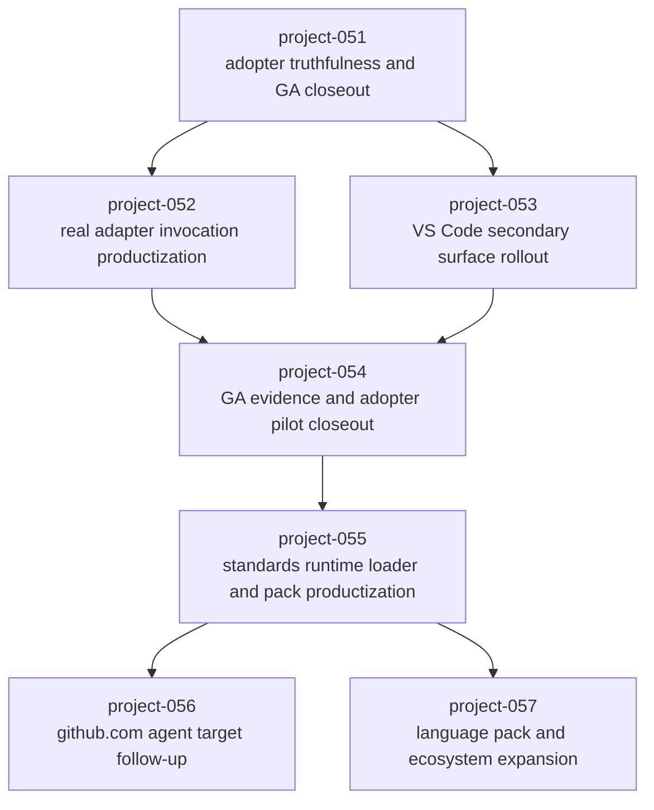

# Repo AI Governor 优先级路线图的 Project / Sprint / Task Package 拆解草案

- Status: draft
- Date: 2026-04-06
- Scope: convert current priority roadmap into executable project / sprint / task packages
- Upstream:
  - `.repo-ai-governor/draft/repo-ai-governor-next-priority-roadmap-based-on-current-surface-status.md`
  - `.repo-ai-governor/draft/repo-ai-governor-current-surface-status-usage-validation-and-gap-guide.md`
  - `.repo-ai-governor/draft/repo-ai-governor-current-priority-backlog.md`
  - `.repo-ai-governor/context/current-context.md`
- Numbering Notes:
  - 当前已有实体 task 文件编号上界为 `TK-585`
  - 本草案建议从 `TK-586` 开始分配新的任务编号块

## 1. 目标

把“接下来应该优先做什么”的路线图，进一步收敛成一份可以直接转成实体执行流的 project / sprint / task package 草案。

本草案的重点不是把所有未来能力一次性铺开，而是：

1. 先明确下一条最值得激活的 `primary stream`。
2. 再明确哪些项目应该进入 `Planned Follow-Up Streams`。
3. 为每个建议项目给出最小可执行的 sprint 和 `TK-xxx` 拆解。

## 2. 总体建议

### 2.1 建议的下一条 primary stream

建议下一条真正激活的主执行流是：

`project-051-adopter-truthfulness-and-ga-closeout`

原因：

1. 当前 CLI 已经是最成熟的 primary surface。
2. 当前最紧迫的剩余问题不在“能力缺失”，而在 adopter truthfulness、支持口径和证据收口。
3. 这条主线完成后，后续 adapter real-invocation、secondary surface、GA evidence 才有稳定基础。

### 2.2 建议登记为 planned follow-up streams 的项目

建议先规划但不立即激活的 follow-up 项目：

1. `project-052-real-adapter-invocation-productization`
2. `project-053-vscode-secondary-surface-rollout`
3. `project-054-ga-evidence-and-adopter-pilot-closeout`
4. `project-055-standards-runtime-loader-and-pack-productization`

建议继续 deferred 的后续项目：

1. `project-056-github-com-agent-target-followup`
2. `project-057-language-pack-and-ecosystem-expansion`
3. 更后面的 P2 平台化项目暂不拆实体执行包

## 3. 推荐执行顺序

## 4. 为什么不建议直接重开旧项目

仓库中已经存在历史项目：

1. `project-020-adoption-productization-and-upgrade-ux`
2. `project-041-desktop-surface-tech-selection-and-design`
3. `project-044-desktop-governance-console-mvp-foundation`
4. `project-046-p1-product-surface-and-delivery-closure`

本草案仍建议创建 `project-051+` 新编号，而不是直接重开旧项目，原因是：

1. 当前问题已经不只是当时的单点 gap，而是基于 `project-050` 完成后的新一轮端面整体现状。
2. 新项目更容易形成新的 closeout 边界、证据链和审计摘要。
3. 旧项目已经承担过历史窗口，不适合把新的 adopter truthfulness / adapter real-invocation / secondary surface 收口全部回灌进去，避免 project truth 被污染。

## 5. project-051：Adopter Truthfulness And GA Closeout

- Recommended Status: `planned -> next primary`
- Recommended Priority: `P0`
- Suggested Stage Mapping: adopter truthfulness / install-upgrade-workspace closeout
- Suggested Phase Mapping: install truth / upgrade & workspace UX / GA support evidence

### 5.1 目标

1. 把当前 CLI primary surface 的 adopter-facing 真值收口为更稳定的产品叙事。
2. 对齐 install mode、workspace migration、upgrade/rollback、support matrix、maintainer evidence。
3. 为后续 adapter 真实调用和 secondary surface 声明建立更稳的外部采用基线。

### 5.2 建议 Sprint 切分

#### sprint-001-install-mode-truth-and-playbook-alignment

- Suggested Status: `planned`
- Sprint Goal: 收紧 `path / link / dist-binary / tgz` 的支持口径，并对齐 README / local adoption / support matrix。
- Task Package: `TK-586`、`TK-587`、`TK-588`

#### sprint-002-upgrade-workspace-ux-and-rollback-closeout

- Suggested Status: `planned`
- Sprint Goal: 把 `upgrade` 与 `workspace dry-run/execute/rollback` 的 adopter 用户路径真正收口。
- Task Package: `TK-589`、`TK-590`、`TK-591`

#### sprint-003-ga-support-truthfulness-and-closeout-evidence

- Suggested Status: `planned`
- Sprint Goal: 将支持矩阵、maintainer playbook、clean-room/release evidence 汇总成统一 closeout truth。
- Task Package: `TK-592`、`TK-593`、`TK-594`

### 5.3 建议任务拆解矩阵（WBS）

| task_id | sprint | title | 目标产出类型 | depends_on | suggested_status |
|---|---|---|---|---|---|
| TK-586 | sprint-001 | freeze adopter install mode support matrix and acceptance contract | contract/docs | current support matrix + README surfaces | planned |
| TK-587 | sprint-001 | align README local adoption playbook and support matrix install-mode truth | docs/alignment | TK-586 | planned |
| TK-588 | sprint-001 | close install-mode truthfulness with clean-room and dist-binary rehearsal evidence | acceptance/evidence | TK-586、TK-587 | planned |
| TK-589 | sprint-002 | freeze upgrade workspace migration rollback user-path contract | contract/ux | TK-588 | planned |
| TK-590 | sprint-002 | implement and document upgrade preview apply rollback plus workspace migration closeout path | implementation/docs | TK-589 | planned |
| TK-591 | sprint-002 | close adopter-facing upgrade and workspace UX with troubleshooting acceptance | closeout/acceptance | TK-589、TK-590 | planned |
| TK-592 | sprint-003 | freeze GA support truthfulness evidence schema and maintainer cross-link contract | contract/evidence | TK-591 | planned |
| TK-593 | sprint-003 | consolidate support matrix maintainer validation and release evidence into one truth surface | docs/evidence | TK-592 | planned |
| TK-594 | sprint-003 | close project-051 with adopter truthfulness audit summary and next-stream recommendation | project/closeout | TK-592、TK-593 | planned |

### 5.4 建议 DoD

1. adopter 能明确知道哪条安装方式是首选，哪条仍有边界。
2. `upgrade / workspace migration / rollback` 在 adopter 文档中形成可操作路径。
3. support matrix 与 maintainer validation playbook 口径一致。
4. 至少一轮 clean-room / dist-binary / release evidence 被收敛到统一 closeout 结论。

## 6. project-052：Real Adapter Invocation Productization

- Recommended Status: `planned follow-up`
- Recommended Priority: `P0/P1`
- Suggested Stage Mapping: adapter real-invocation rollout
- Suggested Phase Mapping: Claude Code baseline / Codex rollout / Copilot-local-model boundary closeout

### 6.1 目标

1. 将多工具适配从“正式支持但偏 fixture-backed”的状态，推进到更可信的真实调用产品路径。
2. 按风险和收益顺序推进：`Claude Code -> Codex -> GitHub Copilot`。
3. 明确 `local-model` 的 fallback / restricted-network 产品定位。

### 6.2 建议 Sprint 切分

#### sprint-001-claude-code-real-invocation-baseline

- Suggested Status: `planned`
- Sprint Goal: 先收口最容易形成真实调用产品路径的 `Claude Code`。
- Task Package: `TK-595`、`TK-596`、`TK-597`

#### sprint-002-codex-real-invocation-and-cross-tool-routing

- Suggested Status: `planned`
- Sprint Goal: 推进 `Codex` 真实调用，并验证跨工具 routing handoff。
- Task Package: `TK-598`、`TK-599`、`TK-600`

#### sprint-003-github-copilot-boundary-and-local-model-positioning

- Suggested Status: `planned`
- Sprint Goal: 收口 `GitHub Copilot` 真实路径边界，并明确 `local-model` 的正式 fallback 口径。
- Task Package: `TK-601`、`TK-602`、`TK-603`

### 6.3 建议任务拆解矩阵（WBS）

| task_id | sprint | title | 目标产出类型 | depends_on | suggested_status |
|---|---|---|---|---|---|
| TK-595 | sprint-001 | freeze Claude Code real invocation config probe timeout and degrade contract | adapter/contract | project-051 closeout recommended | planned |
| TK-596 | sprint-001 | implement Claude Code real invocation defaultable path with structured parsing and timeout handling | adapter/implementation | TK-595 | planned |
| TK-597 | sprint-001 | close Claude Code real invocation baseline with verify run and docs evidence | adapter/acceptance | TK-595、TK-596 | planned |
| TK-598 | sprint-002 | freeze Codex real invocation and cross-tool routing handoff contract | adapter/contract | TK-597 | planned |
| TK-599 | sprint-002 | implement Codex real invocation fallback and route handoff hardening | adapter/implementation | TK-598 | planned |
| TK-600 | sprint-002 | close first-batch multi-tool real invocation routing acceptance | adapter/acceptance | TK-598、TK-599 | planned |
| TK-601 | sprint-003 | freeze GitHub Copilot real invocation boundary and local-model fallback positioning | adapter/product-boundary | TK-600 | planned |
| TK-602 | sprint-003 | implement Copilot real path degrade handling and local-model support matrix alignment | adapter/implementation/docs | TK-601 | planned |
| TK-603 | sprint-003 | close real adapter invocation rollout with support matrix and verify evidence refresh | project/closeout | TK-601、TK-602 | planned |

### 6.4 建议 DoD

1. 至少 1 到 2 个主 adapter 拥有稳定的真实调用产品路径。
2. `verify --adapters` 与 `run --dry-run --trace` 对真实路径有正式证据支撑。
3. support matrix 能区分 fixture-backed、正式真实调用、fallback/degraded 三类状态。

## 7. project-053：VS Code Secondary Surface Rollout

- Recommended Status: `planned follow-up`
- Recommended Priority: `P1`
- Suggested Stage Mapping: secondary surface selection and rollout
- Suggested Phase Mapping: support declaration / MVP hardening / desktop foundation guardrails

### 7.1 目标

1. 明确选择 `VS Code extension` 作为当前更值得收口的 primary secondary surface。
2. 将 desktop 保持为 foundation surface，只补必要 seam，不做大规模产品壳扩张。
3. 为 secondary surface 建立更清晰的文档、验证和正式支持口径。

### 7.2 建议 Sprint 切分

#### sprint-001-vscode-support-boundary-and-packaging-narrative

- Suggested Status: `planned`
- Sprint Goal: 明确 VS Code extension 的正式支持边界、安装说明与 support matrix 口径。
- Task Package: `TK-604`、`TK-605`、`TK-606`

#### sprint-002-vscode-mvp-hardening-and-desktop-foundation-guardrails

- Suggested Status: `planned`
- Sprint Goal: 对 VS Code MVP 做定向 hardening，同时把 desktop 的 non-goal 说清楚。
- Task Package: `TK-607`、`TK-608`、`TK-609`

### 7.3 建议任务拆解矩阵（WBS）

| task_id | sprint | title | 目标产出类型 | depends_on | suggested_status |
|---|---|---|---|---|---|
| TK-604 | sprint-001 | freeze VS Code secondary surface support boundary and packaging matrix | surface/contract | project-051 closeout recommended | planned |
| TK-605 | sprint-001 | align support matrix maintainer evidence and installer narrative for VS Code extension | docs/evidence | TK-604 | planned |
| TK-606 | sprint-001 | close VS Code secondary surface declaration with smoke and docs parity evidence | surface/acceptance | TK-604、TK-605 | planned |
| TK-607 | sprint-002 | freeze VS Code MVP gap list and desktop foundation non-goal guardrails | surface/boundary | TK-606 | planned |
| TK-608 | sprint-002 | implement targeted VS Code MVP hardening and trust-sensitive diagnostics follow-through | implementation | TK-607 | planned |
| TK-609 | sprint-002 | close project-053 with secondary surface rollout summary and desktop foundation recommendation | project/closeout | TK-607、TK-608 | planned |

### 7.4 建议 DoD

1. support matrix 不再只重心宣告 CLI / desktop foundation，而能清晰表达 VS Code extension 的正式状态。
2. VS Code extension 安装与验证叙事形成最小可采用路径。
3. desktop 保持 foundation 口径，不被误述为完整产品。

## 8. project-054：GA Evidence And Adopter Pilot Closeout

- Recommended Status: `planned follow-up`
- Recommended Priority: `P1`
- Suggested Stage Mapping: GA evidence consolidation and pilot rehearsal
- Suggested Phase Mapping: pilot selection / pilot execution / evidence consolidation

### 8.1 目标

1. 用真实目标仓库验证 adopter path。
2. 固化 timing evidence、升级迁移/回滚演练和 GA closeout 证据。
3. 让“我们相信已经可以用”变成“我们有结构化证据证明可以用”。

### 8.2 建议 Sprint 切分

#### sprint-001-real-target-repo-adopter-pilot

- Suggested Status: `planned`
- Sprint Goal: 选择真实目标仓库并完成 adopter rehearsal。
- Task Package: `TK-610`、`TK-611`、`TK-612`

#### sprint-002-ga-evidence-consolidation-and-closeout

- Suggested Status: `planned`
- Sprint Goal: 将 pilot、timing、support matrix、maintainer evidence 汇总为统一 closeout 结论。
- Task Package: `TK-613`、`TK-614`

### 8.3 建议任务拆解矩阵（WBS）

| task_id | sprint | title | 目标产出类型 | depends_on | suggested_status |
|---|---|---|---|---|---|
| TK-610 | sprint-001 | freeze adopter pilot repository selection and acceptance rubric | pilot/contract | project-051、052 recommended | planned |
| TK-611 | sprint-001 | execute pilot-1 install init doctor check verify dry-run rehearsal with timing evidence | pilot/execution | TK-610 | planned |
| TK-612 | sprint-001 | execute pilot-2 upgrade workspace migration rollback rehearsal and capture delta findings | pilot/execution | TK-610 | planned |
| TK-613 | sprint-002 | consolidate support matrix GA evidence and maintainer validation outputs into one dossier | evidence/docs | TK-611、TK-612 | planned |
| TK-614 | sprint-002 | close project-054 with GA readiness recommendation blockers and next-step decision memo | project/closeout | TK-613 | planned |

### 8.4 建议 DoD

1. 至少 1 到 2 个真实目标仓库完成 adopter rehearsal。
2. 有统一 timing evidence 与失败分类。
3. 可产出一份明确的 GA readiness recommendation，而不是分散判断。

## 9. project-055：Standards Runtime Loader And Pack Productization

- Recommended Status: `planned follow-up`
- Recommended Priority: `P1/P2`
- Suggested Stage Mapping: standards runtime productization
- Suggested Phase Mapping: runtime loader path / team pack path / AGENTS adoption boundary

### 9.1 目标

1. 把当前已经很强的 `@repo-ai-governor/standards` 库能力推进成更真实的产品能力。
2. 明确 `official / team / repository` 三层 pack 的消费路径。
3. 决定 root `AGENTS.md` 是否进入 projector 自动产物链。

### 9.2 建议 Sprint 切分

#### sprint-001-standards-runtime-loader-product-path

- Suggested Status: `planned`
- Sprint Goal: 收口 standards runtime loader 的产品消费路径和文档示例。
- Task Package: `TK-615`、`TK-616`、`TK-617`

### 9.3 建议任务拆解矩阵（WBS）

| task_id | sprint | title | 目标产出类型 | depends_on | suggested_status |
|---|---|---|---|---|---|
| TK-615 | sprint-001 | freeze standards runtime loader product path and source-layering contract | standards/contract | project-051 closeout recommended | planned |
| TK-616 | sprint-001 | implement and document standards runtime consumption examples plus team-pack path | standards/implementation/docs | TK-615 | planned |
| TK-617 | sprint-001 | decide AGENTS projector adoption boundary and close standards runtime productization baseline | standards/closeout | TK-615、TK-616 | planned |

### 9.4 建议 DoD

1. `official / team / repository` 三层 source group 有清晰消费路径。
2. standards runtime loader 不再只是 README 中的能力示例。
3. AGENTS 投影边界决策清楚，不再悬而未决。

## 10. project-056：GitHub.com Agent Target Follow-Up

- Recommended Status: `deferred planned`
- Recommended Priority: `P2`

### 建议保留为后续项目，不建议现在激活

建议最小拆解：

1. `TK-618` freeze GitHub.com coding agent target contract and non-MVP exit criteria
2. `TK-619` implement export/apply/verify extension for github_com_agent target
3. `TK-620` close reserved target follow-up with host distribution evidence refresh

当前不建议启动原因：

1. 它不是当前 adopter 主路径最紧迫阻塞项。
2. 当前 host distribution 主体已经完成，reserved target 边界也很清晰。

## 11. project-057：Language Pack And Ecosystem Expansion

- Recommended Status: `deferred planned`
- Recommended Priority: `P2`

### 建议保留为后续项目，不建议现在激活

建议最小拆解：

1. `TK-621` freeze next-wave language pack target matrix and adopter scenarios
2. `TK-622` implement one to two new official language packs or richer examples
3. `TK-623` close language-pack expansion with docs and consumption examples

当前不建议启动原因：

1. Python/Go minimal pack 已存在，不属于“能力缺零”。
2. 当前 ROI 明显低于 adopter truthfulness 与 real adapter path。

## 12. 推荐的 current-context 迁移建议

如果要把这份草案转成实体执行流，建议：

1. 将 `project-051-adopter-truthfulness-and-ga-closeout` 激活为新的 `primary stream`
2. 将以下项目登记到 `Planned Follow-Up Streams`
   - `project-052-real-adapter-invocation-productization`
   - `project-053-vscode-secondary-surface-rollout`
   - `project-054-ga-evidence-and-adopter-pilot-closeout`
   - `project-055-standards-runtime-loader-and-pack-productization`
3. `project-056` 与 `project-057` 先不进入 active/planned stream，保留在路线图级草案即可

## 13. 如果只能现在启动一个项目

如果当前资源只允许启动一个项目，建议只启动：

`project-051-adopter-truthfulness-and-ga-closeout`

原因：

1. 它最直接提高当前 primary surface 的产品完成度。
2. 它会为 adapter 真实调用、secondary surface 声明、GA evidence 建立更稳的地基。
3. 它完成之后，`project-052 ~ project-055` 的优先级和范围会更容易收敛，而不是越做越散。

## 14. 最终建议

把这份拆解草案压缩成一句可执行建议就是：

1. 下一条主流建议激活 `project-051`
2. 再按 `project-052 -> project-053 -> project-054 -> project-055` 顺序推进
3. `project-056` 和 `project-057` 保持 deferred planned，不抢当前窗口资源

也就是说，接下来最合理的动作不是同时新建很多 active stream，而是：

1. 先用一个项目把 primary surface 的 adopter truthfulness 做实
2. 再逐步把 real adapter path、secondary surface、GA evidence 和 standards runtime 依次拉齐
