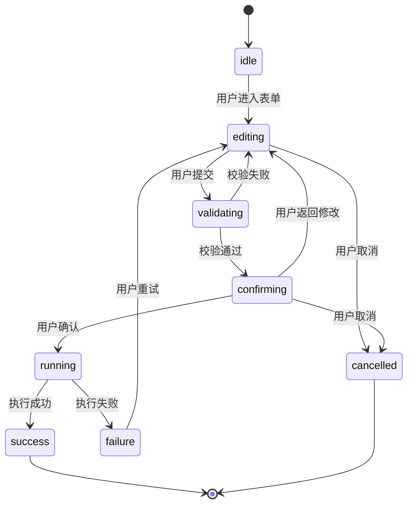

# 评审：React 风格交互式 CLI 技术实施方案

- Status: review
- Date: 2026-03-28
- Target: `.repo-ai-governor/draft/interactive-cli-react-style-technical-solution.md`
- Related:
  - `.repo-ai-governor/draft/interactive-cli-point-and-type-solution-survey.md`
  - `.repo-ai-governor/normative_knowledge_sources/product-requirements-brief.md`
  - `apps/cli/src/main.ts`
  - `apps/cli/src/commands/init-command.ts`
  - `apps/cli/src/constants/cli-command.constant.ts`

## 总体判断

**方案方向正确、结构完整、可执行性较强。** 技术选型（Ink + @inkjs/ui）、分层设计（Shell / Session / Bridge / Runtime）、渐进式切换策略（M1→M2→M3）以及回退保障都经过了合理推演。以下评审聚焦"需要修改或补充"的具体点。

---

## 一、需要修改的问题

### 1. `ReactCliFormField` 接口缺少关键属性

当前 §10 的 `ReactCliFormField` 只有 `id / kind / label / required`，但方案正文多次提到的能力在接口上没有体现：

| 缺失字段 | 来源章节 | 说明 |
|---|---|---|
| `defaultValue` | §6.1-3, §12-3 | "对常见项提供默认值" |
| `placeholder` / `helpText` | §6.1-2, §6.1-4 | "说明文案优先短句"、"错误提示贴近字段" |
| `options` | §9 ReactCliFieldKind.SELECT / MULTI_SELECT | 选项列表没地方声明 |
| `validate` 或 `validationRules` | §9-3, §14.1-3 | "表单校验"在 reducer 层提到，但 descriptor 缺声明入口 |
| `dependsOn` / `visibleWhen` | §6.2-6 | "模板和动态字段控制复杂度"对应的条件显示 |

建议在 §10 的 `ReactCliFormField` 中至少补充 `defaultValue`、`options`、`helpText`、`validate` 四个字段，否则 M1 实现时会发现 descriptor 不够用，导致字段定义逻辑回流到组件层。

### 2. `ReactCliViewModel` 缺少步骤描述信息

当前 `ReactCliViewModel` 只有 `stepIndex`，没有总步骤数、步骤标题等信息。View 层渲染 "Step 2 / 4" 或高亮当前步骤时需要这些数据。

建议补充：

```ts
totalSteps: number;
currentStepTitle: string;
```

### 3. `ReactCliRunState` 缺少 `submitting` 语义

状态机有 `confirming → running`，但实际场景中"用户确认后、命令开始执行前"存在一个提交映射阶段（form values → CLI args），这个阶段如果有参数映射失败，应能路由到 `failure` 而不是直接跳到 `running`。

建议：要么显式加 `SUBMITTING` 状态，要么在 §9 的文字描述中明确 `confirming → running` 的转换包含 bridge 映射，且映射失败回路到 `failure`。

### 4. `workflow` 命令的 `CliCommandName` 注册未提及

§11.1 提出新增 `workflow` 命令入口，但 §5.1 强调"直接复用 `CliCommandName`"。当前 `CliCommandName` 枚举（`apps/cli/src/constants/cli-command.constant.ts`）里没有 `WORKFLOW`。

建议：在方案中显式说明 M2/M3 阶段需要在 `CliCommandName` 中新增 `WORKFLOW`，并同步更新 `CLI_COMMAND_DEFINITIONS`。

### 5. M3 里程碑内容与 §16 描述不一致

- §13 M3 说"补完善 `workflow create/edit/preview`、connect/workspace 默认切 react、upgrade 保持显式启用"
- §16.3 M3 说"`init` 默认切换到 React 风格 CLI、给 upgrade 做 PoC"

两处描述的 M3 范围不同。`connect/workspace` 默认切换和 `workflow edit` 落地分别在哪个 M？需要统一。

建议：统一 §13 和 §16 的 M3 交付清单，明确 `connect/workspace` 默认切换是 M2 末段还是 M3。

---

## 二、需要补充的内容

### 6. ESM / CJS 兼容性约束未提及

当前仓库 CLI 使用 ESM（`import ... from '...js'`）。Ink 4.x 是 ESM-only。方案应确认：

- Ink 版本锁定要求
- 与现有 `tsconfig` 和构建流程的兼容性
- monorepo 中 `apps/cli` 是否需要调整 `package.json` 的 `type` 或 `exports`

### 7. `stderr` 渲染的 Ink 配置方式未展开

§6 明确"React 交互壳层渲染到 `stderr`"，这是关键约束。但 Ink 默认渲染到 `stdout`。方案应补充说明如何实现：

- Ink 的 `render()` 支持自定义 `stdout` / `stdin` 参数，需要显式传入 `process.stderr`
- 或使用 `render(app, { stdout: process.stderr })` 模式
- 这一点应在 §8 的 `react-cli-runner.ts` 职责描述中明确

### 8. 国际化 / i18n 接入策略缺失

方案提到复用 `Locale` 常量，但没有说明 React 组件层的文案如何对接现有 `I18nRuntime`（i18next）：

- 向导标题、步骤说明、验证错误信息的文案走 i18n 还是 hardcode？
- 若走 i18n，组件层如何获取 `t()` 函数？通过 React Context？
- 建议在 §8 目录设计中补充 i18n 接入方式说明

### 9. 异步表单字段（如远程校验）的处理策略未提及

`connect` 命令可能涉及远程校验（如验证 adapter 连接可用性）。当前状态机只有同步的 `validating`，没有说明异步校验的 UX 行为：

- 校验中是否显示 Spinner？
- 校验超时如何处理？
- 建议至少在 §9 或 §14 中注明"首阶段仅支持同步校验；异步校验作为 M2 增强项"

### 10. Ink 实例生命周期管理与 `Ctrl+C` 清理

§12 提到 `Ctrl+C` 走"可恢复中断路径"，但 Ink 的 `render()` 返回的实例需要显式 `unmount()` 和 `waitUntilExit()`。方案应补充：

- 在 `react-cli-runner.ts` 中管理 Ink 实例生命周期
- `SIGINT` 处理时先 unmount React 树，再执行 classic fallback 或 exit
- 未正确清理时可能残留 raw mode 导致终端异常

### 11. 测试策略缺少 `ink-testing-library` 的具体用法说明

§14.2 提到组件测试，§6.2 也提到 `ink-testing-library`，但没有给出测试层次的具体技术栈说明。建议补充：

- 单元/reducer 测试：Vitest + 纯函数
- 组件测试：`ink-testing-library` 的 `render()` + `lastFrame()` 断言模式
- 集成测试：子进程 spawn + stdout/stderr 捕获

### 12. `workflow` 子命令的 Commander 注册方式

当前 `main.ts` 使用扁平命令模型（`program.command('init')`）。`workflow` 带子命令（`workflow init / edit / preview`），需要 Commander 的子命令分组（`program.command('workflow').command('init') ...`）。方案应注明这一点，因为它影响参数解析路径和 `CLI_COMMAND_DEFINITIONS` 的结构。

---

## 三、建议优化

### 13. 将 §13 和 §16 合并为统一的里程碑表

当前方案在 §13（默认切换策略）、§16（里程碑与验收）、§17（任务拆解）三处重复描述了 M1/M2/M3 的内容，存在轻微不一致。建议合并为一个表，减少维护成本。

### 14. 补一张状态机流转图

§9 描述了 8 个状态，但文字不如图直观。建议用 Mermaid 补一张状态机图：



### 15. 考虑 `react-cli` 目录是否应放在独立 package

方案把 `react-cli/` 放在 `apps/cli/src/` 下。考虑到 Ink 引入了 `react`、`react-devtools-core`（可选）、`yoga-wasm-web` 等较重依赖，如果未来 CLI 需要在 CI 中作为轻量入口使用，可考虑将 React CLI 抽为 `packages/cli-react-ui` 并按需加载，避免主 CLI bundle 膨胀。

这是一个可选优化，不阻塞 M1，但值得在方案中记一笔作为后续评估项。

---

## 四、总结

| 类别 | 条数 | 优先级 |
|---|---|---|
| 需修改（接口/状态机/一致性） | 5 条 | 高，影响实现正确性 |
| 需补充（工程约束/测试/生命周期） | 7 条 | 中高，影响首迭代交付质量 |
| 建议优化（结构/可视化/拆包） | 3 条 | 中低，可选但推荐 |

建议修订后升级为 `ready-for-review`，再进入任务拆解。

## 五、复核结论（2026-03-28）

我已经复核了修订后的 [interactive-cli-react-style-technical-solution.md](./interactive-cli-react-style-technical-solution.md)，结论是：

1. 核心结构性问题已经补齐，尤其是 `ReactCliFormField`、`ReactCliViewModel` 和 `ReactCliRunState` 的表达能力明显增强，不再容易把字段定义回流到组件层。
2. `workflow` 的命令边界已经被显式化，新增 `CliCommandName.WORKFLOW`、Commander 子命令树注册和 `CLI_COMMAND_DEFINITIONS` 更新都写进了方案，注册路径清楚了。
3. M2 / M3 的里程碑口径已经统一，`workflow preview` 作为 M2 只读预览、`workflow create/edit` 作为 M3 编辑落地，这个拆分是自洽的。
4. `stderr` 渲染、Ink 生命周期、`SIGINT` 清理、i18n 注入、异步校验、`ink-testing-library` 和子进程集成测试都已经写成工程约束，首迭代实现时不容易漏。
5. 目前剩余的优化项主要是架构层面的可选分拆，不再是会阻塞实现正确性的缺口。

因此，这份方案已经从“有方向”推进到“可进入后续推广准备”的状态。若下一步要继续走 promotion 流程，建议同步检查 compressed 版是否也保持同口径，再进入生命周期/模块注册的正式化步骤。
