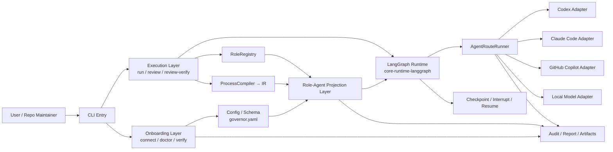

# 技术方案评审：多 AI 工具快速接入与 Role-Agent 投影统一方案

- 评审对象: `.repo-ai-governor/draft/multi-ai-tools-onboarding-with-role-agent-projection-technical-solution.md`
- 评审日期: 2026-03-28
- 交叉对比文档:
  - `.repo-ai-governor/draft/multi-ai-tools-fast-onboarding-technical-solution.md`
  - `.repo-ai-governor/draft/role-to-agent-projection-technical-solution.md`
  - `.repo-ai-governor/draft/langgraph-orchestration-technical-solution.md`
  - `.repo-ai-governor/normative_knowledge_sources/repo-ai-governor-overall-technical-solution.md`
  - `.repo-ai-governor/normative_knowledge_sources/product-requirements-brief.md`
  - `.repo-ai-governor/normative_knowledge_sources/technical-solutions/runtime-orchestration/module-overview.md`

---

## 一、总体评价

方案定位清晰，"外层快速接入 + 内层 role-agent 投影"的两层结构是合理的合并策略，既保留了两份源方案各自的重点，又避免了功能散落。三层架构（接入层 → 投影层 → 执行层）与现有 overall-technical-solution 的分层体系能够对齐。

**方案的主要优点：**

1. 明确了"不重写 runtime"的红线，投影层只做展示语义，不做第二套执行路径
2. 保留了 `role → route → adapter` 主链路不变的原则
3. `connect / doctor / verify` 三段式接入链路清晰，用户心智负担可控
4. 实施顺序合理：先边界→再接入→再投影→最后视图

---

## 二、需要修改或补充的问题

### 2.1 接入层细节丢失——应从源方案回补

> [!WARNING]
> 统一方案将源方案 `multi-ai-tools-fast-onboarding-technical-solution.md` 的大量关键细节压缩掉了，若本方案定位为"唯一可执行参考"，则以下内容必须回补。

| 丢失的内容 | 来源位置 | 建议处理 |
|---|---|---|
| `connect` 的完整参数列表（`--tools`, `--preset`, `--dry-run`, `--overwrite`, `--single-tool-all-roles`, `--role-binding`） | 源方案 §5.1 | 回补到 §5 或作为附录引用 |
| `doctor --fix` 的安全修复边界决议（`safe_local` vs 人工行为只输出 `nextAction`） | 源方案 §12.2 | 这是一个已采纳决策，应显式保留 |
| `verify --adapters` 的三档通过阈值定义（`pass/warn/fail`） | 源方案 §12.3 | 当前方案只说了"给出最终结论"，缺乏可验证的判定标准 |
| **Preset 模板列表与作用说明**（`single-tool-minimal`, `multi-tool-default`, `single-tool-all-roles`, `restricted-network-safe`） | 源方案 §5.4 | 模板是产品体验的关键快捷路径，不应省略 |
| `governor.yaml` 配置段结构示例 (`adapters.tools` / `routing.roleBindings`) | 源方案 §6 | 没有配置示例，读者无法快速理解接入产物形态 |
| 输出契约最小字段定义（`verify --adapters --output json` schema） | 源方案 §8 | 当前方案 §5.3 只列了一行字段名，不够精确 |
| 失败与降级策略（单工具不可用不阻断、全部不可用返回修复步骤、受限网络 `degraded`） | 源方案 §9 | 统一方案完全没提降级策略 |

**建议：** 如果本方案定位为"合并后的唯一入口"，则至少通过"附录"或"引用对齐"的方式保留上述细节。如果源方案仍保留为可查阅文档，则至少在本方案中注明"细节见 §X of source doc"并确保路径引用准确。

---

### 2.2 投影层缺少 `AgentDescriptor` 的 TypeScript 类型约束

当前 §6.3 列出了 `AgentProjectionService` 的输入和输出字段名，但没有给出哪怕是 Draft v1 级别的类型定义。对比 overall-technical-solution §6.2 中 `Agent 契约` 已经有 12+ 个字段定义（含 `capabilities`, `permission_level`, `budget`, `retry_policy_ref` 等），而本方案的 agent descriptor 与 overall 里的 `Agent 契约` 之间的关系没有明确。

**建议补充：**

1. 给出 `AgentDescriptor` 的最小 TypeScript interface（Draft v1），明确每个字段的类型和可选性
2. 明确 `AgentDescriptor` 与 overall-technical-solution §6.2 `Agent 契约` 的关系——是同一个结构补字段，还是两层独立投影？
3. 在 sprint-001 `TK-305`（冻结 agent descriptor 最小字段集）中出一份正式契约文档

---

### 2.3 模块落点与 Monorepo 分层不一致

当前 §9 的模块建议把 `agent-projection/` 放在 `apps/cli/src/` 下：

```
apps/cli/src/
  onboarding/
  agent-projection/
```

但 `AgentProjectionService` 本质上是一个领域服务，它的消费者不只是 CLI，还包括 report、diagnostics 和未来桌面端。按照 overall-technical-solution §4.1 的分层和 LangGraph 方案 §5.1 的职责划分，这类服务应该在 `packages/` 层。

**建议调整：**

```
packages/core-agent-projection/    ← 领域投影服务，可被 CLI/report/desktop 复用
  src/
    agent-projection.service.ts
    agent-descriptor-registry.ts
    agent-session-registry.ts
    agent-projection.types.ts
    agent-projection.mapper.ts

apps/cli/src/
  onboarding/                      ← CLI 专属的接入体验命令
    onboarding-command.ts
    onboarding-template-registry.ts
  agent-projection/
    agent-projection.presenter.ts  ← CLI 专属的 presenter 层
```

`onboarding` 命令入口放在 CLI 是正确的，因为它是 CLI 交互专属的。但 projection service 应当提升为独立包。

---

### 2.4 LangGraph Supervisor 的位置和职责需要精确定界

§9.3 和 §12 架构图中出现了 `LangGraph Supervisor` 作为独立层，承接 agent 节点调度。但：

1. **与现有 LangGraph 方案的关系未明**：`langgraph-orchestration-technical-solution.md` 已经定义了 `packages/core-runtime-langgraph` 作为 LangGraph 适配层，且明确"LangGraph 只负责图怎么跑"。本方案的 `LangGraph Supervisor` 是另起新模块，还是复用 `core-runtime-langgraph`？
2. **Supervisor 与 `AgentRouteRunner` 的交互路径不清楚**：架构图显示 `Supervisor → Agent Node → AgentRouteRunner`，但 agent node 内部是否仍然走 `CompiledIrGraphAdapter` 编排 → `task-driven-run-runtime` 选角色 → `AgentRouteRunner` 分发？还是 supervisor 直接调度？
3. **Supervisor 是否引入了新的编排概念？** 如果是，它和 `ProcessCompiler → IR → graph adapter` 这条已有链路的差异是什么？

> [!IMPORTANT]
> 建议在 §4.2 或 §9.3 中加一个明确说明：`LangGraph Supervisor` 就是 `core-runtime-langgraph` 在 multi-agent 场景下的用法扩展，不是新的编排概念。agent node 内部仍然调用现有的 `AgentRouteRunner` 和 `AgentProtocolContract`。

---

### 2.5 Agent Session 生命周期与现有 Session/Memory 模型的关系

方案提到 `AgentSessionRegistry` 负责"将 agent descriptor 与 execution/session 绑定"并回写给 report/UI，但：

1. overall-technical-solution §4.3 已经有 `Shared Session Manager` 和 `execution_session_id` 概念
2. runtime-orchestration module 已经有 `memory-context-assembly` 和 `memory-recall-policy` 契约

**需要回答：**
- `agent_session` 是 `execution_session` 的子集/投影？还是新增的独立会话？
- 如果是投影，`AgentSessionRegistry` 只读取 `Shared Session Manager` 的状态再做展示投影即可
- 如果是新增，需要说明它和 `execution_session_id` 的关系，避免出现双源

**建议：** 在 §6 中增加一小节"与现有 Session/Memory 的集成点"，明确 `AgentSessionRegistry` 是投影视图而非新的 session source。

---

### 2.6 缺少对 `adapter-routing-runtime` 和 `adapter-verification-runtime` 的对齐说明

方案 Related 列表中列出了 `apps/cli/src/runtime/adapter-routing-runtime.ts` 和 `adapter-verification-runtime.ts`，但正文中没有说明这些已有 runtime 与新方案的关系。具体地：

- `doctor --adapters` 的探测逻辑是否复用 `adapter-verification-runtime`？
- `connect` 的路由生成是否复用 `adapter-routing-runtime`？
- 如果复用，应在 §5 中说明集成方式；如果替代，应在 §11 风险中说明迁移策略

---

### 2.7 Sprint 内的任务粒度和依赖关系需要细化

§14.3 任务拆解整体合理，但有几个问题：

1. **TK-304（三层契约定义）和 TK-305（descriptor 字段集冻结）之间缺少显式依赖声明**——TK-305 依赖 TK-304 的输出
2. **Sprint-003 中 TK-309/310/311 的依赖关系不明确**—— TK-311（LangGraph supervisor 接入）是否依赖 TK-309（projection service）的完成？从架构图看 supervisor 与 projection 是并行的，但从数据流看 supervisor 需要使用 agent descriptor
3. **缺少 sprint-001 的配置 schema 冻结任务**——如果 `adapters.tools` / `routing.roleBindings` 的 schema 不在 sprint-001 锁定，sprint-002 的 `connect` 实现会缺乏输入契约

**建议：**
- 在 TK-304 结果定义中显式包含 `governor.yaml` 配置 schema v2（含 `adapters` + `routing` 段）
- 给 TK-311 增加前置依赖 `TK-309`
- 增加任务间依赖图（可用 Mermaid 表示）

---

### 2.8 缺少验收指标的量化标准

§14.5 项目级验收口径是定性的（例如"多工具接入链路可在 connect / doctor / verify 中闭环验证"），但缺少量化标准。

**建议补充：**

1. `connect`: 至少覆盖 2 种 preset（`single-tool-all-roles` + `multi-tool-default`），生成的配置可通过 schema 校验
2. `doctor --adapters`: 至少覆盖 1 条可修复路径 + 1 条无法自动修复路径的 `nextAction` 输出
3. `verify --adapters`: 输出矩阵可回链 `execution_id`，且三档判定（`pass/warn/fail`）均有覆盖
4. `AgentProjectionService`: 给定同一组 role/route/adapter 输入，投影结果幂等且可序列化为 JSON
5. LangGraph supervisor: `run` 主链路 parity test 通过（与非-supervisor 路径的 audit 输出一致）

---

### 2.9 缺少对外部 Adopter 场景的具体说明

方案多次提到"外部 adopter"和"拿来就能用"，但没有定义外部 adopter 的最小路径。

**建议补充一段 §7.1 或在 §14 中新增任务（可考虑放 sprint-004）：**

- 外部 adopter "Hello World"路径：`npm install → repo-ai-governor init → connect → doctor → verify → run`
- 最小前置依赖：Node.js 版本要求、至少一个 AI 工具已安装（e.g. Codex CLI）
- 预期输出：首次 `verify` 报告通过后可执行第一次治理运行

---

### 2.10 架构图可优化

§12 的 Mermaid 架构图整体方向正确，但有两个问题：

1. **Onboarding Layer 直连 Projection Layer 的箭头暗示了数据流依赖**，但实际上 `connect/doctor/verify` 可以在没有 projection layer 的情况下独立工作——接入层和投影层应该是并行可用的，而不是串行依赖
2. **缺少 `RoleRegistry` 和 `ProcessCompiler` 到 Projection Layer 的输入箭头**——projection service 需要从 role registry 获取 role 定义，从 process compiler 获取 stage context

**建议改进为：**



---

## 三、小项修改建议

| # | 位置 | 问题 | 建议 |
|---|---|---|---|
| 1 | §1 标题 | "Draft" 在标题和 status 都标了 | 保留 status 字段即可，标题中去掉 `（Draft）` 或保留一处 |
| 2 | §3.1 第3条 | "connect / doctor / verify / run / review / review-verify / HITL 都不是空壳" | 建议改为"已实装核心路径"，"不是空壳"作为方案文档措辞不够正式 |
| 3 | §6.3 第11条 | `budget / timeout / constraint 摘要` 粒度不够 | 参考 overall §6.2，拆分为 `token_budget`, `cost_budget`, `time_budget_seconds`, `timeout_policy_ref` |
| 4 | §9 | 缺少 `agent-projection.types.ts` | 源方案 §5 有这个文件，统一方案应保留 |
| 5 | §10 | "先把 connect / doctor / verify 收成一个稳定 onboarding 界面" | 措辞不清——"界面" 应明确为"命令集"或"CLI 子命令组" |
| 6 | §11 第4条 | "`pretty/plain/json` 和 `--no-interactive`" | `--no-interactive` 在源方案中未出现，如果是新引入的 flag 需要说明来源 |

---

## 四、综合结论

| 维度 | 评估 |
|---|---|
| 方案定位与目标 | ✅ 清晰，"接入 + 投影"两层合并逻辑合理 |
| 与 overall-technical-solution 对齐 | ⚠️ 大方向对齐，但 agent descriptor 与 §6.2 agent 契约关系需澄清 |
| 与 LangGraph 方案对齐 | ⚠️ Supervisor 的定位需要与 `core-runtime-langgraph` 显式关联 |
| 接入层完整度 | ❌ 关键细节（参数、schema、降级策略、preset 模板）丢失过多 |
| 投影层完整度 | ⚠️ 概念清晰但缺乏 TypeScript 级别的契约定义与 session 集成说明 |
| 模块分层 | ❌ `agent-projection` 放在 `apps/cli/src/` 下不合理，应提升为 packages |
| Sprint/Task 拆解 | ⚠️ 整体合理但缺少任务间依赖声明和配置 schema 冻结任务 |
| 验收标准 | ❌ 只有定性描述，缺少量化指标 |
| 外部 adopter 说明 | ❌ 多次提及但无具体的最小可用路径 |

**总体建议：** 方案核心思路和分层设计是好的，建议按上述评审意见补充完善后，再提交到 `technical-solution-lifecycle-registry` 进入正式 promote 流程。重点优先修复：**§2.1 接入层细节回补**、**§2.3 模块分层调整**、**§2.4 LangGraph Supervisor 定界**。

---

## 五、复核结论（2026-03-28）

- 整体结论：**认可**

### 逐条复核
1. `2.1 接入层细节丢失`
   - 判定：**认可**
   - 处理：已回补到方案正文的 `5.0~5.6`，包括 connect 参数、doctor safe_local 边界、verify 阈值、preset、配置示例、输出契约和降级策略。
2. `2.2 投影层缺少 AgentDescriptor 类型约束`
   - 判定：**认可**
   - 处理：已在方案正文新增 `AgentDescriptor` TypeScript 契约草案，并说明其与 overall agent 契约的关系。
3. `2.3 模块落点与 Monorepo 分层不一致`
   - 判定：**认可**
   - 处理：已将投影服务提升为 `packages/core-agent-projection`，CLI 仅保留 onboarding 命令和 presenter。
4. `2.4 LangGraph Supervisor 的位置和职责需要精确定界`
   - 判定：**认可**
   - 处理：已说明其为 `core-runtime-langgraph` 的 multi-agent 用法扩展，并明确不替代 `AgentRouteRunner` / `AgentProtocolContract`。
5. `2.5 Agent Session 生命周期与现有 Session/Memory 模型的关系`
   - 判定：**认可**
   - 处理：已补充 `AgentSessionRegistry` 仅投影视图，不引入新的会话事实源，并对接现有 `Shared Session Manager`。
6. `2.6 缺少对 adapter-routing-runtime 和 adapter-verification-runtime 的对齐说明`
   - 判定：**认可**
   - 处理：已在 `9.4` 明确 connect、doctor、verify 的复用方式。
7. `2.7 Sprint 内的任务粒度和依赖关系需要细化`
   - 判定：**认可**
   - 处理：已为 `TK-304~TK-314` 增加依赖列，并补充任务依赖图与 schema 冻结说明。
8. `2.8 缺少对验收指标的量化标准`
   - 判定：**认可**
   - 处理：已在 `14.5` 增加可验证的量化验收口径。
9. `2.9 缺少对外部 adopter 场景的具体说明`
   - 判定：**认可**
   - 处理：已新增 `7.1` 外部 adopter 最小路径。
10. `2.10 架构图可优化`
   - 判定：**认可**
   - 处理：已改为并行可用的 Onboarding / Execution 结构，并补入 `RoleRegistry`、`ProcessCompiler` 与 projection 的输入关系。

### 验证命令
1. `sed -n '1,620p' .repo-ai-governor/draft/multi-ai-tools-onboarding-with-role-agent-projection-technical-solution.md`（通过）
