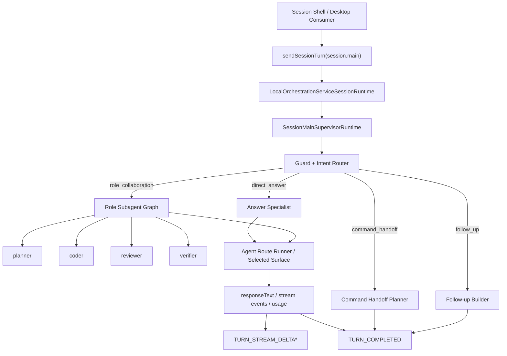
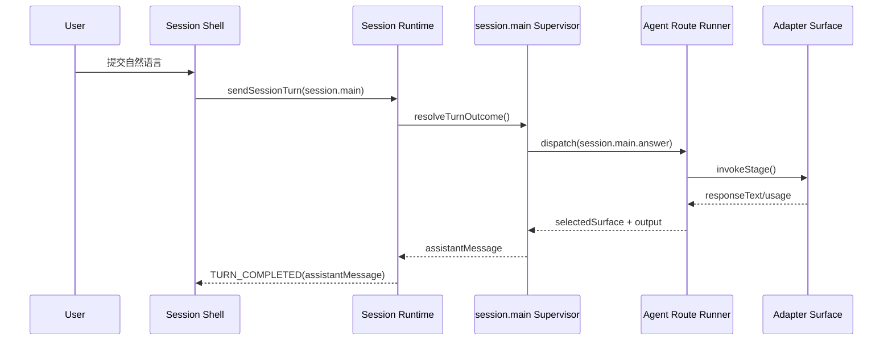
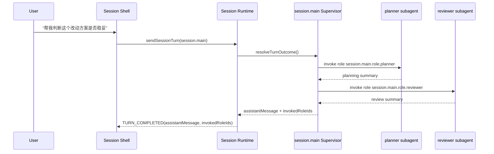

# Repo AI Governor `session.main` 真回答与命令接管技术方案（Draft）

- Status: draft
- Date: 2026-03-31
- Scope: service-owned `session.main` / conversational answer execution / natural-language command handoff / CLI + desktop shared session semantics
- Target Modules:
  - `runtime.cli-interactive-shell`
  - `runtime.orchestration`
  - `runtime.adapter-routing`
  - `entry.cli`
- Related:
  - `.repo-ai-governor/draft/interactive-cli-session-first-agent-shell-technical-solution.md`
  - `.repo-ai-governor/draft/session-shell-output-presentation-and-markdown-rendering-technical-solution.md`
  - `.repo-ai-governor/draft/langgraph-orchestration-technical-solution.md`
  - `.repo-ai-governor/context/dev/project-033-session-main-agent-runtime-productization/plan.md`
  - `packages/core-orchestration-service/src/local-orchestration-service-session-runtime.ts`
  - `packages/core-orchestration-service/src/local-orchestration-service-session-main-agent-dispatcher.ts`
  - `apps/cli/src/runtime/interactive-shell/session-shell-runner.ts`
  - `apps/cli/src/runtime/interactive-shell/session-shell-transcript-store.ts`

## 1. 背景与问题

当前 `repo-ai-governor` 已经具备：

1. `pnpm exec repo-ai-governor` 进入 session shell 的默认入口。
2. 普通文本输入被发送到 `session.main`。
3. `session.main` 能输出 `responseMode / selectedSurface / selectedBy / suggestedSlashCommand / executionIntent` 等结构化元数据。

但用户实际体验仍然是：

1. 普通问句不会得到真正的 assistant 回答。
2. 界面只显示一张 command recap 卡片。
3. `Surface: codex` 这类字段只是“选路元数据”，并不代表真的调用了对应 agent surface。

根因已经在代码层坐实：

1. `session shell -> sendMainTurn()` 链路是真实存在的。
2. transcript presenter 只有在 turn result 带 `assistantMessage` 时，才会渲染成真正的 assistant 消息。
3. 当前 `LocalOrchestrationServiceSessionMainAgentDispatcher` 的默认 `ANSWER` 分支只返回：
   - `responseMode=answer`
   - `executionIntent=session.answer`
   - `selectedSurface / selectedBy`
4. 但它没有真正调用 adapter route，也没有填 `assistantMessage`。

结果就是：

1. `project-033` 交付了“service-owned main-agent turn contract”。
2. 但还没有交付“主 agent 真正生成回答或结构化发起命令执行”。

## 2. 目标

本方案目标是把 `session.main` 从“结构化回执路由器”升级为“真对话主 agent”，让用户在执行：

```bash
pnpm exec repo-ai-governor
```

之后，输入自然语言时可以得到以下三种真实结果之一：

1. 直接得到 assistant 回答。
2. 得到澄清问题。
3. 得到命令执行预览，并在合适条件下触发命令 handoff。

同时必须保持：

1. canonical session truth 继续由 local orchestration service 托管。
2. CLI 与 future desktop 继续只消费 shared DTO / event contract。
3. 高风险命令不能因为自然语言入口而绕过确认与治理。
4. `pretty/plain/json`、`stderr/stdout` 边界和 `resume` 语义不被破坏。
5. 当前 `project-032` 已落地的 Markdown transcript presenter 能直接复用。

## 3. 非目标

1. 不在首阶段把 `session.main` 变成完整的 graph-first supervisor。
2. 不让自然语言入口直接替代 `run / review / workflow` 等后台治理流程。
3. 不在首阶段强制实现所有 adapter 的 token 级实时 streaming。
4. 不让 CLI 进程成为新的 session state owner。
5. 不让 `core-orchestration-service` 直接依赖 `apps/cli/**` 私有 runtime。

## 4. 外部参考结论

基于官方资料，可以提炼出 4 条与当前问题高度相关的共识。

### 4.1 Session 必须由 runtime 持久化，而不是 presenter 自己拼历史

OpenAI Agents SDK 的 `sessions` 文档明确采用：

1. runner 在每次 turn 前读取 session history。
2. turn 完成后把 user input 与 assistant output 一并写回 session。
3. 同一 session 可以继续用于恢复、审批中断和后续 turn。

这和当前仓库已经接受的 `service-owned session truth` 完全一致。

参考：

1. [OpenAI Agents SDK Sessions](https://openai.github.io/openai-agents-js/guides/sessions/)

### 4.2 “回答”与“工具/命令调用”应该是结构化分流，而不是全靠字符串拼接

OpenAI Responses API 的 function calling 与 Agents SDK 的 handoffs 都强调：

1. 模型可以输出最终回答。
2. 也可以输出结构化 tool call / handoff。
3. 实际执行动作仍由应用层掌控，而不是让模型文本直接等同于执行。

这说明当前仓库最合理的方向不是“让 `session.main` 随便输出一段文本，CLI 自己猜要不要执行”，而是：

1. `session.main` 产出结构化 turn result。
2. shell 根据 `responseMode / executionIntent / requiresConfirmation` 决定 preview、确认或执行。

参考：

1. [OpenAI Responses Function Calling](https://platform.openai.com/docs/guides/function-calling?api-mode=responses)
2. [OpenAI Agents SDK Handoffs](https://openai.github.io/openai-agents-js/guides/handoffs/)

### 4.3 Streaming 与 approvals/resume 应该是 runtime 的正式能力

LangGraph 官方文档把 streaming 与 interrupts 都视为一等运行时能力：

1. streaming 用来持续暴露 message chunk 和 progress updates。
2. interrupt 用来暂停等待外部确认，再在同一 thread/session 上恢复。

这和本仓库现有：

1. `TURN_STREAM_DELTA`
2. `TURN_COMPLETED / TURN_FAILED / TURN_CANCELLED`
3. `resumeSession`

的方向是统一的。

参考：

1. [LangChain Streaming](https://docs.langchain.com/oss/javascript/langchain-streaming)
2. [LangGraph Interrupts](https://docs.langchain.com/oss/javascript/langgraph/interrupts)

### 4.4 Slash command 更适合被视为用户可发现的 prompt/tool surface

MCP 对 prompts 的说明里明确提到：prompts 适合被客户端作为“用户可显式发现并触发的入口”暴露，例如 slash commands。

这意味着：

1. 当前仓库的 slash command registry 仍然应由 shell 控制。
2. 后续如果要把某些 slash command 做成更标准的 prompt/tool capability，方向也是兼容的。
3. 但这不要求 `session.main` 首阶段就完全 MCP 化。

参考：

1. [Model Context Protocol Introduction](https://modelcontextprotocol.io/)
2. [Model Context Protocol Prompts](https://modelcontextprotocol.io/specification/2025-06-18/server/prompts)

### 4.5 多 agent 交互更适合用 supervisor / subagents / handoffs，而不是单一回答器

LangChain 官方 multi-agent 文档把多 agent 的核心价值归纳为：

1. context management
2. distributed development
3. parallelization
4. multi-hop collaboration

并明确给出几种模式：

1. `subagents`
2. `handoffs`
3. `router`
4. `custom workflow`

这和你现在指出的问题完全一致：

1. 我们已经 `connect` 了多个 role。
2. 但这些 role 目前仍然只是“已连接 descriptor”，不是“可交互、可协作的前台子 agent”。
3. 如果继续停留在单一 answer executor 路径，那么这些 role 之间依然没有真正的交互手段。

同时，A2A 官方也明确区分了：

1. MCP 更适合 tools/resources
2. A2A 更适合 agent-to-agent collaboration

这说明从中长期方向看：

1. 如果我们希望 `session.main` 最终能把已 connect 的 roles 组织起来协作，
2. 那么更合理的目标架构不是“单 agent 回答器”，
3. 而是“supervisor + subagents / handoffs”的多 agent 前台运行时。

参考：

1. [LangChain Multi-agent](https://docs.langchain.com/oss/javascript/langchain/multi-agent)
2. [A2A Protocol](https://a2a-protocol.org/latest/)
3. [A2A and MCP](https://a2a-protocol.org/dev/topics/a2a-and-mcp/)

## 5. 方案对比

### 5.1 方案 A：最小补丁，只给默认 `ANSWER` 分支塞模板文案

做法：

1. 保持当前 dispatcher 不调用真实 adapter。
2. 在默认分支里直接拼一个 `assistantMessage`，例如“已收到，我将帮你检查工作区状态”。

优点：

1. 改动最小。
2. 很快能让 recap 消失。

问题：

1. 仍然没有真实回答。
2. `selectedSurface` 依然是伪元数据。
3. 无法解释为什么路由到某个 surface，也无法实际执行命令。

结论：

1. 不推荐，只能当临时止血。

### 5.2 方案 B：service-owned hybrid main-agent

做法：

1. 保留 service-owned `session.main`。
2. 保留 deterministic command-intent guard 作为第一层分流。
3. 对普通自然语言 turn，真正走 adapter route runner 生成回答。
4. 对命令型自然语言 turn，输出 handoff preview，并在安全策略允许时执行。

优点：

1. 与 `project-033` 已落地的 path A 完全连续。
2. 能最快补上“真回答”能力。
3. 高风险动作仍然能保持 preview + confirm。
4. 现有 Markdown transcript、resume、desktop consumer parity 都能复用。

问题：

1. 需要补一个真正的 service-side answer executor。
2. 需要解决 `core` 包和 `apps/cli` routing runtime 的依赖边界。
3. 首阶段 streaming 可能只能做到 coarse delta，而不是所有 surface 都 token 级。

结论：

1. 可作为过渡实现，但不应作为最终目标架构。

### 5.3 方案 C：graph-first foreground supervisor + role subagents / handoffs

做法：

1. 前台每个自然语言 turn 都进入 service-owned supervisor runtime。
2. supervisor 维护共享 session state，并根据 turn 状态决定：
   - 直接回答
   - 发起 follow-up
   - 生成 command handoff preview
   - 调度一个或多个 role subagents
3. 已 `connect` 的 roles 不再只是静态 descriptor，而是变成：
   - 可被 `session.main` 调用的 subagents
   - 可参与 handoff 的 role endpoints
   - 可在同一 session state 下协作的执行单元
4. 后续若要引入远端 agent，可继续沿着 `A2A for agents + MCP for tools` 扩展。

优点：

1. 长期扩展性最好。
2. 与 future multi-agent orchestration 更统一。
3. 最适合解决“connected roles 之间目前完全没有交互”的结构性缺口。
4. 更容易把 `planner / coder / reviewer / verifier` 从静态角色注册升级成真正可协作的前台 agent network。
5. 更贴合外部社区在 multi-agent 上的主流模式：`supervisor / subagents / handoffs / custom workflow`。

问题：

1. 对当前缺口来说更重，需要新增 supervisor runtime seam，而不是只补 answer executor。
2. 需要谨慎切分“前台多 agent 协作”和“后台高副作用治理流程”，避免让前台 supervisor 绕过 policy gate。
3. 需要先解决 package 依赖边界，不能让 `core-orchestration-service` 直接吃 `apps/cli` 私有 runtime。

结论：

1. 推荐作为目标架构。

### 5.4 推荐结论

推荐采用方案 C 作为正式目标架构，但实施路径采用“C-target, phased bootstrap”：

1. 架构目标选方案 C：
   - `session.main` 是 supervisor
   - connected roles 是 subagents / handoff targets
   - 同一 shared session 中允许多 hop 协作
2. 实施起步可以借用方案 B 的最小切口：
   - 先让 supervisor 只调用 `answer specialist + handoff planner`
   - 然后逐步把 `planner / coder / reviewer / verifier` 接成前台可调度子 agent
3. 也就是说：
   - 方案 B 只作为方案 C 的 Phase A bootstrap
   - 不再把方案 B 当成最终推荐方向

## 6. 推荐架构

### 6.1 总体思路

推荐把 `session.main` 升级为一个 service-owned supervisor runtime，而不是继续让单个 dispatcher 函数同时负责：

1. 关键词判断。
2. surface 选择。
3. assistant 输出。
4. command handoff 预览。
5. role 间交互。

更合理的分层是：



### 6.2 推荐 turn pipeline

#### 阶段 1：submitted

继续保留：

1. `TURN_SUBMITTED`
2. `latestUserMessage`
3. `turnIndex`

#### 阶段 2：guard / intent

这里先做低风险、确定性的前置分流：

1. test hooks：`simulate cancel`、`force failure`
2. 高置信命令意图：
   - `connect`
   - `doctor`
   - `verify`
   - `plan`
   - `review`
   - `run`
3. 输入过短时的 follow-up question

这一步保留 deterministic guard 的原因是：

1. 高副作用动作不应该完全交给第一版模型 planner。
2. 当前仓库已经有 `command_handoff_preview` contract，可以继续复用。
3. 即使最终目标是 supervisor，多 agent 前台运行时也仍然需要一个显式 safety/router gate。

#### 阶段 3：supervisor route

对于通过 guard 的普通 turn，supervisor 决定当前更适合哪一种执行模式：

1. `direct_answer`
2. `follow_up_question`
3. `command_handoff_preview`
4. `role_collaboration`

这里的 `role_collaboration` 是方案 C 与方案 B 的真正差异点：

1. 它允许已 connect 的 role 被真正调度。
2. 它允许一个 turn 内发生多 hop 协作。
3. 它允许后续扩展到并行子任务或 handoff。

#### 阶段 4：subagent / answer execution

当 supervisor 选择 `direct_answer` 或 `role_collaboration` 时：

1. 通过 route runner 为当前 active agent 或 subagent 选择 surface。
2. 调用对应 adapter 执行。
3. 若有多个子 agent，则在 shared session state 中合成中间结果。
4. 最终把回答写成 `assistantMessage`。

这一步之后：

1. `selectedSurface` 不再是假元数据。
2. `selectedBy` 不再只是默认值，而是实际选路结果。
3. `connected roles` 不再只是 onboarding 结果，而是前台可协作 runtime 的一部分。

#### 阶段 5：completed / failed / cancelled

继续复用现有 session event type：

1. `TURN_STREAM_DELTA`
2. `TURN_COMPLETED`
3. `TURN_FAILED`
4. `TURN_CANCELLED`

不推荐在这个阶段再发明第二套前台私有协议。

### 6.3 推荐 collaboration 模式

为避免“方案 C 听起来很大，但不知道第一版到底怎么协作”，建议把 supervisor 可用的前台协作模式先固定成 5 类。

#### 模式 A：direct answer

适用场景：

1. 用户只是问一个事实、解释或状态总结问题。
2. 不需要 role 间拆分。

行为：

1. supervisor 直接调用 `Answer Specialist`
2. 返回单条 `assistantMessage`

#### 模式 B：single-role delegate

适用场景：

1. 用户问题明显偏向某一个已 connect role
2. 例如“从 reviewer 角度看看这个方案风险”

行为：

1. supervisor 选择一个 role subagent
2. 只调这一个 subagent
3. 结果可直接作为最终回答，或再经 supervisor 做轻量总结

#### 模式 C：serial role collaboration

适用场景：

1. 需要多 hop 思考
2. 例如 `planner -> coder -> reviewer`

行为：

1. supervisor 顺序调度多个 role
2. 每一步都消费上一步摘要，而不是把全量上下文无限复制给下一个 role
3. 最终由 supervisor 汇总成一个用户可读回答

#### 模式 D：parallel role fan-out

适用场景：

1. 同一问题希望从多个 role 并行给出不同观点
2. 例如让 `architect / reviewer / verifier` 同时评估风险

行为：

1. supervisor 并行调度多个 role subagents
2. 收集各自结构化结果
3. 由 supervisor 做 synthesize

这类模式应优先限制在“分析/建议”型场景，不要一开始就并行触发高副作用执行。

#### 模式 E：command handoff

适用场景：

1. 用户真正想做的是 `doctor / connect / verify / plan / review / run`
2. 这类动作已有成熟治理链路

行为：

1. supervisor 不直接执行重命令
2. 而是生成 `command_handoff_preview`
3. 交给 session shell 走 preview + confirm + execute

一句话总结：

1. 方案 C 不是“所有 turn 都强制多 agent”
2. 而是“supervisor 有能力在 direct answer / delegate / collaborate / handoff 之间切换”

### 6.4 推荐时序

#### 6.4.1 direct answer



#### 6.4.2 role collaboration



## 7. 关键设计点

### 7.1 让 `responseMode=answer` 真正对应真实回答

推荐新增一条正式规则：

1. 当 `responseMode=answer` 时，`TURN_COMPLETED.payload.assistantMessage` 必须存在。
2. 如果 answer branch 没有得到 `assistantMessage`，该 turn 应视为 runtime failure，而不是退化成 recap。

这条规则可以立即消除“看起来像回答，实际上只是回执”的歧义。

### 7.2 connected roles 应升级为可调度 subagents，而不只是静态 descriptor

当前仓库已经有：

1. `connect / doctor / verify` 产出的 role / surface / fallback 事实
2. `runtime.agent-projection` 的 projection contract
3. shared session truth

但缺的正是：

1. role 与 role 之间的交互语义
2. role 被 `session.main` 真正调用的前台 runtime
3. role 级多 hop / handoff / synthesize 机制

因此方案 C 的正式要求应当是：

1. connected role 必须能被映射为 `session.main` 可调度的 subagent descriptor
2. `session.main` 至少要支持：
   - 调一个子 agent
   - 顺序调多个子 agent
   - 合成一个最终回答
3. 后续如需跨进程或跨框架协作，再演进到 A2A surface，而不是一开始就把 role 重新发明成第二套静态配置

### 7.2.1 `AgentDescriptor -> SessionMainSubagentDescriptor` 映射规则

为减少后续实现分歧，建议把 projection 层产物到前台 subagent 的映射规则先写死。

建议最小映射如下：

| `AgentDescriptor` 字段 | `SessionMainSubagentDescriptor` 字段 | 用途 |
|---|---|---|
| `agent_id` | `subagentId` | 前台子 agent 稳定标识 |
| `agent_role` | `roleId` | planner / coder / reviewer / verifier |
| `role_profile_id` | `roleProfileId` | 回链 role profile |
| `primary_surface` | `preferredSurface` | 默认优先 surface |
| `fallback_surfaces[]` | `fallbackSurfaces[]` | 回退 surface |
| `capabilities[]` | `capabilities[]` | supervisor 决策依据 |
| `permission_level` | `permissionLevel` | 风险门槛判定 |
| `selected_surface` | `lastSelectedSurface` | 仅做历史提示，不当作下一轮硬约束 |
| `selected_by` | `projectionSelectedBy` | 投影来源解释 |
| `failure_reasons[]` | `availabilityNotes[]` | UI / runtime 提示 |

推荐新增一个前台 runtime 专用 descriptor：

```ts
interface SessionMainSubagentDescriptor {
  subagentId: string;
  roleId: string;
  roleProfileId: string;
  preferredSurface: string;
  fallbackSurfaces: string[];
  capabilities: string[];
  permissionLevel: 'read' | 'edit' | 'test' | 'commit' | 'pr';
  projectionStatus: 'ready' | 'degraded' | 'unavailable';
  availabilityNotes: string[];
}
```

约束：

1. `SessionMainSubagentDescriptor` 只能由 projection contract 派生，不能成为新的 canonical source
2. supervisor 可以消费它，但不能回写 projection truth

### 7.2.2 role eligibility 判定

connected role 不代表每次 turn 都能被调起。建议增加一层 eligibility 判定：

1. `projection_status=ready`
2. surface 至少存在一个可用 candidate
3. permission level 不突破当前 turn 的风险上限
4. capability 至少满足本次协作模式要求

例如：

1. `reviewer` 可以参与 `single-role delegate` 和 `parallel analysis`
2. `coder` 不应在未确认前直接进入高副作用执行
3. `verifier` 更适合作为分析/校验 role，而不是默认第一回答者

### 7.3 answer / subagent branch 复用现有 adapter routing，而不是另造聊天后端

当前仓库已经具备：

1. `AgentRouteRunner`
2. `AgentProtocolContract.invokeStage()`
3. `AgentProtocolContract.streamEvents()`
4. 多 surface adapter：Codex / Claude Code / GitHub Copilot / Local Model

因此 answer / subagent branch 的推荐做法不是再造一套聊天协议，而是新增一条正式 route family：

1. `routeKey: session.main.answer`
2. `routeKey: session.main.role.<role-id>`
3. `stageId: stage-session-main-answer`
4. `stageId: stage-session-main-role-<role-id>`

其输入建议最少包含：

1. `userMessage`
2. `transcriptWindow`
3. `workspaceSummary`
4. `currentRouteId`
5. `sessionRoutingPreference`
6. `allowedCommands`
7. `outputStyle=markdown`
8. `locale`

适配器最终输出建议至少归一化为：

1. `responseText`
2. `usage`
3. `selectedSurface`
4. `auditRecord`

### 7.3.1 route family 建议

为了让 supervisor 行为可以逐步扩展，而不是所有逻辑都塞在 `session.main.answer`，建议从 Day 1 就预留 route family：

1. `session.main.answer`
   - 通用 direct answer specialist
2. `session.main.role.planner`
3. `session.main.role.coder`
4. `session.main.role.reviewer`
5. `session.main.role.verifier`
6. `session.main.synthesize`
   - 并行/串行子结果归并

这组 route family 的意义是：

1. role 间交互在 route 层可审计
2. 后续 A2A / remote role bridge 可以只替换单条 role route 的执行方式
3. 不需要重写整个 supervisor contract

### 7.4 复用现有 Markdown transcript presenter

`project-032` 已经让 session shell 支持：

1. `renderKind=markdown`
2. assistant 完成态消息的 Markdown 渲染

因此本方案不需要重新设计前台视觉模型，只需要保证：

1. answer branch 最终输出的是 Markdown-friendly `assistantMessage`
2. command handoff 继续走 `command_recap`
3. running command progress 继续停留在 running dock，不混进 transcript

### 7.5 命令执行采用“先 preview，后执行”的治理策略

推荐把自然语言命令执行分成两层：

#### 层 A：默认策略

1. 自然语言命中命令意图时，先输出 `command_handoff_preview`
2. shell 展示规范化命令和原因
3. 用户确认后再执行

#### 层 B：可选增强

对明确的低风险、只读类命令，可引入 `auto_execute_safe_handoff` 策略，但必须满足：

1. 命令在 allowlist 中
2. risk facts 判定为只读低风险
3. policy gate 返回 `allow`

第一阶段不建议默认开启这条能力。这样既能保住治理边界，也能让“直接对话”更快落地。

### 7.6 先保证“真回答 + 可协作”，再追求“全量 token streaming”

当前 adapter protocol 虽然已有：

1. `AgentStreamEventType.TOKEN`
2. `AgentStreamEventType.TOOL_CALL`

但现有各 adapter 的 `streamEvents()` 仍主要返回 coarse lifecycle。

因此推荐分两步：

1. Phase 1：先基于 `invokeStage()` 保证最终 `assistantMessage` 真正存在，并让至少一条 role-subagent path 可工作。
2. Phase 2：把支持 streaming 的 surface 升级为真实 token delta，并把它们映射到 `TURN_STREAM_DELTA`。

这意味着第一阶段即使只有“最终回答，没有逐 token streaming”，也已经比当前“只有 recap 没有回答”好得多。

### 7.7 supervisor 决策矩阵

建议把决策逻辑收敛成明确矩阵，而不是后续散落成多处 if/else：

| 条件 | 推荐模式 | 说明 |
|---|---|---|
| 问句是纯解释/状态总结 | `direct_answer` | 默认快速路径 |
| 问句明显点名某个 role | `single-role delegate` | 例如“从 reviewer 角度看” |
| 需要两步以上 reasoning / cross-role synthesis | `role_collaboration` | 走 serial / parallel subagents |
| 明显命中高置信命令意图 | `command_handoff` | 交给既有命令面 |
| 输入不足或歧义很大 | `follow_up_question` | 不强行回答 |

推荐把这个矩阵编码进 `SessionMainIntentRouter`，并保持可审计输出：

1. `interactionMode`
2. `routerDecisionReason`
3. `eligibleRoleIds[]`
4. `invokedRoleIds[]`

## 8. 依赖边界与工程落点

### 8.1 当前最大的工程边界

当前真正的卡点不是“怎么调用 adapter”，而是“谁可以持有 route runner 和 protocol map”。

现实约束是：

1. `core-orchestration-service` 不能反向依赖 `apps/cli/**`
2. 但当前 `CliAdapterRoutingRuntime` 在 `apps/cli/src/runtime/adapter-routing-runtime.ts`
3. `LocalOrchestrationServiceShell` 和 sidecar host 都在 `packages/core-orchestration-service`

因此不能简单写成：

1. `LocalOrchestrationServiceSessionRuntime` 直接 import `CliAdapterRoutingRuntime`

### 8.2 推荐做法：引入 service-side supervisor runtime seam

推荐新增一个 package-level contract，例如：

1. `SessionMainSupervisorRuntimeContract`

最小能力：

1. `resolveTurnOutcome(turnContext): Promise<SessionMainTurnOutcome>`
2. `cancelTurn(turnId): Promise<void>`（可选）

然后把它作为依赖注入到：

1. `LocalOrchestrationServiceShellDependencies`
2. `LocalOrchestrationServiceSidecarHostDependencies`

这样 `LocalOrchestrationServiceSessionRuntime` 只依赖 contract，不依赖 CLI 私有 runtime。

### 8.2.1 推荐 contract

建议把 seam 细化成下面的最小接口：

```ts
interface SessionMainSupervisorRuntimeContract {
  resolveTurnOutcome(
    context: SessionMainSupervisorTurnContext,
  ): Promise<SessionMainTurnOutcome>;
  cancelTurn?(turnId: string): Promise<void>;
}
```

其中 `SessionMainSupervisorTurnContext` 最小字段建议包括：

1. `sessionId`
2. `turnId`
3. `turnIndex`
4. `userMessage`
5. `workspaceId`
6. `workspaceRoot`
7. `locale`
8. `sessionRoutingPreference`
9. `transcriptWindow`
10. `availableSubagents`
11. `allowedSlashCommands`
12. `policyHints`

### 8.3 Phase 1 的最小可落地路径

如果想最快验证“方案 C 的最小闭环”，推荐：

1. 先在 embedded shell 路径下注入 `sessionMainSupervisorRuntime`
2. 该 runtime 第一版只包含：
   - `answer specialist`
   - `command handoff planner`
   - `1` 条可工作的 role subagent path
3. 该 runtime 由 CLI 组装，但通过 package contract 注入给 service shell
4. sidecar parity 作为下一阶段 follow-up

优点：

1. 实现成本最低
2. 能最快验证用户要的“启动后直接对话”

代价：

1. sidecar host 暂时还不能独立复用这条能力
2. connected roles 的多 agent 能力在第一阶段还不会完整展开
3. 需要下一阶段把组装逻辑再从 `apps/cli` 往 package 层抽

### 8.4 正式推荐方向：抽出 runtime-neutral routing package

为了不让 embedded-only 临时路径长期固化，推荐最终抽出：

1. `packages/core-agent-routing-runtime`

其职责：

1. 持有 protocol map 构造逻辑
2. 持有 route runner 组装逻辑
3. 接受 adapters config、exec runners、local model config 等运行时依赖

这样：

1. embedded shell 可复用
2. sidecar host 可复用
3. future desktop 继续只是 consumer，不需要重新拥有 routing logic

### 8.5 ownership 切分建议

建议把组装责任切成三层：

1. `runtime.agent-projection`
   - 负责 `AgentDescriptor`
2. `core-agent-routing-runtime`
   - 负责 route runner / protocol map / route family
3. `core-orchestration-service`
   - 负责 supervisor turn lifecycle / session events / persistence

这样能避免：

1. CLI 私有 runtime 继续往 `core` 里泄漏
2. projection 层被误用成执行 runtime
3. shell presenter 反向拥有 agent truth

## 9. 建议的运行时组件

推荐将当前单文件 dispatcher 扩成以下几个组件：

1. `SessionMainSupervisorRuntime`
   - 总控前台多 agent turn pipeline
2. `SessionMainGuardResolver`
   - 处理 cancel/failure hooks、短输入、显式命令意图
3. `SessionMainIntentRouter`
   - 决定 direct answer / follow-up / handoff / role-collaboration
4. `SessionMainAnswerExecutor`
   - 处理 direct answer specialist path
5. `SessionMainRoleSubagentRuntime`
   - 负责 role descriptor -> subagent execution
6. `SessionMainHandoffPlanner`
   - 生成 `suggestedSlashCommand / executionIntent / handoffCommandPreview`
7. `SessionMainTurnOutcomeProjector`
   - 把 answer/follow-up/handoff 统一投影为 session event payload

建议文件落点：

```text
packages/core-orchestration-service/src/session-main/
  session-main-supervisor-runtime.ts
  session-main-guard-resolver.ts
  session-main-intent-router.ts
  session-main-answer-executor.ts
  session-main-role-subagent-runtime.ts
  session-main-handoff-planner.ts
  session-main-turn-outcome-projector.ts

packages/core-orchestration-service/src/types/interfaces/
  session-main-supervisor-runtime.interface.ts

packages/core-agent-routing-runtime/src/
  agent-routing-runtime.ts
  session-main-route-factory.ts
  session-main-role-subagent-factory.ts
```

## 10. 建议的结果模型

推荐把 `SessionMainTurnOutcome` 统一成：

```ts
interface SessionMainTurnOutcome {
  responseMode:
    | 'answer'
    | 'follow_up_question'
    | 'command_handoff_preview';
  interactionMode?: 'direct_answer' | 'role_collaboration' | 'command_handoff';
  assistantMessage?: string;
  followUpQuestion?: string;
  suggestedSlashCommand?: string;
  executionIntent?: string;
  requiresConfirmation: boolean;
  selectedSurface?: string;
  selectedBy?: string;
  invokedRoleIds?: string[];
  sessionRoutingPreferenceApplied: boolean;
  handoffCommandPreview?: string;
  handoffBacklinks?: Array<{
    kind: 'slash_command' | 'execution_intent' | 'command_preview' | 'artifact';
    label: string;
    target: string;
  }>;
  usage?: {
    inputTokens?: number;
    outputTokens?: number;
    totalTokens?: number;
    estimatedCostUsd?: number;
  };
}
```

约束建议：

1. `answer` 必须带 `assistantMessage`
2. `follow_up_question` 必须带 `followUpQuestion`
3. `command_handoff_preview` 至少带 `suggestedSlashCommand` 或 `handoffCommandPreview`
4. 当 turn 经过 role collaboration 时，应至少记录一个 `invokedRoleIds[]`

### 10.1 `SessionMainSupervisorTurnContext`

建议同时定义 supervisor 输入模型：

```ts
interface SessionMainSupervisorTurnContext {
  sessionId: string;
  turnId: string;
  turnIndex: number;
  userMessage: string;
  workspaceId: string;
  workspaceRoot: string;
  locale: string;
  sessionRoutingPreference?: string;
  transcriptWindow: Array<{
    role: 'user' | 'assistant' | 'system';
    content: string;
  }>;
  availableSubagents: SessionMainSubagentDescriptor[];
  allowedSlashCommands: string[];
  policyHints?: {
    allowAutoExecuteSafeHandoff?: boolean;
    maxParallelSubagents?: number;
  };
}
```

### 10.2 `SubagentInvocationRecord`

为了让 role collaboration 可审计，建议补一个中间记录结构：

```ts
interface SubagentInvocationRecord {
  subagentId: string;
  roleId: string;
  routeKey: string;
  stageId: string;
  selectedSurface?: string;
  selectedBy?: string;
  startedAt: string;
  endedAt?: string;
  outcome: 'completed' | 'failed' | 'cancelled';
  summary?: string;
}
```

推荐在 `TURN_COMPLETED` payload 中至少允许回灌精简版：

1. `invokedRoleIds[]`
2. `subagentCount`
3. `synthesisMode`

而不是一开始就把全部中间 trace 都暴露到 transcript presenter。

### 10.3 session event payload delta 建议

为了让 future desktop 和 CLI 都能消费 richer supervisor 结果，建议 `TURN_COMPLETED.payload` 预留以下字段：

1. `interactionMode`
2. `routerDecisionReason`
3. `invokedRoleIds[]`
4. `subagentCount`
5. `synthesisMode`
6. `routerEligibleRoleIds[]`

约束：

1. 这些字段属于 consumer-facing DTO，可以出现在 session event payload
2. 但 transcript presenter 只选择性渲染，不要把所有内部 trace 平铺给用户

## 11. 分阶段实施建议

### 11.1 Phase A：真回答闭环

目标：

1. supervisor runtime 建立最小闭环
2. 普通问句得到真实 `assistantMessage`
3. command-intent 继续 preview，不自动执行
4. 至少一条 role subagent path 可工作

范围：

1. 引入 `SessionMainSupervisorRuntime`
2. 引入 `SessionMainAnswerExecutor`
3. 新增 `session.main.answer` route
4. 新增一条 `session.main.role.<role-id>` 试点 route
5. `responseMode=answer` 强制要求 `assistantMessage`
6. CLI transcript 直接渲染 markdown answer

建议切片：

1. `A1`: `SessionMainSupervisorRuntimeContract + turn context`
2. `A2`: `session.main.answer` direct answer path
3. `A3`: 一条 `session.main.role.reviewer` 试点 path
4. `A4`: `TURN_COMPLETED` payload 增加 `interactionMode / invokedRoleIds[]`

### 11.2 Phase B：自然语言命令 handoff productization

目标：

1. 自然语言命令型 turn 变成更可信的 handoff
2. connected roles 真正进入多 hop 协作
3. 可选支持低风险命令 auto-execute policy

范围：

1. 补齐 `SessionMainHandoffPlanner`
2. 补齐 `SessionMainRoleSubagentRuntime`
3. 接入 risk facts / policy gate
4. 让 `doctor / connect / verify / plan / review / run` 的自然语言提示更稳定
5. 让 `planner / coder / reviewer / verifier` 至少支持顺序 handoff 协作

建议切片：

1. `B1`: `SessionMainIntentRouter` 决策矩阵稳定化
2. `B2`: `planner -> reviewer` 顺序协作
3. `B3`: `architect / reviewer / verifier` 并行 fan-out 试点
4. `B4`: `command_handoff` 接入 risk facts / policy gate

### 11.3 Phase C：streaming 与 sidecar parity

目标：

1. 回答过程可持续显示 delta
2. embedded / sidecar / desktop 保持同构
3. 为后续 A2A remote agent 扩展保留 protocol seam

范围：

1. adapter `TOKEN / TOOL_CALL` -> `TURN_STREAM_DELTA` 映射
2. 抽出 runtime-neutral routing package
3. sidecar host 复用同一条 `sessionMainSupervisorRuntime`
4. 预留 role-subagent -> remote-agent 的 A2A bridge seam

建议切片：

1. `C1`: `TOKEN / TOOL_CALL` -> `TURN_STREAM_DELTA`
2. `C2`: `core-agent-routing-runtime` 抽包
3. `C3`: sidecar host parity
4. `C4`: remote role bridge seam（不要求当轮就启用 A2A）

## 12. 验收标准

1. 在真实 TTY 下执行 `pnpm exec repo-ai-governor` 后输入：
   - `帮我检查当前工作区的状态`
   - 可以得到真正的 assistant 回答，而不是只有 recap 卡片。
2. 当 turn 走 `answer` 分支时，`selectedSurface` 必须反映真实 route runner 结果，而不是默认元数据。
3. 当 turn 走命令型语义时，session shell 能显示规范化 handoff preview，并保留确认步骤。
4. `resume` 重新附着后，之前的 assistant 回答仍能作为同一份 canonical session truth 呈现。
5. `pretty/plain/json` 与 `stderr/stdout` contract 不发生破坏性变化。
6. current CLI transcript Markdown presenter 不需要重做，只需消费真实 `assistantMessage`。
7. 在至少一个真实 role 场景下，`session.main` 能调起已 connect 的 role subagent，而不是始终停留在单 agent 回答。

## 13. 风险与取舍

### 13.1 embedded-only 先行的风险

如果第一阶段只在 embedded 模式打通，会暂时留下 sidecar parity 缺口。

缓解：

1. 在方案文档里明确这是 Phase A 临时落点。
2. Phase C 必须把 routing runtime 抽出到 package 层。

### 13.2 命令自动执行的安全风险

如果太早允许自然语言直接执行命令，会突破现有治理边界。

缓解：

1. 第一阶段默认只做 preview + confirm。
2. 自动执行只对 allowlist 里的低风险只读命令开放，并且仍受 policy gate 约束。

### 13.3 streaming 完整度风险

如果把 token streaming 当成 Phase A 前置条件，交付会显著变慢。

缓解：

1. 先交付真实 final answer。
2. 再补强 incremental delta。

### 13.4 多 agent 前台协作复杂度风险

如果 supervisor 过早承担太多 role orchestration，容易让前台 turn runtime 失控。

缓解：

1. 先从 `1` 条 role subagent 试点链路开始。
2. 高副作用流程仍然通过 command handoff 进入既有治理命令面。
3. 让 role collaboration 优先服务“思考/分析/建议”，再逐步扩展到更重的执行链。

## 14. 结论

当前用户看到“已经进入 `session.main`，但没有真回答”的现象，不是入口没接好，而是 `session.main` 还停留在“结构化回执”阶段。

最合理的下一步不是继续把 `session.main` 收缩成单一回答器，而是把它往 supervisor 方向推进：

1. 保持 service-owned session truth
2. 保持 deterministic command guard
3. 为普通自然语言 turn 引入真实 answer executor
4. 让已 connect 的 roles 逐步升级为可调度 subagents
5. 为命令型自然语言 turn 保持结构化 handoff preview
6. 逐步补上 streaming、safe auto-execute、sidecar parity 与 A2A 扩展位

一句话收敛：

1. `pnpm exec repo-ai-governor` 的默认入口已经对了。
2. 现在缺的是“真正让 `session.main` 调到选中的 surface，并把回答写回 canonical transcript”。
3. 从中长期架构看，更值得选的是方案 C：`service-owned supervisor + role subagents / handoffs`。
4. 从短期落地看，可以让方案 B 只作为方案 C 的 bootstrap slice，而不是最终目标。

## 15. 参考

1. [OpenAI Responses API](https://platform.openai.com/docs/api-reference/responses/tutorials-and-guides)
2. [OpenAI Responses Function Calling](https://platform.openai.com/docs/guides/function-calling?api-mode=responses)
3. [OpenAI Agents SDK Sessions](https://openai.github.io/openai-agents-js/guides/sessions/)
4. [OpenAI Agents SDK Handoffs](https://openai.github.io/openai-agents-js/guides/handoffs/)
5. [LangChain Streaming](https://docs.langchain.com/oss/javascript/langchain-streaming)
6. [LangGraph Interrupts](https://docs.langchain.com/oss/javascript/langgraph/interrupts)
7. [LangChain Multi-agent](https://docs.langchain.com/oss/javascript/langchain/multi-agent)
8. [Model Context Protocol Introduction](https://modelcontextprotocol.io/)
9. [Model Context Protocol Prompts](https://modelcontextprotocol.io/specification/2025-06-18/server/prompts)
10. [A2A Protocol](https://a2a-protocol.org/latest/)
11. [A2A and MCP](https://a2a-protocol.org/dev/topics/a2a-and-mcp/)
