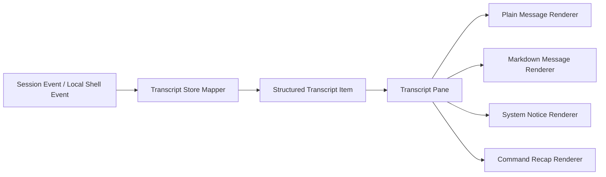
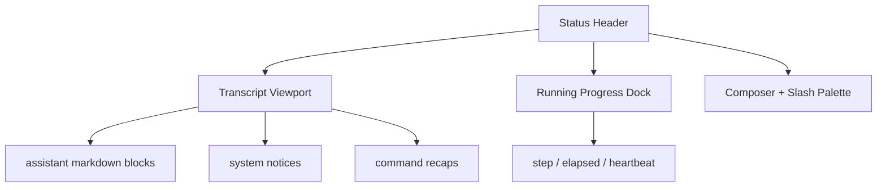

# Repo AI Governor Session Shell 输出美化与 Markdown 渲染技术方案（Draft）

- Status: draft
- Date: 2026-03-31
- Scope: session transcript presentation / assistant markdown rendering / live progress vs transcript layout / stderr-only interactive shell UX
- Target Modules:
  - `runtime.cli-interactive-shell`
  - `runtime.cli-session-transcript`
  - `presentation.react-cli-session-shell`
  - `entry.cli`
- Related:
  - `.repo-ai-governor/draft/interactive-cli-session-first-agent-shell-technical-solution.md`
  - `.repo-ai-governor/draft/command-live-progress-react-shell-technical-solution.md`
  - `apps/cli/src/react-cli/views/session-shell-app.tsx`
  - `apps/cli/src/react-cli/views/transcript-pane.tsx`
  - `apps/cli/src/runtime/interactive-shell/session-shell-runner.ts`
  - `apps/cli/src/runtime/interactive-shell/session-shell-transcript-store.ts`
  - `apps/cli/src/types/interfaces/cli-session-shell.interface.ts`

## 1. 目标与问题

当前 session shell 已经具备：

1. 会话 transcript
2. slash command palette
3. running progress dock
4. `stderr-only` live shell

但“看起来杂乱”的问题仍然明显：

1. transcript item 目前仍偏“标签 + 多行纯文本”
2. assistant 回答、系统提示、命令摘要的视觉层级还不够稳定
3. 长命令 live progress 与历史消息虽然已经分离，但历史区仍缺少更强的阅读结构
4. 如果把所有内容都做成原始 log append，用户会感觉像在看事件流，而不是在看一段会话

因此，这里的目标不是简单“换个颜色”，而是把 session shell 从“终端日志面板”提升为“结构化会话阅读面”。

## 2. 对上一轮结论的摘要

上一轮结论可以收敛成一句话：

1. 不要把整个会话输出都粗暴改造成实时 Markdown 流。
2. 更成熟的路径是“结构化壳层 + Markdown 内容块”混合渲染。

展开后就是三点：

1. `progress / status / warning / artifact / command recap`
   - 继续走结构化组件渲染。
2. `assistant` 的完成态回答
   - 优先整理为 Markdown 再渲染。
3. 高频变化区和低频阅读区
   - 必须分开。

这个结论背后的工程判断是：

1. 终端 UI 社区更常见的是“日志区 + 状态区 + 富文本区”分层，而不是“所有输出统一走一个 markdown stream”。
2. 对于高频刷新场景，实时拼接 Markdown 更容易引入闪烁、重排和未闭合 block 带来的视觉抖动。
3. 对于最终回答、帮助文本、命令 recap 这类低频内容，Markdown 能显著提升可读性。

这里第 2 点是基于 Ink / Textual / Rich 的渲染方式做出的工程推断，不是某一个库文档里的原句，但与官方组件设计方向一致。

## 3. 社区方案归纳

### 3.1 结构化输出而不是单一日志流

`Ink` 官方把 `<Static>` 明确定位为“只渲染一次、不再重绘的历史输出”，同时保留动态区域做实时状态更新。这个模式和我们当前 session shell 的需求高度一致：

1. 历史 transcript 适合 append-only
2. running progress 适合固定位置动态刷新

`Textual` 官方也把 `Log`、`RichLog`、`Markdown` 拆成不同职责：

1. `Log`
   - 更适合简单文本日志
2. `RichLog`
   - 适合可实时追加的富内容
3. `Markdown`
   - 适合文档式阅读内容

这说明社区共识并不是“一个万能消息组件包打天下”，而是按内容语义分区。

### 3.2 Markdown 更适合完成态内容

`Rich` 官方直接把 Markdown 定义成适合在终端里展示 richer content 的方式。

`Textual` 也提供专门的 `Markdown` widget，并额外提供 `get_stream()` 用于流式追加。这反过来说明了一件事：

1. 如果一个框架要专门为 Markdown 增加 stream API，
2. 就意味着“把 Markdown 当普通文本逐行写入”并不够稳。

因此，对当前仓库而言，更合适的做法不是 token 级实时 Markdown 重排，而是：

1. 先累积 assistant 当前 turn 的草稿
2. 到“可阅读边界”再批量刷新
3. 最终完成后沉淀为稳定的 Markdown 内容块

### 3.3 高频更新必须限速和分层

`Ink` 官方 README 里给出了几个很关键的开关：

1. `patchConsole`
   - 防止 `console.*` 输出和主 UI 混写
2. `incrementalRendering`
   - 只更新变化的行，减少闪烁
3. `maxFps`
   - 限制更新频率

这三个点都说明：终端 UI 的“好看”并不只是样式问题，核心是控制刷新模型。

## 4. 多方案对比

| 方案 | 描述 | 优点 | 主要问题 | 是否推荐 |
|---|---|---|---|---|
| 方案 A：继续纯文本 transcript | 保持当前 `label + lines[]` 渲染，只微调颜色和 spacing | 最小改动 | 可读性提升有限，仍然偏日志感 | 不推荐 |
| 方案 B：所有输出统一实时 Markdown 渲染 | user / assistant / system / progress 全部进 Markdown renderer | 风格统一 | 高频更新会抖动；progress 不适合 Markdown；未闭合 block 容易重排 | 不推荐 |
| 方案 C：结构化壳层 + Markdown 内容块 | progress/status 继续结构化；assistant 完成态消息与 recap 走 Markdown | 兼顾稳定性和可读性；最符合社区实践 | 需要升级 transcript item contract 与 renderer | 推荐 |

## 5. 推荐方案

推荐采用方案 C：`Structured Session Shell + Markdown Content Blocks`。

### 5.1 核心原则

1. shell 自身仍然是结构化 React/Ink UI
2. live progress 不进入 Markdown renderer
3. transcript 中只有“适合阅读的内容块”才进入 Markdown renderer
4. `stderr-only` live contract 保持不变
5. `json/plain` contract 完全不受影响

### 5.2 渲染分层

推荐把会话界面拆成三块：

1. `history transcript`
   - append-only，会沉淀已完成消息
2. `running status dock`
   - 固定在底部或 transcript 下方，持续刷新
3. `composer + palette`
   - 保持现有输入交互

其中 transcript 再细分为四类消息：

1. `assistant_markdown`
2. `plain_message`
3. `system_notice`
4. `command_recap`

## 6. 具体技术方案

### 6.1 当前接缝判断

结合当前代码，最关键的现实约束有三个：

1. [session-shell-app.tsx](/Users/jimmydaddy/study/ai-governor/apps/cli/src/react-cli/views/session-shell-app.tsx)
   - 已经明确区分 transcript、progress panel、composer、palette，这意味着大布局不必推翻。
2. [transcript-pane.tsx](/Users/jimmydaddy/study/ai-governor/apps/cli/src/react-cli/views/transcript-pane.tsx)
   - 目前只支持 `label + lines[]` 逐行渲染，无法表达 Markdown block、artifact list、callout tone。
3. [session-shell-transcript-store.ts](/Users/jimmydaddy/study/ai-governor/apps/cli/src/runtime/interactive-shell/session-shell-transcript-store.ts)
   - 目前把 service event 映射成简单文本 item，这里是 contract 升级的最佳入口。

这意味着我们不需要重写 shell runner，而需要升级“transcript item 语义 + transcript renderer”。

### 6.2 目标状态

建议把 transcript item 从“行文本”升级成“块语义”。

建议新增 block 级模型：



推荐的新模型形态如下：

```ts
interface CliSessionShellTranscriptItem {
  id: string;
  role: CliSessionTranscriptRole;
  label: string;
  renderKind: 'plain_text' | 'markdown' | 'system_notice' | 'command_recap';
  plainLines?: string[];
  markdownSource?: string;
  tone?: 'neutral' | 'info' | 'success' | 'warning' | 'error';
  artifactPaths?: string[];
}
```

这里不是要求服务端事件马上变更 canonical schema。CLI presenter 完全可以先在本地派生这层 `renderKind`。

### 6.3 具体改造点

#### 6.3.1 类型层

优先修改：

1. [cli-session-shell.interface.ts](/Users/jimmydaddy/study/ai-governor/apps/cli/src/types/interfaces/cli-session-shell.interface.ts)
2. [types/index.ts](/Users/jimmydaddy/study/ai-governor/apps/cli/src/types/index.ts)
3. [types/interfaces/index.ts](/Users/jimmydaddy/study/ai-governor/apps/cli/src/types/interfaces/index.ts)

改造目标：

1. 为 transcript item 增加 `renderKind`
2. 为 Markdown 内容增加 `markdownSource`
3. 为 command recap 增加 artifact path / status tone

#### 6.3.2 transcript store 映射层

重点修改：

1. [session-shell-transcript-store.ts](/Users/jimmydaddy/study/ai-governor/apps/cli/src/runtime/interactive-shell/session-shell-transcript-store.ts)

建议策略：

1. `assistantMessage`
   - 默认映射为 `markdown`
2. `TURN_COMPLETED` 的 command handoff preview / follow-up question
   - 先整理成更稳定的 Markdown 文本块，再入 transcript
3. `SESSION_RESUMED` / `SYSTEM` notices
   - 保持 `system_notice`
4. local command result recap
   - 映射为 `command_recap`

工程上最重要的一点是：

1. transcript store 负责“把事件翻译成更适合阅读的 presenter model”
2. 而不是把 service event 原样抄到 UI

#### 6.3.3 渲染层

重点修改：

1. [transcript-pane.tsx](/Users/jimmydaddy/study/ai-governor/apps/cli/src/react-cli/views/transcript-pane.tsx)
2. 新增 `markdown-message.tsx`
3. 新增 `system-notice-message.tsx`
4. 新增 `command-recap-message.tsx`

推荐策略：

1. `transcript-pane.tsx`
   - 改成按 `renderKind` 分发 renderer
2. `markdown-message.tsx`
   - 负责 assistant 内容、帮助文档、命令说明块
3. `system-notice-message.tsx`
   - 负责 resume / clear / status 变化这类信息型消息
4. `command-recap-message.tsx`
   - 负责命令结果摘要、artifact backlink、exit status

Markdown renderer 有两条实现路径：

1. 首选：引入 `ink-markdown`
   - 优点：实现快、语义直接
   - 风险：需要新增依赖并确认 ESM/Ink 6 兼容性
2. 备选：自实现轻量 Markdown presenter
   - 只支持标题、列表、引用、代码块、行内 code
   - 优点：依赖更少，样式完全可控
   - 风险：维护成本更高

我的推荐是：

1. 先做 `ink-markdown` 方案验证
2. 若兼容性或样式不可控，再退回轻量自研 renderer

### 6.4 刷新与流式策略

这里不建议 assistant token 每来一点就立即整棵 Markdown 重新渲染。

推荐使用两段式策略：

1. `streaming draft`
   - 当前 turn 未完成时，先显示为普通文本或轻量段落块
2. `finalized markdown`
   - turn 完成后，再收敛成 Markdown 渲染块

如果后续确实要支持流式 Markdown，可再增加一次 batching：

1. 每 `100-200ms` 聚合一次增量
2. 只在段落边界、列表边界、代码块闭合时触发 Markdown rerender

这部分是基于 `Textual Markdown.get_stream()` 与 Ink 增量重绘模型做出的工程推断，目的是避免高频重排带来的视觉闪烁。

### 6.5 session shell 布局建议

建议把当前布局从“单层 transcript”进一步强化成下面的结构：



布局原则：

1. transcript 是阅读区
2. progress dock 是操作态区
3. composer 是输入区

不要再把 progress log 混进 transcript 中间。

### 6.6 文件级实施建议

建议按下面顺序落地：

1. 类型升级
   - [cli-session-shell.interface.ts](/Users/jimmydaddy/study/ai-governor/apps/cli/src/types/interfaces/cli-session-shell.interface.ts)
2. 事件到 presenter model 映射升级
   - [session-shell-transcript-store.ts](/Users/jimmydaddy/study/ai-governor/apps/cli/src/runtime/interactive-shell/session-shell-transcript-store.ts)
3. transcript renderer 拆分
   - [transcript-pane.tsx](/Users/jimmydaddy/study/ai-governor/apps/cli/src/react-cli/views/transcript-pane.tsx)
   - 新增 `markdown-message.tsx`
   - 新增 `system-notice-message.tsx`
   - 新增 `command-recap-message.tsx`
4. shell 外壳 spacing 与分区微调
   - [session-shell-app.tsx](/Users/jimmydaddy/study/ai-governor/apps/cli/src/react-cli/views/session-shell-app.tsx)
5. 依赖与兼容验证
   - `ink-markdown` 实验接入或 fallback renderer

### 6.7 分阶段落地

#### Phase 1：低风险 UI 结构升级

1. 先不引入新依赖
2. 先把 transcript item 改为 `renderKind`
3. assistant 仍然先走“增强 plain text”
4. system notice / command recap 先做成独立组件

产出：

1. 消息分层变清晰
2. progress 与历史区彻底职责分明

#### Phase 2：Markdown renderer 接入

1. 引入 `ink-markdown` 或 fallback renderer
2. assistant 完成态消息切到 Markdown
3. `/help`、slash command usage、command recap 描述块同步切换

产出：

1. 会话阅读体验明显提升
2. 回答内容更像文档而不是日志

#### Phase 3：流式体验优化

1. 增加 Markdown batching
2. 根据实际性能调 `maxFps`
3. 如有必要，为 transcript 历史区补 viewport / paging 行为

## 7. 验收标准

### 7.1 视觉与交互

1. assistant 最终回答支持标题、列表、代码块和引用的 Markdown 展示
2. system notice 与 command recap 视觉上明显区别于 assistant 消息
3. long-running progress 不再混入历史 transcript 主体
4. 用户在不滚动命令输出的情况下也能清楚区分：
   - 正在运行什么
   - 历史里说了什么
   - 最终产物在哪里

### 7.2 契约与兼容

1. `stderr-only` live shell 不变
2. `stdout` machine-readable contract 不变
3. `json/plain` 模式完全不挂 Markdown renderer
4. 非交互模式不引入任何额外格式化副作用

### 7.3 性能与稳定性

1. 高频 progress 刷新期间 transcript 不闪烁
2. assistant 长回答完成后渲染稳定，不出现大面积重排
3. 没有 `console.*` 与 Ink 主界面混写

## 8. 推荐结论

这件事的关键不是“把终端输出变花”，而是把会话语义分层。

最稳的路线不是：

1. 保持纯文本 transcript
2. 或者把所有输出都强行实时 Markdown 化

而是：

1. session shell 继续做结构化 UI owner
2. progress/status/log 保持结构化组件
3. assistant 完成态消息、帮助文档、命令 recap 进入 Markdown 渲染
4. transcript contract 从 `lines[]` 升级到 `renderKind + content blocks`

一句话总结：

1. “好看”不是皮肤问题，
2. 它本质上是“把实时操作态和阅读态分开”，
3. 再用 Markdown 把真正值得阅读的内容呈现出来。

## 9. 外部参考

1. [Ink README](https://github.com/vadimdemedes/ink)
2. [ink-markdown](https://www.npmjs.com/package/ink-markdown)
3. [Textual Markdown](https://textual.textualize.io/widgets/markdown/)
4. [Textual Log](https://textual.textualize.io/widgets/log/)
5. [Textual RichLog](https://textual.textualize.io/widgets/rich_log/)
6. [Rich Markdown](https://rich.readthedocs.io/en/stable/markdown.html)
7. [Bubble Tea viewport](https://pkg.go.dev/github.com/charmbracelet/bubbles/v2/viewport)

## 10. 对仓库的直接建议

如果紧接着要开实现，我建议任务顺序就是：

1. 先做 transcript item contract 升级
2. 再做 `system_notice / command_recap / assistant_markdown` 三类 renderer 拆分
3. 最后再决定是接 `ink-markdown` 还是自研轻量 renderer

这样收益最快，也不会一下子把 session shell 的稳定性打散。
