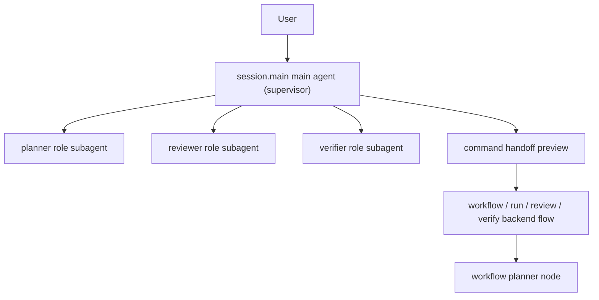

# Session Main Supervisor And Role Subagent Collaboration ADR

- Status: active
- Date: 2026-04-02
- Module ID: `runtime.orchestration`
- ADR ID: `adr.runtime.orchestration.session-main-supervisor-role-subagents.v1`

## 1. Context

`project-033` 已把 `session.main` 从 `baseline_ack` 提升为 service-owned 主 turn runtime，并完成了 CLI/resume/desktop consumer parity 的 path-A productization。但当前用户在 `pnpm exec repo-ai-governor` 默认入口里仍然面临两个结构性缺口：

1. 普通问句虽然已经进入 `session.main`，但不一定能稳定得到真实 assistant 回答。
2. `connect` 后拿到的 role / surface / fallback 结果仍主要停留在 projection descriptor，connected roles 之间缺少前台可协作的 runtime 语义。
3. 即便自然语言已经明显命中一个前台动作意图，当前产品也仍容易停留在“只会展示 preview recap”的阶段，低风险 skill 缺少可治理的 direct-execute continuity。
4. 当用户问“你能做什么”“review 是什么”“review 和 review verify 有什么区别”时，当前 supervisor taxonomy 仍缺少一条正式的 capability explanation route，导致能力介绍、help prose、slash discoverability 与 governed execution 之间容易分裂成多份事实源。

同时，`runtime.cli-interactive-shell` 已正式接受：

1. session-first shell 是默认人类入口。
2. transcript / resume / handoff preview 必须消费 service-backed DTO。
3. assistant 完成态消息和 command recap 可以走结构化 transcript presenter。

这使得“`session.main` 只是 metadata recap router”已经不足以支撑产品目标。真正合理的方向是把 `session.main` 升级为 service-owned supervisor runtime，让它在同一 shared session truth 下：

1. 执行 direct answer。
2. 产出 follow-up question。
3. 生成 command handoff preview。
4. 调度一个或多个 role subagents，并回灌可消费的协作结果。

## 2. Decision

1. `runtime.orchestration` 正式接受 `session.main` 的目标架构为 `service-owned supervisor`，而不是继续停留在单一路由回执或单 agent answer executor。
2. supervisor 前台 turn pipeline 必须先在统一入口中区分至少七类语义：
   - `greeting / social chat`
   - `explicit role collaboration`
   - `capability explanation`
   - `follow_up continuation`
   - `skill intent`
   - `slash-command-adjacent command handoff`
   - `repo question`
3. connected roles 不再只被视为静态 onboarding 结果；它们应被映射为 `session.main` 可调度的 role subagents / handoff targets，但该映射只能消费 projection truth，不能反向改写 projection truth。
4. natural-language skill routing 必须先经过 service-owned risk/policy gate，而不是默认一刀切 `preview + confirm` 或无限制自动执行：
   - `help`、`doctor`、`verify` 与 scope-resolved `review.code` 等低风险只读 skill 可以被判定为 `direct_execute`
   - `connect`、`run`、`review verify`、多步 bundle，以及高成本/高歧义场景继续走 `preview + confirm`
   - `session.main` 的自由对话不是可选 fallback；普通闲聊、寒暄、轻量问答与未成形需求默认都应先走 `direct answer`
   - 当用户在自由对话里自然表达出可执行意图时，`session.main` 应在同一对话面里把该输入升级为 `skill handoff`、`command handoff` 或 `role delegate`，而不是要求用户先离开自由对话模式
   - `direct answer` 可以落到 tool-capable surface，但前提是 runtime 必须向 adapter 下发正式的 `chat-only / tool-forbidden` 执行策略，并由 adapter 在宿主层真正收紧到 no-tool 或 read-only 行为
5. supervisor 的第一阶段实现允许采用 `C-target, phased bootstrap`：
   - 先交付真实 direct answer
   - 再补 `1` 条可工作的 role subagent path
   - 再补 conversation-first chatability + risk-tiered skill handoff
   - 最后扩展多 role collaboration、streaming 与 sidecar parity
6. `runtime.orchestration` 只拥有 supervisor lifecycle、turn outcome projection 与 shared session event contract；具体 route runner / protocol map 组装应沿 package-level seam 收口，不允许 `core-orchestration-service` 反向依赖 `apps/cli/**` 私有 runtime。
7. `runtime.orchestration` 进一步正式接受一条 service-owned `session.main` capability explainer：
   - 它必须拥有 locale-neutral governed capability seed / localized descriptor view，而不是继续复用某个 CLI-only help prose source
   - 它必须先回答“能做什么 / 何时使用 / 有什么区别”，再决定是否桥接到 governed execution
   - capability explanation 是插入现有 taxonomy 的正式分支，不替换 `greeting/social chat`、`repo question`、`skill intent` 或 `slash-command-adjacent command handoff`
8. governed capability catalog 的单一事实来源只覆盖可解释的 governed bridge capabilities，不覆盖全部 shell-local builtins：
   - `help`、`connect`、`doctor`、`verify`、`plan`、`review`、`review verify`、`run`、`workflow` 等可以进入 capability catalog
   - `/confirm`、`/cancel`、`/clear`、`/exit`、`/resume`、`/history`、`/search`、`/multiline`、`/status`、`/theme`、`/agent` 等 CLI-only builtin 继续由 `runtime.cli-interactive-shell` slash registry 本地自治
   - CLI presenter 可以把两类 discoverability 合并展示，但 orchestration 不得拥有 shell-local builtin 的 canonical truth
9. 纯 capability explanation turn 仍属于 `answer` 路径；若同一句话同时包含 explanation 与 executable ask，runtime 必须先命中 capability explanation，再仅在 scope-resolved 且 policy 允许时桥接到既有 `direct_execute` 或 `command_handoff_preview` outcome，而不是发明一条新的 hybrid pending-state contract。

## 3. Consequences

1. `TURN_COMPLETED.payload` 需要允许 service-owned runtime 回灌 richer turn metadata，例如 `interactionMode`、`invokedRoleIds[]`、`routerDecisionReason`、`selectedSurface`、`skillId`、`skillVersion`、`riskTier`、`confirmationMode`、`executionPath`、`capabilityAnswerKind`、`referencedCapabilityIds[]` 与 `suggestedActions[]`，但 presenter 只做选择性呈现。
2. `runtime.cli-interactive-shell` 继续只是 consumer：它可以呈现 answer / preview-confirm handoff / direct-execute skill recap / collaboration recap，但不得在本地选择 subagent、拼装 role truth、重算 risk tier 或模拟 supervisor 决策。
3. shared session truth 需要同时保留两类 continuity：
   - `preview_confirm` 的 pending handoff 恢复链
   - `direct_execute` 的 executed-state / result-presentation 恢复链
   - `capability explanation` 的 answer-only metadata 恢复链
4. `runtime.agent-projection` 继续负责 `AgentDescriptor` truth；projection descriptor 可被 supervisor 派生成 subagent descriptor，但 projection module 不能被误用成第二套 execution runtime。
5. 为了避免 embedded-only 临时路径长期固化，后续需要把 route runner / protocol map 组装继续抽离到 runtime-neutral package，并让 sidecar host 复用同一条 supervisor seam。
6. 该 ADR 定义的是正式方向，不等于代码已全面完成；`project-035-session-main-supervisor-and-role-subagent-productization` 负责把 direct answer、role subagent bootstrap、risk-tiered skill handoff 与 command-handoff governance 真正产品化。
7. 该 ADR 现进一步要求 capability prose 采用 locale-neutral seed + localized view 分层；`runtime.orchestration` 不得把某一种语言的 raw prose 文本写成 canonical truth，也不得反向依赖 CLI `--help` builder。

## 4. Boundary Clarifications

### 4.1 `connect/apply` 激活的是配置真值，不等于前台 supervisor 已直接使用这些 role

`runtime.agent-projection` 的 `connect -> diff -> apply -> verify` 链路负责的是：

1. 发现 candidate role/surface 绑定。
2. 审阅并写回活动 `governor.yaml`。
3. 让显式命令面与后台 runtime 可以消费新的 `routing.roleBindings`。

因此：

1. `connect apply` 之后，真实 agent binding 已经对 `run / doctor / verify` 等显式命令生效。
2. 但前台 `session.main` 何时把这些 role 当成 subagents 调用，仍由 `project-035` 的 supervisor productization 决定。
3. 换句话说，`apply` 激活的是配置层与后台执行层；`session.main` 的前台协作激活，要等 bootstrap / collaboration sprint 落地。

### 4.2 `main agent`、`planner` role 与后台 workflow planner 不是同一个东西

为避免后续实现把“planner”混成单一概念，正式边界固定如下：

1. `session.main` main agent
   - 前台入口 supervisor
   - 负责 direct answer / follow-up / handoff / delegate / collaborate 的决策
2. `planner` role subagent
   - 被 `session.main` 调度的专业角色之一
   - 负责规划、分解、方案建议，不是默认入口 owner
3. workflow planner / process node
   - 后台正式流程中的规划节点
   - 服务于 `run / workflow / review` 等治理流程，而不是等价于前台对话入口

约束：

1. `main agent` 不得默认退化成 `planner` 的别名。
2. `planner` role 只能作为 subagent 被调用，不能直接替代 supervisor。
3. 后台 workflow planner 继续属于流程编排语义，不能因为前台 supervisor 引入而绕过既有 policy / audit / ledger。

### 4.3 `session.main` main agent 的正式特性

`session.main` 不是“只能 handoff 的治理路由器”，也不是“只能闲聊的聊天助手”。正式特性固定如下：

1. 它必须能够承接自由对话，包括寒暄、开放式提问、模糊需求和轻量追问。
2. 它必须能够从自由对话中识别出可执行任务，并把这些任务收敛为：
   - 自己直接回答
   - 低风险 direct-execute skill
   - governed command handoff
   - 单角色或多角色 delegate / collaboration
3. “自由对话”与“任务执行/分派”是同一主 agent 的连续能力，不允许在产品语义上被拆成互斥模式。
4. 若实现为了治理原因限制 direct answer，必须限制的是 `tool use` 与 `mutation capability`，而不是取消主 agent 的自由对话能力本身。
5. `session.main` 的自由对话资格必须是 `availability-first`：只要某个 surface 可用，且宿主/runtime 能对该 turn 强制执行正式的 `chat-only / tool-forbidden` 策略，它就仍然可以承接主 agent 的自由对话；缺失或退化的 `TOOL_CALLING` capability 元数据本身，不得成为取消自由对话的理由。

### 4.4 推荐关系图

### 4.5 `review`、`review verify` 与 `help` 不是同一确认等级

1. `review.code`
   - 属于只读分析型 skill。
   - 当 scope 已明确，且只需单轮/轻量 profile 时，可以被 risk gate 判为 `direct_execute`。
2. `review verify`
   - 属于正式 CR 生命周期动作。
   - 默认仍保留 `preview + confirm`。
3. `help`
   - 属于零副作用能力发现动作。
   - 可被判为 `answer` 或 `direct_execute`，不应强制额外确认。

### 4.6 governed capability catalog 与 shell-local builtins 不是同一事实层

1. service-owned capability catalog 只拥有可解释的 governed capability truth。
2. shell-local builtins 继续由 `runtime.cli-interactive-shell` registry 维护。
3. presenter 可以把 governed capabilities 与 builtin commands 组合成统一 discoverability surface，但组合结果不是新的 canonical source。

### 4.7 capability explanation 的本地化与 shared-session 投影边界

1. `runtime.orchestration` 应持有 locale-neutral capability seed，并通过 i18n runtime 渲染为当前 locale 的 descriptor view。
2. shared session truth 只投影 capability answer kind、referenced capability ids 与 suggested actions，不把整份 localized prose 强行写成第二份 session-owned catalog。
3. CLI 与 future desktop 只能消费这份 shared session metadata 与 localized answer output，不得各自再造平行 capability taxonomy。

## 5. Source Anchors

1. `.repo-ai-governor/draft/session-main-agent-answer-and-command-handoff-technical-solution.md`
2. `.repo-ai-governor/draft/session-main-conversational-chat-and-skill-intent-handoff-technical-solution.md`
3. `.repo-ai-governor/draft/session-main-capability-explainer-and-contextual-command-guidance-technical-solution.md`
4. `.repo-ai-governor/context/dev/project-033-session-main-agent-runtime-productization/project-033-session-main-agent-runtime-productization-completion-audit-summary.md`
5. `.repo-ai-governor/normative_knowledge_sources/technical-solutions/runtime-cli-interactive-shell/contracts/cli-session-shell-contract.md`
6. `.repo-ai-governor/normative_knowledge_sources/technical-solutions/runtime-agent-projection/contracts/agent-projection-contract.md`
