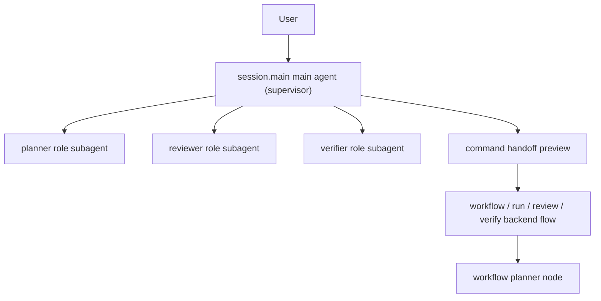

# Session Main Supervisor And Role Subagent Collaboration ADR

- Status: active
- Date: 2026-03-31
- Module ID: `runtime.orchestration`
- ADR ID: `adr.runtime.orchestration.session-main-supervisor-role-subagents.v1`

## 1. Context

`project-033` 已把 `session.main` 从 `baseline_ack` 提升为 service-owned 主 turn runtime，并完成了 CLI/resume/desktop consumer parity 的 path-A productization。但当前用户在 `pnpm exec repo-ai-governor` 默认入口里仍然面临两个结构性缺口：

1. 普通问句虽然已经进入 `session.main`，但不一定能稳定得到真实 assistant 回答。
2. `connect` 后拿到的 role / surface / fallback 结果仍主要停留在 projection descriptor，connected roles 之间缺少前台可协作的 runtime 语义。

同时，`runtime.cli-interactive-shell` 已正式接受：

1. session-first shell 是默认人类入口。
2. transcript / resume / handoff preview 必须消费 service-backed DTO。
3. assistant 完成态消息和 command recap 可以走结构化 transcript presenter。

这使得“`session.main` 只是 metadata recap router”已经不足以支撑产品目标。真正合理的方向是把 `session.main` 升级为 service-owned supervisor runtime，让它在同一 shared session truth 下：

1. 执行 direct answer。
2. 产出 follow-up question。
3. 生成 command handoff preview。
4. 调度一个或多个 role subagents，并回灌可消费的协作结果。

## 2. Decision

1. `runtime.orchestration` 正式接受 `session.main` 的目标架构为 `service-owned supervisor`，而不是继续停留在单一路由回执或单 agent answer executor。
2. supervisor 必须在统一 turn pipeline 中显式区分至少四类结果：
   - `answer`
   - `follow_up_question`
   - `command_handoff_preview`
   - `role_collaboration`
3. connected roles 不再只被视为静态 onboarding 结果；它们应被映射为 `session.main` 可调度的 role subagents / handoff targets，但该映射只能消费 projection truth，不能反向改写 projection truth。
4. natural-language command execution 继续服从 `preview + confirm + execute` 治理链路；高副作用动作不得因 supervisor 引入而绕过既有 policy / risk gate。
5. supervisor 的第一阶段实现允许采用 `C-target, phased bootstrap`：
   - 先交付真实 direct answer
   - 再补 `1` 条可工作的 role subagent path
   - 最后扩展多 role collaboration、streaming 与 sidecar parity
6. `runtime.orchestration` 只拥有 supervisor lifecycle、turn outcome projection 与 shared session event contract；具体 route runner / protocol map 组装应沿 package-level seam 收口，不允许 `core-orchestration-service` 反向依赖 `apps/cli/**` 私有 runtime。

## 3. Consequences

1. `TURN_COMPLETED.payload` 需要允许 service-owned runtime 回灌 richer turn metadata，例如 `interactionMode`、`invokedRoleIds[]`、`routerDecisionReason` 与 `selectedSurface`，但 presenter 只做选择性呈现。
2. `runtime.cli-interactive-shell` 继续只是 consumer：它可以呈现 answer / handoff / collaboration recap，但不得在本地选择 subagent、拼装 role truth 或模拟 supervisor 决策。
3. `runtime.agent-projection` 继续负责 `AgentDescriptor` truth；projection descriptor 可被 supervisor 派生成 subagent descriptor，但 projection module 不能被误用成第二套 execution runtime。
4. 为了避免 embedded-only 临时路径长期固化，后续需要把 route runner / protocol map 组装继续抽离到 runtime-neutral package，并让 sidecar host 复用同一条 supervisor seam。
5. 该 ADR 定义的是正式方向，不等于代码已全面完成；`project-035-session-main-supervisor-and-role-subagent-productization` 负责把 direct answer、role subagent bootstrap 与 command handoff governance 真正产品化。

## 4. Boundary Clarifications

### 4.1 `connect/apply` 激活的是配置真值，不等于前台 supervisor 已直接使用这些 role

`runtime.agent-projection` 的 `connect -> diff -> apply -> verify` 链路负责的是：

1. 发现 candidate role/surface 绑定。
2. 审阅并写回活动 `governor.yaml`。
3. 让显式命令面与后台 runtime 可以消费新的 `routing.roleBindings`。

因此：

1. `connect apply` 之后，真实 agent binding 已经对 `run / doctor / verify` 等显式命令生效。
2. 但前台 `session.main` 何时把这些 role 当成 subagents 调用，仍由 `project-035` 的 supervisor productization 决定。
3. 换句话说，`apply` 激活的是配置层与后台执行层；`session.main` 的前台协作激活，要等 bootstrap / collaboration sprint 落地。

### 4.2 `main agent`、`planner` role 与后台 workflow planner 不是同一个东西

为避免后续实现把“planner”混成单一概念，正式边界固定如下：

1. `session.main` main agent
   - 前台入口 supervisor
   - 负责 direct answer / follow-up / handoff / delegate / collaborate 的决策
2. `planner` role subagent
   - 被 `session.main` 调度的专业角色之一
   - 负责规划、分解、方案建议，不是默认入口 owner
3. workflow planner / process node
   - 后台正式流程中的规划节点
   - 服务于 `run / workflow / review` 等治理流程，而不是等价于前台对话入口

约束：

1. `main agent` 不得默认退化成 `planner` 的别名。
2. `planner` role 只能作为 subagent 被调用，不能直接替代 supervisor。
3. 后台 workflow planner 继续属于流程编排语义，不能因为前台 supervisor 引入而绕过既有 policy / audit / ledger。

### 4.3 推荐关系图

## 5. Source Anchors

1. `.repo-ai-governor/draft/session-main-agent-answer-and-command-handoff-technical-solution.md`
2. `.repo-ai-governor/context/dev/project-033-session-main-agent-runtime-productization/project-033-session-main-agent-runtime-productization-completion-audit-summary.md`
3. `.repo-ai-governor/normative_knowledge_sources/technical-solutions/runtime-cli-interactive-shell/contracts/cli-session-shell-contract.md`
4. `.repo-ai-governor/normative_knowledge_sources/technical-solutions/runtime-agent-projection/contracts/agent-projection-contract.md`
