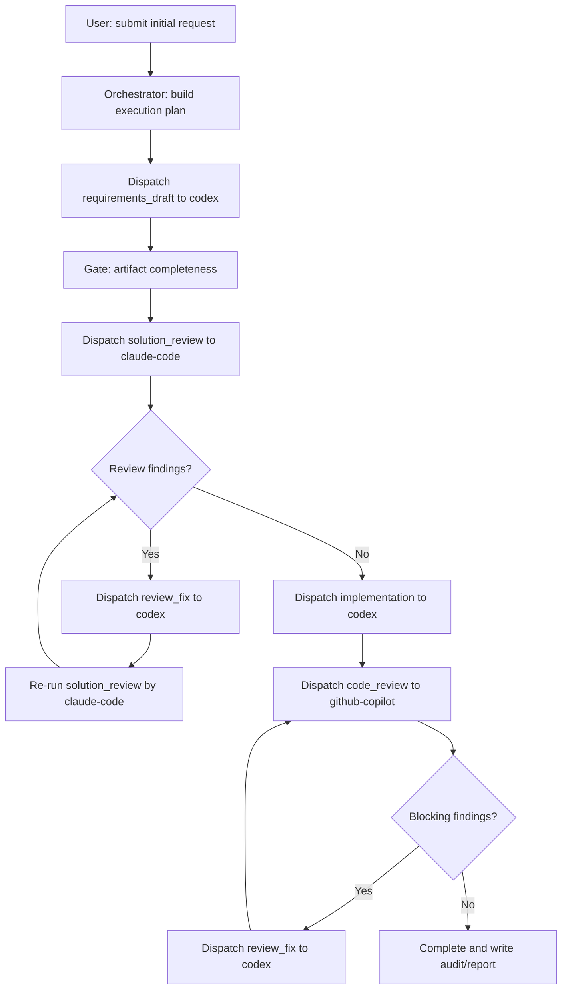

# Multi-AI Handoff Orchestration Solution

- Date: 2026-03-17
- Project: `automation-v1`
- Sprint: `sprint-001`
- Status: draft

## Problem

当接入多个 AI 角色后，核心问题不是“能不能接入”，而是“谁来统一分配任务并自动触发下一步”。

如果没有统一分配者，就会出现：

1. 阶段责任不清，多个 AI 在同一阶段重复输出。
2. 交接靠人工复制粘贴，自动化断裂。
3. review 结论无法自动回流到实施阶段。

## Decision

采用单一“中央编排者”方案：

1. 用户只在开始时输入需求。
2. `Repo AI Governor Orchestrator` 作为唯一任务分配者。
3. 每个阶段绑定一个 `primary surface`（例如 codex、claude-code、github-copilot）。
4. 执行前先做 surface preflight（安装、登录态、权限、探活命令）。
5. 阶段完成后由事件触发器自动派发下一阶段，无需用户二次输入。
6. 仅在高风险门禁、preflight 失败或重试超限时暂停并请求人工确认。

## Role Assignment Model

角色分配由 `stage -> surface` 路由表决定，不由临时提示词决定。

示例分工：

1. `requirements_draft` -> `codex`
2. `solution_review` -> `claude-code`
3. `implementation` -> `codex`
4. `code_review` -> `github-copilot`
5. `review_fix` -> `codex`

路由规则（v1）：

1. 每个阶段只有一个主执行入口。
2. 主入口不可用时回退到 `defaultSurface`。
3. 每次路由决策都写入审计日志。

## Orchestration Flow



## Auto-Trigger Rules

自动触发通过事件规则实现：

1. `stage.completed + gates.pass` -> 触发下一个阶段。
2. `review.completed + findings.blocking` -> 触发 `review_fix` 到实现入口。
3. `review.completed + findings.non_blocking` -> 继续下一阶段并记录 warning。
4. `stage.failed + retry<limit` -> 同入口重试。
5. `stage.failed + retry>=limit` -> 暂停并请求人工确认。

## Surface Preflight Checks

需要，在正式编排前必须确认目标 AI 入口可用。建议作为 `run` 的默认前置阶段：

1. 安装可用性
   - 对应 CLI/插件可执行（例如 `codex`、`claude`、`gh copilot` 探活命令）。
2. 身份与授权
   - 已登录且具备调用权限（token/session 未过期）。
3. 仓库侧接线
   - 对应目录存在并可读：`.codex/skills/`、`.claude/skills/`、`.github/skills/`。
4. 最小功能探活
   - 每个 surface 执行一次 lightweight health check 并返回统一结果。
5. 降级策略
   - 某 surface 不可用时按路由回退到 `defaultSurface`，并写入 warning。
   - 若该阶段是强绑定角色（例如必须由 `claude-code` review），则暂停并请求人工确认。

## Data Contracts

最小数据对象：

1. `ExecutionRequest`
   - `executionId`
   - `goal`
   - `initialInput`
   - `routingProfile`
2. `StageWorkItem`
   - `executionId`
   - `stageId`
   - `assigneeSurface`
   - `inputArtifacts`
   - `expectedOutputs`
   - `gatePolicy`
3. `StageResult`
   - `status`
   - `outputs`
   - `findings`
   - `nextAction`
4. `SurfaceHealthReport`
   - `surface`
   - `available`
   - `checks`
   - `fallbackDecision`

## Config Proposal

```yaml
automation:
  defaultSurface: codex
  preflight:
    enabled: true
    failOnMissingRequiredSurface: true
    healthCheck:
      codex: "codex --version"
      claude-code: "claude --version"
      github-copilot: "gh copilot --help"
  routing:
    requirements_draft: codex
    solution_review: claude-code
    implementation: codex
    code_review: github-copilot
    review_fix: codex
  trigger:
    autoContinue: true
    maxRetryPerStage: 2
    pauseOn:
      - high_risk_change
      - policy_violation
```

## How It Solves Your Scenario

你的场景可以直接按以下方式执行：

1. 用户输入一次需求：“生成需求文档”。
2. 编排者自动分配给 `codex` 生成需求文档草稿。
3. 草稿完成后自动触发 `claude-code` 做方案 review。
4. 若有问题，自动触发 `codex` 修订，不需要用户再次下指令。
5. 修订后自动回到 `claude-code` 复评，直到通过或达到重试阈值。

## Command Shape (v1)

```bash
repo-ai-governor run \
  --mode assisted \
  --project automation-v1 \
  --sprint sprint-001 \
  --routing-profile multi-ai-dev-review \
  --preflight \
  --input ./request.md \
  --format json
```

说明：

1. 用户只提供初始输入。
2. 执行前自动完成多 surface preflight。
3. 后续阶段由编排者自动派发。
4. 若触发高风险门禁或必需 surface 不可用，流程暂停等待人工确认。

## Implementation Mapping

1. `TK-951`
   - 定义 orchestrator、work item、routing profile、事件模型、surface preflight 契约。
2. `TK-952`
   - 在 `run` 中实现“preflight -> 派发 -> 等待结果 -> 触发下一阶段”的事件循环。
3. `TK-953`
   - 把高风险门禁与 required-surface 策略接入自动触发链。
4. `TK-954`
   - 落盘完整交接与路由审计记录。
5. `TK-955`
   - 用 `codex + claude-code + github-copilot` 做端到端验收。

## Trade-offs

1. 优点：自动化稳定、责任清晰、可审计。
2. 代价：需要先定义统一阶段与产物契约，早期实现成本较高。
3. 风险控制：v1 先做串行路由，不做同阶段并发多模型写入。
