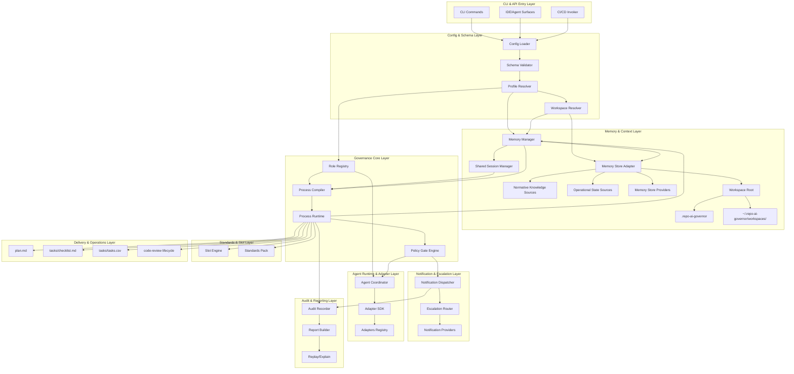
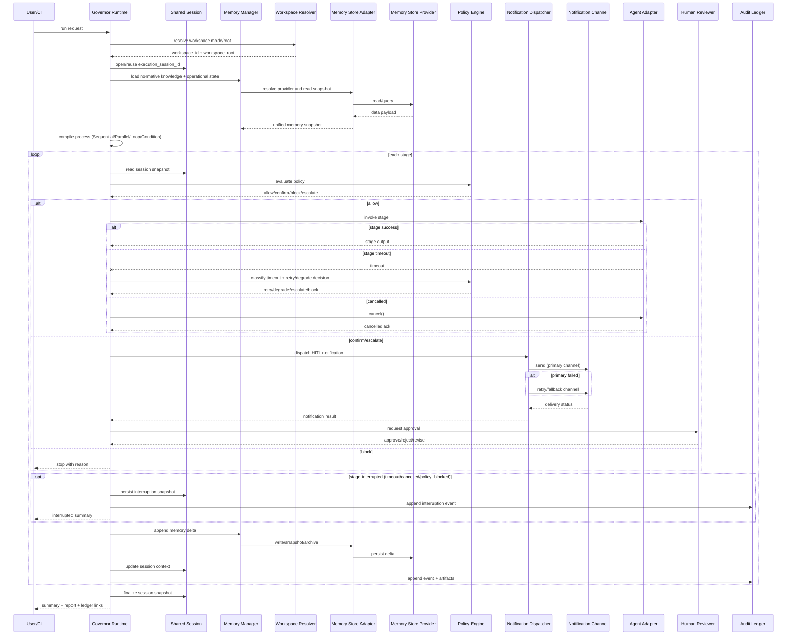

# Repo AI Governor 可扩展架构图与仓库分层结构

- Status: active
- Date: 2026-03-18
- Role: implementation blueprint
- Basis:
  - `docs/repo-ai-governor-overall-technical-solution.md`
  - `docs/product-requirements-brief.md`

## 1. 设计目标

1. 给出“可扩展且可落地”的系统架构图。
2. 给出支持长期演进的仓库分层结构。
3. 给出模块依赖方向约束，避免后续架构腐化。
4. 给出从当前仓库到目标结构的渐进迁移路径。
5. 以 Monorepo 作为默认工程组织方式，支撑核心引擎与多适配器并行演进。

## 2. 顶层架构图（Layered + Extensible）



## 3. 执行时序图（含 HITL 升级与通知分发）



说明：错误分类、重试/熔断、取消/超时、并发聚合的执行契约以 `docs/repo-ai-governor-overall-technical-solution.md` 的 `§5.3` 到 `§5.5` 为准。

## 4. 关键扩展点

1. `Adapter SDK`
   - 新增 AI 工具只需实现统一接口：`probe/invokeStage/streamEvents/requestConfirmation`。
2. `Role Registry`
   - 支持默认角色与用户自定义角色并存，统一做角色定义、约束和版本管理。
3. `Memory Manager`
   - 统一管理“规范知识源 + 执行状态源”的读写与上下文合成策略。
4. `Shared Session Manager`
   - 多 Agent 共享同一个执行 session，支持快照、增量回写与回放。
5. `Workspace Resolver`
   - 按配置解析 `tool_managed/repo_local` 模式，输出 `workspace_id/workspace_root`，并提供迁移切换入口。
6. `Memory Store Adapter`
   - 通过统一 Provider 契约（`read/write/query/snapshot/archive`）屏蔽存储后端差异。
7. `Memory Store Providers`
   - 支持文件+CSV、本地数据库、线上数据库等多后端可插拔实现。
8. `Policy Engine`
   - 人工闸口策略通过规则表配置，不把审批逻辑硬编码在命令里。
9. `Notification Dispatcher`
   - 在 HITL 触发/升级场景统一分发通知，支持重试、退避与失败回退，并输出通知回执到审计事件。
10. `Notification Providers`
   - 支持 `email/webhook/chat-im/issue-system` 等渠道可插拔接入。
11. `Slot Engine`
   - 新增项目规则通过声明式 slot 注入，不改核心流程引擎。
12. `Standards Pack`
   - 官方/团队/仓库规则分层覆盖，结构化配置统一渲染。
13. `Artifact Registry & Dependency Resolver`
   - 关键产物生成后统一登记，任务执行前按依赖声明解析并注入上下文。

## 5. 目标仓库分层结构（Monorepo）

```text
repo-ai-governor/
  apps/
    cli/
      src/
      test/
  packages/
    core-process/
      src/
      test/
    core-policy/
      src/
      test/
    core-role-registry/
      src/
      test/
    core-runtime/
      src/
      test/
    core-memory/
      src/
      test/
    core-session/
      src/
      test/
    artifact-registry/
      src/
      test/
    memory-store-adapter/
      src/
      test/
    memory-providers/
      fs-csv/
        src/
        test/
      sqlite/
        src/
        test/
      postgres/
        src/
        test/
    notification-dispatcher/
      src/
      test/
    notification-providers/
      email/
        src/
        test/
      webhook/
        src/
        test/
      chat-im/
        src/
        test/
      issue-system/
        src/
        test/
    core-audit/
      src/
      test/
    config/
      src/
      test/
    standards/
      src/
      test/
    slots/
      src/
      test/
    adapter-sdk/
      src/
      test/
    adapters/
      codex/
        src/
        test/
      github-copilot/
        src/
        test/
      claude-code/
        src/
        test/
    reporting/
      src/
      test/
    shared-types/
      src/
    shared-utils/
      src/
      test/
  integrations/
    ci/
    ide/
  scripts/
    governance/
    release/
    ci/
  docs/
  examples/
  tests/
    contract/
    integration/
    e2e/
  .repo-ai-governor/   # optional; enabled when workspace.mode=repo_local
  AGENTS.md
  code_standards.md
```

工具托管 workspace（默认，不在目标仓库内）：

```text
~/.repo-ai-governor/workspaces/<repo_fingerprint>/
  governor.yaml
  context/current-context.md
  normative_knowledge_sources/
  artifacts/
```

## 5.1 Monorepo 版本与发布策略（Baseline）

1. 版本策略
   - `core-*`、`adapter-sdk`、`shared-*` 采用 lockstep 版本策略，确保核心契约同步演进。
   - `adapters/*`、`memory-providers/*`、`notification-providers/*` 采用 independent 版本策略，按能力独立发布。
2. 契约兼容规则
   - `adapter-sdk`、`memory-store-adapter`、`notification-dispatcher` 任一主版本升级时，必须触发对应 provider/adapter 的契约回归测试。
3. 发布编排建议
   - 使用 Changesets（或等价工具）维护跨包变更日志与发布计划。
   - 支持 `canary -> rc -> ga` 渠道，先验证核心包再放开 provider/adapters 发布。
4. 依赖锁定建议
   - 核心包之间使用 workspace 协议固定版本对齐；provider/adapters 对核心契约使用显式兼容区间声明。

## 6. 模块依赖方向约束

1. `apps/cli` -> 允许依赖 `packages/*`，不允许反向被核心依赖。
2. `core-role-registry` -> 负责默认/自定义角色定义与校验，可依赖 `config/shared-types`。
3. `memory-store-adapter` -> 仅定义存储契约与 provider 装配，不依赖 `core-runtime`。
4. `memory-providers/*` -> 仅依赖 `memory-store-adapter/shared-*`，不得依赖 `apps/cli` 与 `adapters/*`。
5. `notification-dispatcher` -> 负责 HITL 通知策略执行与回退，可依赖 `core-policy/core-audit/config/shared-types`。
6. `notification-providers/*` -> 仅依赖 `notification-dispatcher/shared-*`，不得依赖 `core-runtime` 与 `adapters/*`。
7. `core-memory` -> 可依赖 `config/shared-types/memory-store-adapter`，不依赖具体 provider 实现。
8. `core-session` -> 可依赖 `core-memory/shared-types`，不依赖具体 `adapters/*`。
9. `artifact-registry` -> 可依赖 `shared-types/config/core-audit`，不得依赖 `apps/cli` 与具体 `adapters/*`。
10. `core-runtime` -> 可依赖 `core-process/core-policy/core-role-registry/core-memory/core-session/artifact-registry/notification-dispatcher/config/adapter-sdk/standards/slots/core-audit`。
11. `adapters/*` -> 仅依赖 `adapter-sdk/shared-types/shared-utils`，不依赖 `apps/cli`。
12. `standards/slots` -> 不依赖具体 adapter 实现，保持工具无关。
13. `reporting` -> 只读核心执行结果，不反向控制 runtime。
14. `shared-*` -> 不依赖业务域模块。

## 6.1 依赖方向自动化执行备忘（Pending Integration）

1. 计划新增依赖边界检查脚本：`scripts/governance/check-package-dependency-boundary.js`。
2. 计划输出两类结果：
   - 机器可读（JSON）用于 CI 阻断。
   - 人类可读（Markdown/terminal）用于本地定位违规路径。
3. 计划接线命令（当前未启用）：
   - `node ./scripts/governance/check-package-dependency-boundary.js`
4. 生效策略建议：
   - 初期以 warning 模式运行并建立白名单；
   - 稳定后切换为 blocking gate，纳入 `code_standards.md -> Verification Commands`。

## 6.2 Package Public API Surface 约束

1. 可见性分层
   - `public`: `adapter-sdk`, `memory-store-adapter`, `notification-dispatcher`, `reporting`, `shared-types`。
   - `internal`: `core-*`, `slots`, `standards`, `core-session`, `core-memory`, `core-runtime` 等实现域包。
2. 导出约束
   - `public` 包必须通过 `package.json -> exports` 显式声明稳定入口，不允许深层路径隐式导出。
   - `internal` 包默认不对外暴露 programmatic API，只允许 workspace 内部依赖。
3. 目录建议
   - `public` 包建议使用 `src/public/` 与 `src/internal/` 分层，入口统一经 `src/index.ts`。
4. 版本兼容要求
   - `public` 包发生 breaking change 时必须提升主版本并附迁移说明；
   - `internal` 包可随 workspace 版本联动，但不得绕过依赖方向约束。

## 7. 从当前仓库的渐进迁移路径

1. Step 1（边界先行）
   - 在现有 `src/` 内按域建立子目录边界，补充 import lint 规则。
2. Step 2（核心抽离）
   - 先抽离 `core-process/core-policy/core-role-registry/core-memory/core-session/notification-dispatcher/adapter-sdk/memory-store-adapter` 到 `packages/`。
3. Step 3（存储后端落地）
   - 先实现 `memory-providers/fs-csv`，并预留 `sqlite/postgres` provider 骨架。
   - 同步落地 `artifact-registry` 的文件/CSV 基线存储。
4. Step 4（通知后端落地）
   - 实现 `notification-providers/webhook` 基线，并按风险级别配置 `email/chat-im/issue-system` 回退渠道。
5. Step 5（适配器模块化）
   - 将现有 codex/copilot/claude 适配拆到 `packages/adapters/*`。
6. Step 6（入口瘦身）
   - `apps/cli` 只保留命令路由与参数编排，核心逻辑下沉 packages。
7. Step 7（契约测试）
   - 为 `adapter-sdk`、`memory-store-adapter`、`artifact-registry`、`notification-dispatcher`、`process DSL`、`policy decisions` 建立跨包契约测试。
   - 测试目录基线：`tests/contract/`（契约）、`tests/integration/`（跨包集成）、`tests/e2e/`（端到端链路）。

## 7.1 Priority-Phase-Migration 对照（同步总纲）

本表与 `docs/repo-ai-governor-overall-technical-solution.md` 的 `§11.1` 保持同步，作为架构迁移实施入口。

| PRD Priority | Delivery Focus | Technical Phases | Architecture Migration Steps |
|---|---|---|---|
| P0（已完成） | 可安装、可初始化、最小治理闭环 | Phase A（最小可用）+ Phase B（最小门禁） | Step 1（边界先行） |
| P1（进行中） | 多 Agent 编排、策略化 HITL、多工具适配 | Phase B + Phase C + Phase D | Step 2 ~ Step 6 |
| P2（规划中） | 平台化能力、组织级可观测与治理强化 | Phase E + 平台扩展阶段 | Step 7 + 平台扩展步骤 |

## 8. 目录治理建议

1. 新增目录前先标注层级归属与依赖方向。
2. 新增模块必须在文档中登记“扩展点类型”（core/adapter/role/memory-store/notification/slot/standards/reporting）。
3. 每次迭代若触及架构边界，先更新本蓝图再改实现。

## 9. 与总纲关系

1. `docs/repo-ai-governor-overall-technical-solution.md`：定义全工具方针与原则。
2. 本文档：定义“如何落成目录与模块边界”的工程蓝图。
3. sprint 文档：记录阶段性交付，不替代本蓝图。
