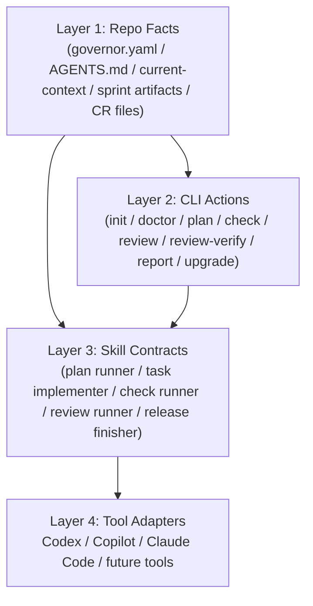

# Repo AI Governor Skill System Design

- Date: 2026-03-14
- Status: draft
- Audience: product / platform / AI workflow design
- Basis:
  - [product-requirements.md](./product-requirements.md)
  - [cli-command-design.md](./cli-command-design.md)
  - [config-schema-draft.md](./config-schema-draft.md)
  - [quick-start.md](./quick-start.md)
  - [examples/adapters/codex/README.md](../examples/adapters/codex/README.md)
  - [examples/adapters/github-copilot/README.md](../examples/adapters/github-copilot/README.md)
  - [examples/adapters/claude-code/README.md](../examples/adapters/claude-code/README.md)

## Goal

为 `Repo AI Governor` 设计一套“以 skill 承接治理流程节点”的体系，让 AI 在 `plan / implement / check / review / release` 等阶段不再只依赖临时 prompt，而是通过可复用、可移植、可组合的 skill 来执行仓库治理流程。

这套设计的目标不是替代现有 CLI，而是让：

1. 结构化配置仍然是规则事实源
2. CLI 仍然是稳定、可验证的治理执行面
3. skill 成为 AI 行为编排层
4. 不同模型和 IDE 可以复用同一套阶段化行为模板

## Problem Statement

当前 `Repo AI Governor` 已经有了两类能力：

1. 仓库治理事实源
   - `governor.yaml`
   - `AGENTS.md`
   - `.repo-ai-governor/context/current-context.md`
   - `plan.md`、`tasks/checklist.md`、`tasks/tasks.csv`、`TK-xxx.md`
   - `code-review/review_*.md`
2. 命令式治理动作
   - `init`
   - `doctor`
   - `plan`
   - `check`
   - `review`
   - `review-verify`
   - `report`
   - `upgrade`

但 AI 在使用这些能力时仍然缺一层稳定的行为协议：

1. 什么时候先读 `AGENTS.md`
2. 什么时候必须读取 `current-context.md`
3. 什么时候要执行 CLI 命令，什么时候只更新文档
4. 什么时候必须回写 checklist / CSV / CR
5. 多任务并发时如何选择正确的 stream
6. 不同 AI 工具如何共享同一套流程节点行为

这就是 skill 层要解决的问题。

## Core Positioning

一句话定义：

`Repo AI Governor` 定义制度，skill 定义 AI 如何执行制度。

更具体地说：

1. 规则本体
   - 放在结构化配置、workflow、standards、slots、sprint 产物中
2. 命令执行面
   - 由 CLI 提供稳定动作、可验证输出和退出码
3. AI 行为层
   - 由 skill 定义在某个阶段要读取什么、调用什么、产出什么、如何停止

因此，skill 不应成为新的事实源，也不应把规则重新复制一份。它应该只消费已有事实源，并把 AI 的行为约束成可重复流程。

## Design Principles

### 1. Facts Stay In Repo

规范、状态、任务和评审记录必须继续保留在仓库产物中。skill 不保存项目状态。

### 2. Skill Is Behavioral, Not Structural

skill 负责定义：

1. 读取顺序
2. 执行动作
3. 命令调用
4. 产物回写
5. 失败停止条件

而不是重新定义：

1. task schema
2. CR schema
3. slot schema
4. workflow schema

### 3. One Node, One Skill Contract

每个治理节点对应一个稳定 skill 合同：

1. 输入
2. 前置读取
3. 推荐命令
4. 输出
5. 完成标准
6. 禁止行为

### 4. Adapter-Neutral Core

`Codex`、`GitHub Copilot`、`Claude Code` 的差异主要发生在入口注入方式，而不应发生在治理流程本身。

所以 skill 体系应尽量分成：

1. 核心治理 skills
2. 适配器桥接层

### 5. Concurrency-Ready

未来支持多 stream 并发时，skill 不能只依赖“当前 sprint”这种隐含上下文，而要支持显式 `stream_id / project / sprint` 解析。

## Four-Layer Architecture



职责划分：

1. Layer 1
   - 存真实状态
   - 可审计
   - 可供人和 AI 共同读取
2. Layer 2
   - 提供稳定命令
   - 提供退出码和标准输出
   - 保证门禁可重复执行
3. Layer 3
   - 组织 AI 的行为顺序
   - 把自然语言请求映射到治理节点
   - 把命令调用和产物回写串起来
4. Layer 4
   - 解决不同工具如何消费 skill / prompt / rule bundle

## Skill Contract

每个正式 skill 都应至少包含以下信息：

1. `name`
2. `description`
3. `trigger mapping`
4. `required reads`
5. `optional reads`
6. `commands to invoke`
7. `artifact updates`
8. `stop conditions`
9. `guardrails`
10. `result template`

推荐增加两个并发字段：

1. `stream resolution`
   - 如何从 `current-context.md` 解析当前 stream
   - 多 stream 时如何显式选择
2. `side effect level`
   - `read-only`
   - `artifact-write`
   - `code-write`
   - `delivery`

## Stream Resolution Model

为了支持未来多任务并发，所有治理型 skill 都应按以下顺序解析上下文：

1. 用户显式指定的 `project / sprint / stream`
2. `.repo-ai-governor/context/current-context.md` 中的 `primary`
3. 如果存在多个 active stream 且没有显式目标，则 skill 必须停下并要求明确 stream

这意味着 skill 不能把 `AGENTS.md` 里的固定 `Current Context` 当作唯一状态源，而应把它当作稳定入口说明。

## Recommended Skill Set

### A. Foundation Skills

#### 1. `governor-context-loader`

职责：

1. 读取 `AGENTS.md`
2. 读取 `current-context.md`
3. 解析当前 `project / sprint / docs root`
4. 输出本次任务的事实源路径

适用场景：

1. 任何正式治理 skill 的前置步骤
2. 多 stream 并发时的上下文解析

输出重点：

1. 当前活动 stream
2. 对应的 sprint 产物路径
3. 当前应写入的 checklist / CSV / CR 目录

#### 2. `governor-artifact-sync`

职责：

1. 按规范回写 `plan.md`
2. 追加 `tasks/checklist.md`
3. 追加 `tasks/tasks.csv`
4. 写入或更新 `TK-xxx.md`
5. 维护 CR 文件状态前缀

适用场景：

1. `plan`
2. `implement`
3. `review`
4. `review-verify`
5. sprint closeout

它本身不是用户直触发 skill，更适合作为其他 skill 的复用模块。

### B. Workflow Node Skills

#### 3. `governor-plan-runner`

职责：

1. 读取需求输入或帮用户整理成 `request.md`
2. 执行 `repo-ai-governor plan`
3. 检查 `plan.md / checklist / tasks.csv / TK-xxx.md`
4. 发现缺失则补齐

前置读取：

1. `AGENTS.md`
2. `current-context.md`
3. `request.md` 或用户输入
4. 相关 standards / workflow / slot 信息

停止条件：

1. `plan` 命令失败
2. sprint 路径不存在且无法安全初始化
3. 任务产物未生成齐全

#### 4. `governor-task-implementer`

职责：

1. 读取指定 `TK-xxx.md`
2. 读取相关代码与规范
3. 实施代码修改
4. 运行最小自检
5. 回写 checklist / CSV 执行记录

前置读取：

1. `TK-xxx.md`
2. 当前 sprint `plan.md`
3. 必要的 standards / slot 命中摘要
4. 相关代码文件

关键约束：

1. 必须围绕任务卡工作
2. 不允许绕开任务卡直接做大范围不受控修改
3. 实施后必须留下 execution record

#### 5. `governor-check-runner`

职责：

1. 执行 `repo-ai-governor check`
2. 解释检查结果
3. 将 findings 反馈给 AI 或用户
4. 需要时触发统一报告生成

适用场景：

1. 实施后自检
2. PR 前门禁
3. 自动化流水线前置检查

#### 6. `governor-review-runner`

职责：

1. 执行 `repo-ai-governor review`
2. 生成 `review_<slug>.md`
3. 解释 findings
4. 把 CR 文件路径回写到当前任务记录

关键约束：

1. 评审结论必须落盘
2. 不允许只在聊天里给 review 结果而不更新仓库产物

#### 7. `governor-review-fixer`

职责：

1. 读取 `review_<slug>.md` 或 `verified_review_<slug>.md`
2. 逐条修复被接受的 finding
3. 更新执行记录
4. 再执行 `review-verify`

这个 skill 适合和现有 code-review-workflow 配合，但会更强绑定本仓库的治理产物格式。

#### 8. `governor-report-runner`

职责：

1. 执行 `repo-ai-governor report`
2. 生成 markdown / json / summary
3. 输出适合人读或适合下游 AI 再消费的报告

适用场景：

1. sprint 汇报
2. CI 结果整理
3. external trial 结果反馈

### C. Delivery Skills

#### 9. `governor-delivery-finisher`

职责：

1. 运行仓库门禁
2. 生成 Conventional Commit
3. commit
4. 可选 push

当前仓库已经有本地版本：

1. [workspace-delivery-finisher/SKILL.md](../.codex/skills/workspace-delivery-finisher/SKILL.md)

未来建议把它抽象成可被初始化仓库复用的官方 skill 模板。

### D. Future Skills

#### 10. `governor-auto-runner`

职责：

1. 串行调用 `plan -> implement -> check -> review -> review-verify -> report`
2. 按权限边界决定哪些动作自动执行
3. 产出完整审计轨迹

注意：

1. 这不是当前 MVP 应立即实现的 skill
2. 它属于 `automation-v1` Project 的核心能力

## Minimum Viable Skill Set

如果只做第一版，建议先实现 5 个：

1. `governor-context-loader`
2. `governor-plan-runner`
3. `governor-task-implementer`
4. `governor-review-runner`
5. `governor-delivery-finisher`

原因：

1. 覆盖从需求到交付的最短闭环
2. 与当前 CLI 能力完全对齐
3. 不需要等待自动模式 `v1`
4. 能最快验证“skill 是否真能承接流程节点”

## Skill Directory Proposal

建议在官方仓库保留一套可移植 skill 资产：

```text
.codex/skills/
  governor-context-loader/
    SKILL.md
    agents/openai.yaml
    scripts/
    templates/
  governor-plan-runner/
    SKILL.md
    agents/openai.yaml
    scripts/
    templates/
  governor-task-implementer/
    SKILL.md
    agents/openai.yaml
    scripts/
    templates/
  governor-check-runner/
    SKILL.md
    agents/openai.yaml
    scripts/
    templates/
  governor-review-runner/
    SKILL.md
    agents/openai.yaml
    scripts/
    templates/
  governor-review-fixer/
    SKILL.md
    agents/openai.yaml
    scripts/
    templates/
  governor-report-runner/
    SKILL.md
    agents/openai.yaml
    scripts/
    templates/
  governor-delivery-finisher/
    SKILL.md
    agents/openai.yaml
    scripts/
    templates/
  shared/
    references/
    prompts/
    scripts/
    templates/
```

说明：

1. 每个 skill 保持单一职责
2. 共享约束、模板和结果格式放到 `shared/`
3. 初始化新仓库时，可以根据 adapter / project 生成推荐 skill 组合
4. 如果某个 skill 需要稳定生成模板、结构化数据或预填空骨架，可以在该 skill 目录下放 `scripts/` 与 `templates/`

## Trigger And Script Strategy

### Trigger Rule

推荐把 skill 的触发分成 3 层：

1. 显式 skill 关键词触发
   - 例如 `$governor-plan-runner`
   - 适合高级用户或自动化编排器
2. 自然语言意图触发
   - 例如“帮我拆任务”“开始 TK-101”“做 code review”
   - 由 agent 把意图映射到 skill
3. adapter 注入触发
   - 由 `Codex / Copilot / Claude Code` 的入口 prompt 或 rule bundle 预置 skill 使用方式

结论：

1. 是，skill 应该支持通过 skill 关键词触发
2. 也应该支持不写关键词、仅通过意图自动匹配

### Script Usage Rule

skill 可以调用脚本，但脚本在体系中的定位应当是“生成确定性骨架”，而不是替代 AI 的语义决策。

推荐把 skill 的执行模式分成 3 类：

1. `instruction-only`
   - skill 只规定读取顺序、判断逻辑和产物回写规则
   - 不调用额外脚本
2. `cli-orchestrated`
   - skill 直接调用 `repo-ai-governor` CLI
   - 例如 `plan / check / review / report`
3. `script-assisted`
   - skill 先调用脚本生成模板、占位文档或结构化数据
   - 然后 AI 再补齐语义内容、结论、说明和判断

### Recommended Boundary

推荐边界如下：

1. 脚本负责：
   - 生成模板文档骨架
   - 生成结构化 JSON / YAML / CSV 初稿
   - 收集固定输入并转成统一格式
   - 渲染 adapter bundle、prompt 片段或报告框架
2. AI 负责：
   - 填写需求语义
   - 生成计划内容
   - 做技术判断
   - 解释 findings
   - 写 review 结论
   - 决定如何修改代码

一句话：

脚本产出“稳定壳子”，AI 负责“高语义填空”。

### Fill Zone Contract

如果 skill 走 `script-assisted` 模式，建议模板显式标出可由 AI 填写的区域，例如：

1. `TODO_AI_FILL: summary`
2. `TODO_AI_FILL: acceptance`
3. `TODO_AI_FILL: implementation_notes`
4. `TODO_AI_FILL: review_conclusion`

这样可以保证：

1. 结构稳定
2. AI 知道哪些部分应该补内容
3. 后续自动化校验可以识别“未填完模板”的情况

### When To Prefer Script-Assisted

以下场景优先考虑 `script-assisted`：

1. task card 模板生成
2. CR 模板生成
3. release note 骨架生成
4. adapter prompt bundle 渲染
5. 统一报告初稿生成

以下场景不建议优先脚本化：

1. 技术方案取舍
2. 代码实现判断
3. finding 严重度判断
4. review 结论归纳
5. 风险解释

## How Skills Map To CLI
| Skill | Primary CLI | Repo Artifacts | Recommended Mode |
| --- | --- | --- | --- |
| `governor-context-loader` | none or `doctor` | `AGENTS.md`, `current-context.md` | `instruction-only` |
| `governor-plan-runner` | `plan` | `plan.md`, `checklist.md`, `tasks.csv`, `TK-xxx.md` | `cli-orchestrated` + optional `script-assisted` |
| `governor-task-implementer` | `check` optional | code files, `TK-xxx.md`, `checklist.md`, `tasks.csv` | `instruction-only` + optional `cli-orchestrated` |
| `governor-check-runner` | `check` | report artifacts | `cli-orchestrated` |
| `governor-review-runner` | `review` | `review_<slug>.md` | `cli-orchestrated` + optional `script-assisted` |
| `governor-review-fixer` | `review-verify` | `verified_*.md`, `resolved_*.md` | `instruction-only` + `cli-orchestrated` |
| `governor-report-runner` | `report` | `.repo-ai-governor/reports/*` | `cli-orchestrated` + optional `script-assisted` |
| `governor-delivery-finisher` | repo gate + git | git commit history | `cli-orchestrated` |

## Adapter Integration Strategy

不同工具的接入方式不同，但 skill 体系应尽量共用。

### Codex / Codex CLI

适合直接消费：

1. `AGENTS.md`
2. `current-context.md`
3. skill 说明文件
4. 由 adapter bundle 渲染出的阶段上下文

### GitHub Copilot

适合原生消费 skill，同时保留 `copilot-instructions` / prompt 作为补充入口：

1. 直接安装或同步 agent skill 目录
2. 在 `Copilot coding agent`、`Copilot CLI`、支持 agent mode 的 IDE 中按 skill 使用
3. 继续把 skill 规则投影成 `copilot-instructions`
4. 在 CLI 或复杂阶段场景中追加当前阶段 prompt

### Claude Code

适合原生消费 skill，并在需要时进一步组合 subagent：

1. 直接安装 skill 目录
2. 让 Claude Code 按 skill 描述自动触发
3. 在更复杂场景中，把 skill 预加载到 subagent
4. 需要时再叠加 `system prompt` / `task prompt` 作为 adapter 补充上下文

结论：

1. 核心治理 skill 保持统一
2. `GitHub Copilot` 与 `Claude Code` 都应被视为原生 skill surface
3. `copilot-instructions`、prompt 文件和 bundle 仍有价值，但更适合作为 skill 的补充投影层
4. 每个 adapter 只负责把同一套 skill 转成目标工具最自然的消费方式

### Updated Adapter Positioning

按当前理解，三类入口更准确的定位应是：

1. `Codex / Codex CLI`
   - 原生 skill surface
2. `GitHub Copilot`
   - 原生 skill surface
   - 仍适合配合 `copilot-instructions` 与 prompt 文件
3. `Claude Code`
   - 原生 skill surface
   - 还可进一步和 subagent 组合

## Example Lifecycle

### Case 1: 用户说“帮我拆这个需求”

系统建议触发：

1. `governor-context-loader`
2. `governor-plan-runner`

执行顺序：

1. 读取 `AGENTS.md`
2. 读取 `current-context.md`
3. 如无 active stream，则引导创建 project / sprint 或明确输出为临时规划文档
4. 整理 `request.md`
5. 调 `plan`
6. 确认 `plan.md / checklist / tasks.csv / TK-xxx.md`

### Case 2: 用户说“开始 TK-101”

系统建议触发：

1. `governor-context-loader`
2. `governor-task-implementer`
3. `governor-check-runner`

### Case 3: 用户说“做 code review”

系统建议触发：

1. `governor-context-loader`
2. `governor-review-runner`
3. 可选 `governor-report-runner`

### Case 4: 用户说“按 CR 修复并复核”

系统建议触发：

1. `governor-context-loader`
2. `governor-review-fixer`
3. `governor-review-runner` optional

### Case 5: 用户说“收尾”

系统建议触发：

1. `governor-delivery-finisher`

## Guardrails

### 1. Do Not Store State In Skill

skill 不记录项目真实进度；进度必须写回仓库。

### 2. Do Not Bypass Artifacts

skill 不允许只在对话里给结论而不更新：

1. checklist
2. tasks.csv
3. CR 文件
4. current context

### 3. Do Not Hide Command Execution

只要一个节点的治理动作已经有 CLI，skill 应优先调用 CLI，而不是手工模拟。

### 4. Respect Permission Levels

按 side effect level 区分：

1. `read-only`
2. `artifact-write`
3. `code-write`
4. `delivery`

未来 `automation-v1` 应据此决定哪些 skill 可自动串行执行。

## Implementation Roadmap

### Phase 1: Skill Baseline

目标：

1. 把 `plan / implement / review / finish` 四类核心动作变成 skill
2. 先服务当前仓库与 Codex 入口

建议任务：

1. 定义 `governor-context-loader`
2. 定义 `governor-plan-runner`
3. 定义 `governor-task-implementer`
4. 复用并升级 `workspace-delivery-finisher`

### Phase 2: Adapter Projection

目标：

1. 把 skill 投影成 `Codex / Copilot / Claude Code` 可消费的入口格式

建议任务：

1. Codex skill bundle
2. Copilot instructions projection
3. Claude Code prompt projection

### Phase 3: Orchestration

目标：

1. 让多个 skill 可以按 workflow 自动串行
2. 为 `automation-v1` 提供最小行为单元

建议任务：

1. stage-to-skill mapping
2. permission-aware skill runner
3. audit trail output

## Recommended Next Project

如果要把这份设计继续落地成开发计划，最适合新开一个 Project：

`skills-v1`

建议首个 sprint 的范围：

1. `governor-context-loader`
2. `governor-plan-runner`
3. `governor-task-implementer`
4. `governor-delivery-finisher` 官方化
5. skill 与 adapter bundle 的最小接线

## Success Criteria

这套 skill 体系是否成功，可以看 5 个标准：

1. 同一类请求不再依赖临时 prompt，而是可稳定触发对应 skill
2. skill 执行后，仓库产物更新稳定且可审计
3. 不同 AI 工具可以共享同一套治理节点行为
4. 多 stream 并发时，skill 仍能解析正确上下文
5. 后续自动模式 `v1` 能直接复用 skill 作为执行单元

## Conclusion

对 `Repo AI Governor` 来说，skill 最合适的定位不是“附加说明文件”，而是：

1. 连接治理事实源与 AI 行为的中间层
2. 连接 CLI 执行动作与不同模型入口的标准层
3. 为未来自动化编排提供可复用执行单元的基础层

因此，用 skill 承接流程节点是合理且推荐的方向，而且它和当前仓库已经落下来的 `workflow / standards / slots / adapters / CLI` 能力是自然衔接的。
